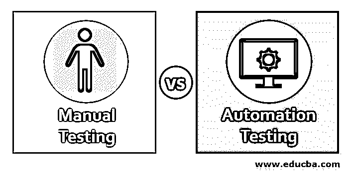

# 手动测试与自动化测试

> 原文：<https://www.educba.com/manual-testing-vs-automation-testing/>

## 手动测试和自动化测试的区别

在这篇文章中，我们将会看到一个关于手工测试和自动化测试的概要。测试是通过检查运行一组开发的代码来识别错误并纠正它们的过程。目的是确保最终产品具有所需的功能，并且能够工作而不报告任何错误。可以通过两种方式完成，手工测试和自动化测试。虽然目标是相同的，但方法、成本、结果和好处是不同的。因此，两者在产品的开发周期中都很重要。

#### 手动测试:

从最终用户的角度分析应用程序的特性和功能称为测试。为了定义缺陷并对其进行相应的分类，理解业务需求是至关重要的。

<small>网页开发、编程语言、软件测试&其他</small>

这分四步完成:

*   **编写测试用例**:根据业务需求，编写测试用例。这些测试用例是测试人员在产品中测试功能和场景的指南。
*   **运行测试:**测试用例就绪后，测试就可以运行了。跟踪工具有助于记录这些测试的结果，以备将来使用。
*   **记录 bug:**详细记录 bug，有描述、截图、录音、报告、复制步骤等。是开发团队在产品发布前理解和修复 bug 的重要输入。
*   **报告结果:**测试反馈对开发团队至关重要。它提供了测试运行、跳过、失败和严重程度的错误记录的摘要。

#### 自动化测试:

这是在产品发布之前，在使用脚本化代码序列的自动化测试工具中，根据业务需求验证功能和特性的过程。这样做是为了运行一个重复测试，分析预期和实际结果之间的差距。这些自动化测试工具帮助运行测试，记录错误，比较结果，并报告总结。自动化测试适用于测试跨重复流程和连续交付的案例，重点是更快更频繁地执行流程。它节省了运行测试的时间和成本。

有两种常用的方法来进行自动化测试:

*   GUI 测试:它通过自动化图形用户界面上的用户行为来测试程序的功能。这有助于预测和分析软件对预期用户点击和导航的响应，并生成报告。它还将此结果与预期结果进行比较，并标出已确定的差距。
*   **API 测试:**该测试绕过 GUI，通过使用编程接口来验证测试条件的应用行为。

### 手工测试和自动化测试的直接比较(信息图表)

下面是手工测试和自动化测试之间的 9 大对比:

### 手动测试和自动化测试的主要区别

让我们讨论一下手工测试和自动化测试之间的一些关键区别:

*   [手动测试通常](https://www.educba.com/manual-testing/)用于产品发布前的最终测试阶段，测试人员被给予测试案例和场景，他需要运行测试，记录错误并报告它们。然而，自动化测试是在开发阶段运行的，主要是在相同系统结构中运行重复测试的单元测试步骤。
*   由于测试用例是手工运行和记录的，手工测试需要更高的人力成本和工作量。虽然自动化测试节省了运行测试所花费的时间，但是测试用例需要开发，并且需要足够的时间和精力，从而导致更高的成本。从长期来看，自动化测试对于连续交付是有益的。
*   手动测试非常适合动态条件，而自动化测试可以在非动态测试条件下获得更好的结果。
*   自动化测试对于有更新、发布和长维护周期的产品来说是理想的，在这些产品中，相同的自动化测试用例一旦开发出来就可以运行。显然，它也可以与手工测试结合使用，同时测试人员可以维护测试用例并分析结果。
*   在 DevOps 和连续交付日益流行的时代，自动化测试被用来运行回归测试和重复性任务。然而，由于更新和维护测试用例所花费的精力和成本，不能用自动化测试来测试根据用户偏好和需求动态变化的 GUI。因此，手动测试是唯一的方法。
*   当测试人员进行手动测试时，可能会有大量的代码需要测试，在运行测试或报告结果时，可能会出现人为错误。另一方面，自动化测试的运行更加有效，报告更加准确。不可能有错误记录和报告部分。

### 手动测试与自动化测试对照表

下表总结了手工测试和自动化测试的比较 **:**

| **手动测试** | **自动化测试** |
| 该测试由测试人员运行。 | 该测试由开发人员进行。 |
| 投入的努力不能重复使用。 | 这些工具是可重用的，必要时可以更新。 |
| 测试人员可以随时进行动态更改。 | 它按照脚本限制和/或定义了功能测试。 |
| 运行测试的努力和成本更高。 | 运行测试的成本非常低。 |
| 测试用例的开发和维护成本很低。 | 开发测试用例的工作量更大。 |
| 根据班次或时区，资源可用性有限。 | 这些测试也可以在工作时间之外进行。 |
| 报道成本随着细节的深入而上升。 | 可以定制报告以高效地满足需求。 |
| 人为失误的可能性。 | 它有很少或没有错误的可能性。 |
| 在瀑布模型中是高效的。 | 在开发和连续交付中非常有用。 |

### 结论

手动测试需要必要的手动工作和时间来运行测试用例；它在结合人类智能的同时动态地处理任务。自动化测试按照代码集运行脚本，并得出实际结果，并与预期结果进行比较。当两者结合使用时，它将效率和质量带到最佳水平。同时，人工工作被投入到创建测试用例和分析报告中，回归测试的重复任务由自动化测试来完成，因此确保了准确性、效率和质量。总的来说，这是一款性价比极高的完美产品。

### 推荐文章

这是手动测试和自动化测试的指南。这里我们用信息图和比较表来讨论手工测试和自动化测试的主要区别。您也可以看看以下文章，了解更多信息–

1.  [组件测试 vs 单元测试](https://www.educba.com/component-testing-vs-unit-testing/)
2.  [静态测试与动态测试](https://www.educba.com/static-testing-vs-dynamic-testing/)
3.  [负载测试与压力测试](https://www.educba.com/load-testing-vs-stress-testing/)
4.  [Wireshark vs Fiddler](https://www.educba.com/wireshark-vs-fiddler/)

