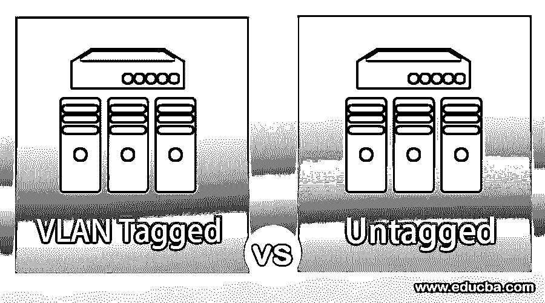
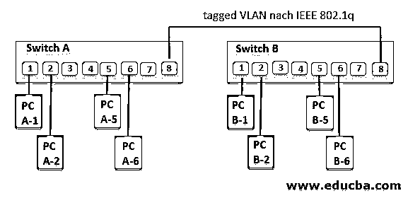
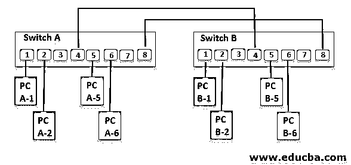
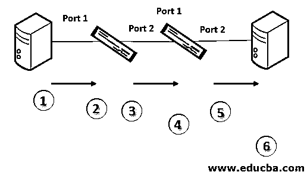
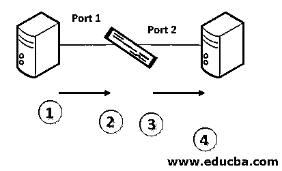

# VLAN 标记 vs 未标记

> 原文：<https://www.educba.com/vlan-tagged-vs-untagged/>

## VLAN 标记与未标记的区别

**标记的 VLAN:**来到标记的 VLANs 将多个 VLANs 连接到一个端口略有不同。该帧包含目的地址标记，因此可以建立一个端口来完成两台交换机之间的连接。

<small>网页开发、编程语言、软件测试&其他</small>

**未标记 VLAN:**是基于端口的 VLANs 它将单个物理交换机划分为多个逻辑交换机。

以下是未标记 VLAN 的示例:

| **开关 A** |
| **开关端口** | **VLAN ID** | **连接的设备** |
| One | 1(绿色) | PC A-1 |
| Two | PC A-2 |
| Three | (未使用) |
| Four | (未使用) |
| Five | 2(橙色) | PC A-5 |
| Six | PC A-6 |
| Seven | (未使用) |
| Eight | (未使用) |

在这里，所有的 pc 机都连接在一个交换机上，可以互相通信。假设我们在另一个房间有另一套相同的配置。

| **开关 B** |
| **开关端口** | **VLAN ID** | **连接的设备** |
| One | 1(绿色) | PC B-1 |
| Two | PC B-2 |
| Three | (未使用) |
| Four | (未使用) |
| Five | 2(橙色) | PC B-5 |
| Six | PC B-6 |
| Seven | (未使用) |
| Eight | (未使用) |

要连接这两个 VLANs，需要两根电缆。

### 标记与未标记之间的直接对比(信息图)

以下是 VLAN 带标签和不带标签的 7 大区别:

### VLAN 标记与未标记的主要区别

让我们来看看 VLAN 标记和未标记之间的主要区别:

#### VLAN 标记

当帧包含 VLAN 标记时，它就是标记端口。它使用“中继”一词来指代标记的端口。发送方将发送带有 VLAN 标签的帧，接收方收到该帧。当它从一台主机发送数据时，它用于广播，并将数据传递到端口中连接的所有主机。

**交通流量如下:**

*   主机将发送不带标签的帧。
*   当帧进入交换机 1 时，它会将 VLAN 标签添加到端口 2。
*   交换机 1 确定端口 2 应该将数据转发到交换机 2。如果它是被标记的端口，它将检查该端口是否允许 VLAN 10 保持标记完整并发送该帧。如果 VLAN 10 不允许，那么帧将被丢弃。
*   最后，主机 B 接收数据。

#### 未标记的 vlan

未标记的 VLANs 连接到主机或服务器。连接的主机在任何 VLAN 上发送流量，它将到达端口，交换机将添加 VLAN 标签。它将根据 VLAN ID 发送数据。当帧离开时，交换机将在无标签端口从帧中剥离 VLAN 标签。然后转发就正常了。

**交通流量如下:**

*   当流量从主机 A 发送到交换机时，它没有 VLAN 标签。
*   当端口 1 收到帧时，交换机将 VLANs 标记插入帧中。这是一个未标记的端口。
*   从端口 2 转发出去的帧中去掉了 VLAN 标签。
*   最后，主机 B 收到未标记的帧。

### VLAN 标记与未标记对比表

让我们来讨论标记和未标记之间最重要的比较:

| **标记与未标记 VLAN 的主要区别** | **已标记** | **未标记** |
| **意为** | 在 VLAN 插入标签的过程。 | 在 VLAN 移除标签的过程。 |
| **数据包流量** | 携带 VLAN ID (VID)的数据包。 | 没有 VLAN 身份证的包裹。 |
| **思科使用** | 思科中继端口。 | 思科接入端口。 |
| **配置** | 中继端口中可以配置多个 VLAN。 | 在接入端口中只能配置一个交换机端口。 |
| **入口** | 如果数据包被标记，我们不能做什么，其余的将被拒绝。对于未标记的数据包，我们也可以强制端口访问它。 | 它必须告诉交换机哪个 VLAN 将到达未标记的数据包。 |
| **出口** | 它必须告诉交换机哪些 VLANs 需要在端口上可用。 | 我们可以为每个端口选择一个 VLAN，这样传出的数据包就不会被标记。 |
| **优先级设置** | 符合 802.1Q 标准的 VLAN，包括优先级设置，并允许一个端口加入多个 VLAN。 | 不使用或转发 802.1Q VLAN 标记的 VLAN，包括优先级设置。 |

### 使用 VLANs 的利弊

以下是一些利弊解释。

*   购买足够的开关会减少。
*   将我们的网络划分为多个子网。
*   控制数据流中的流量。
*   限制用户在网络内使用系统的权限
*   这是非常安全的，所以我们需要管理病毒/恶意软件免费。因为一个系统影响，就会延伸到整个网络。
*   当我们构建更大的网络时，我们需要更多的路由器来管理工作负载。

### 推荐文章

这是一个 VLAN 标记与未标记的指南。在这里，我们讨论了 VLAN 标记与未标记的关键差异的信息图表和比较表。您也可以看看以下文章，了解更多信息–

1.  [C 与 C++](https://www.educba.com/c-vs-c-plus-plus/)
2.  [Scala vs Java](https://www.educba.com/scala-vs-java/)
3.  [vs 兰](https://www.educba.com/vlan-vs-lan/)
4.  [局域网的类型](https://www.educba.com/types-of-lan/)

