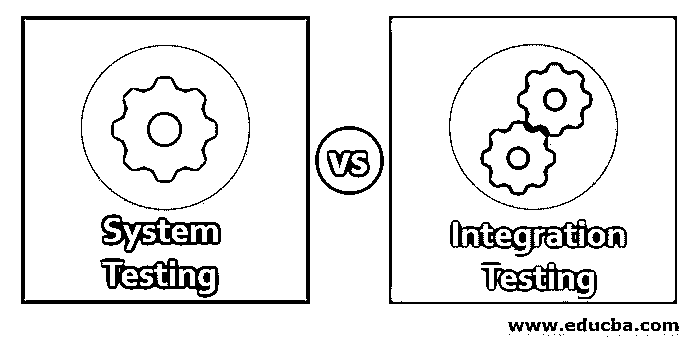

# 系统测试与集成测试

> 原文：<https://www.educba.com/system-testing-vs-integration-testing/>

## 系统测试和集成测试的区别

系统测试是针对客户提供的需求规格对整个系统的正确性进行的测试，而[集成测试是](https://www.educba.com/integration-testing/)为确保应用程序集成精度的功能行为而执行的测试过程。集成测试是应用于应用程序的各种[测试方法](https://www.educba.com/testing-methodologies/)之一。另一方面，系统测试将适用于各种其他类型的测试方法，如功能测试、安全测试等。

### 什么是系统测试？

从这里开始，系统测试是从用户的角度进行的；测试是将产品作为一个整体来进行的。进行系统测试时不需要完整的内部代码知识，因为这是一种黑盒技术。系统测试又分为功能性测试和非功能性测试，用户或组织可以根据他们的具体需要进行选择，因为系统测试是一项高级技术，所以它总是在集成测试完成后进行，并需要多次重复操作。系统测试是一个扫描操作，找出隐藏在不同模块中的所有错误，并对整个系统中产生的错误进行评级。

<small>网页开发、编程语言、软件测试&其他</small>

### 什么是集成测试？

如果系统测试是从用户的角度进行的，那么可以说在集成测试中，模块是从彼此的角度进行比较的。由于一个系统是由不同的模块组成的，首先，所有的模块被单独测试，然后它们与互连接口的不同可能组合也被测试以完成该过程。系统内部的命令数据必须通过接口在不同模块之间传输，因此需要确保每个模块中使用的逻辑与其他交互模块中使用的逻辑一致。由于不同的模块由不同的开发人员开发，他们使用的方法和逻辑可能不同，集成测试成功地建立了接口之间的一致性，使整个系统中的数据流变得顺畅。

可以使用不同的技术，如自下而上的集成测试、自上而下的集成测试、大爆炸方法集成测试、三明治方法集成测试。好的方面是，这种类型的测试可以随着产品的开发不断进行，开发人员不需要总是等待一个完整的产品开始测试；像 integration tester 这样的工具用于执行集成测试。

### 系统测试和集成测试之间的直接比较(信息图表)

以下是系统测试和集成测试之间的 6 大区别:

### 系统测试和集成测试的主要区别

让我们讨论一下系统测试和集成测试之间的一些主要区别:

*   在系统测试中，系统自始至终作为成品进行测试，同时单独测试各个组件模块，并在集成测试中根据不同的可能组合对接口进行比较。
*   系统测试在集成测试成功后进行，而集成测试可以在产品通过[单元测试阶段](https://www.educba.com/unit-testing/)后立即开始。
*   系统测试需要了解内部结构和整体[编程语言](https://www.educba.com/what-is-a-programming-language/)，但不需要了解应用程序的内部代码，而集成测试需要了解与应用程序内部代码相关的信息，以及互连模块的知识和它们相互之间的行为方式。
*   系统测试涵盖了功能测试和非功能测试，即系统的性能和可用性都可以从用户的角度进行测试。集成测试只进行不同集成模块和相关接口的功能测试。
*   由于范围仅限于功能要求，只有黑盒技术足以对软件应用程序进行系统测试，而集成测试既使用了[黑盒技术，也使用了白盒](https://www.educba.com/white-box-testing-vs-black-box-testing/)和灰盒技术，因为执行该测试需要接口逻辑信息。
*   为了复制真实场景，测试在一个临时服务器上执行，该服务器类似于实际应用程序应该使用的生产服务器，而集成测试可以使用第三方工具和 API 来执行。

### 系统测试和集成测试对照表

我们来讨论一下系统测试和集成测试的顶级对比。

| **系统测试** | **集成测试** |
| 1.系统测试主要强调将系统作为一个整体模块进行测试。 | 1.集成测试强调不同模块之间的功能接口。 |
| 2.系统测试只能由测试工程师进行。 | 2.集成测试需要测试工程师和开发人员之间的团队合作才能成功执行。 |
| 3.因为这里的测试包括所有的外部接口，所以任何发现的缺陷都被认为是系统缺陷。 | 3.在集成测试中，测试是在相关接口和不同模块之间进行的，因此发现的任何缺陷都属于单个模块。 |
| 4.由于系统测试是从实际用户的角度进行的，所以这里开发的测试环境被模拟成大致类似于用户-软件交互的真实场景。 | 4.对于集成测试，测试环境被相应地模拟，以模拟两个独立模块之间的交互。 |
| 5.系统测试本身包含大量不同的测试类型，包括功能测试、可用性测试、性能测试、可靠性测试、健全性、回归、维护、可扩展性测试、安全性测试、安装测试和重测等参数。 | 5.与系统测试不同，集成测试包括不同的方法来执行它，这些方法是大爆炸法、自顶向下法、自底向上法、三明治法和混合集成法。 |
| 6.由于不考虑内部编码，系统测试的执行和管理相对简单。 | 6.集成测试执行起来相对复杂，因为它需要控制数据库、平台、执行环境等因素。 |

### 结论

测试阶段需要不同的视角和技术来成功执行；系统测试和集成测试对于清理和抛光软件来说是非常有用和方便的技术。一个深思熟虑的方法和选择适当的工具来执行系统和集成测试，确保没有 bug 在地毯下逃脱，并且您的代码尽可能地高效和有效。

### 推荐文章

这是系统测试和集成测试的指南。在这里，我们讨论了直接比较、关键差异、信息图和比较表。您也可以看看以下文章，了解更多信息–

1.  [单元测试 vs 集成测试](https://www.educba.com/unit-test-vs-integration-test/)
2.  [卡斯帕 vs CISSP](https://www.educba.com/casp-vs-cissp/)
3.  [硒负荷测试](https://www.educba.com/selenium-load-testing/)
4.  [PAAS vs SAAS](https://www.educba.com/paas-vs-saas/)

