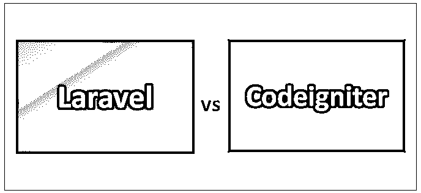

# Laravel vs Codeigniter

> 原文：<https://www.educba.com/laravel-vs-codeigniter/>

## Laravel 和 Codeigniter 的区别

Laravel 是一个 PHP 框架。它是一个用于 web 应用程序开发的开源框架。此框架基于模型视图控制器设计模式，由于借助此框架开发的项目更具结构化和可管理性。这个框架重用了核心框架的现有功能，以及它自己的特性。这个框架拥有早期框架的所有基本特性。在该框架的帮助下开发的 Web 应用程序更加安全；它防止网站受到黑客的攻击。Laravel 的语法和风格被认为是优雅的。对于学习者来说，CodeIgniter 被认为是简单而快速的入门和开发工具。Laravel 仍然因其更高级的特性而作为最好的 PHP web 框架受到欢迎。Laravel 在不到十年的时间里获得了巨大的人气，其市场份额是 CodeIgniter 的两倍。虽然 CodeIgniter 已经分享了 14 年的关注，但这位新手，虽然两者都在全球范围内用于 web 开发，但 CodeIgniter 已经在 43 个国家受欢迎，而 Laravel 领先 113 个国家。

### Laravel 和 Codeigniter 的面对面比较(信息图)

以下是 Laravel 和 Codeigniter 的 6 大区别

<small>网页开发、编程语言、软件测试&其他</small>

### Laravel 和 Codeigniter 的主要区别

两者都是市场上的热门选择；让我们讨论一些主要的区别:

*   CodeIgniter 不支持 ORM，而 Laravel 使我们作为开发人员能够利用雄辩的对象关系映射 ORM。通过主动记录实现，我们可以使用 ORM 系统更有效地处理各种数据库。雄辩的对象关系映射进一步允许开发者通过单个数据库表的特定模型直接与数据库交互。开发人员甚至可以使用该模型来完成普通任务，如插入新记录和运行数据库查询。
*   与 Laravel 相比，CodeIgniter 数据库更多；这两个框架支持数据库依次是 MySQL、微软 Bi、 [PostgreSQL 和 MongoDB](https://www.educba.com/mongodb-vs-postgresql/) 。Codeigniter 支持的附加数据库是以下 ORACLE、Microsoft SQL Server、oriented、IBM DB2 和 JDBC 兼容的。
*   CodeIgniter 要求开发人员额外使用模块化扩展来创建和维护模块，而 Laravel 设计有内置的模块化特性。这使得开发人员能够通过这个包将一个大项目分成小模块。我们可以在多个项目中进一步重用这些模块。
*   许多开发人员在 PHP 7 平台上的 CodeIgniter 应用程序中发现了这个问题，而在 Laravel 的情况下却没有发现
*   CodeIgniter 没有提供任何特定的特性来简化数据库模式迁移。做这件事需要很多努力。Laravel 通过其提供的数据库无关迁移特性使之变得简单。这使得开发人员更容易修改和共享应用程序的数据库模式，而无需编写复杂的代码来执行此操作。通过将数据库无关的迁移与 Laravel Framework 提供的模式构建器结合起来，我们可以轻松地进一步开发应用程序的数据库模式。
*   CodeIgniter 没有提供内置的模板引擎。程序员需要将框架与健壮的模板引擎(如 Smarty)集成，以完成常见任务并提高 web 应用程序的性能。Laravel 提供了对强大模板引擎刀片内置支持。这个模板引擎使 PHP 开发人员能够通过增强和操作各种视图来优化站点的性能。
*   CodeIgniter 没有提供简化 REST APIs 开发的特性。开发人员在使用 CodeIgniter 框架开发 web 应用程序时，必须编写更多代码来创建自定义 REST APIs 在 Laravel 中，它提供的 RESTful 控制器使开发人员能够构建 REST APIs，而无需投入额外的时间和精力。我们可以简单地在 restful 控制器中将$restful 属性设置为 true 来构建定制的 REST APIs，而无需编写额外的代码。
*   程序员获得模块化扩展来创建和维护 CodeIgniter 中的模块，因为内置模块不受支持。然而，Laravel 允许模块的重用。
*   对于数据迁移，Laravel 在格式方面有更广泛的支持。CodeIgniter 有一个限制，只能支持有限的格式。这个框架没有默认的编辑器，第三方库是一个费时费力的选择。

### CodeIgniter 的特点

CodeIgniter 的特性如下:

*   极轻的重量
*   基于模型-视图-控制器的系统
*   查询生成器数据库支持
*   安全和 XSS 滤波
*   表单和数据验证
*   会话管理
*   图像操作库，如调整大小、裁剪、旋转等。支持 GD、NetPBM 和 Image Magick。
*   提供邮件发送类，支持附件，HTML/文本邮件，多种协议如 SMTP，POP 等等。

### Laravel 框架的特点

*   模块化:它提供了许多内置模块和库，有助于增强 web 应用程序。所有模块都与 Composer 依赖项管理器集成在一起，这使得更新非常容易。
*   路由:它为 web 开发人员提供了一种灵活的方法来定义 Web 应用程序中的各种路由。路由有助于以最佳方式扩展 web 应用程序，并提高应用程序的性能。
*   可测试性: Laravel 提供了各种特性和助手，通过各种测试用例来帮助软件测试人员。这个特性有助于按照用户的要求维护代码。
*   查询构建器和 ORM: 它提供了一个强大的查询构建器，帮助使用各种简单的方法链查询大型数据库。它给出了 ORM(对象关系映射器)和 ActiveRecord 实现，称为口才。
*   **配置管理特点:**借助 Laravel 设计的网站运行在不同的环境下，配置也不同，这意味着其配置是不断变化的。它提供了一种一致且强大的方法来高效地维护配置。
*   **模板引擎:**Laravel 使用的 Blade 模板引擎，这是一种轻量级模板语言，用于设计分层布局和包含动态内容的预定义不同类型块的块。
*   **模式构建器:** Laravel 用 PHP 代码维护了各种数据库定义和模式。它还支持跟踪与数据库迁移相关的所有更改。
*   **认证:**用户认证是所有网站的共同特征。Laravel 提供设计认证，因为它具有注册，发送密码提醒和忘记密码等功能。

### Laravel 与 Codeigniter 对比表

下面是 Laravel 和 CodeIgniter 之间的比较

| **比较的基础** | 拉勒维尔 | **CodeIgniter** |
| **定义** | Laravel 是一个基于 MVC 模式的开源 PHP 框架，它健壮且易于学习，旨在为需要一个适度而优雅的工具包来构建全功能 web 应用程序的程序员服务。 | CodeIgniter 是一个开源的、功能强大的 PHP 应用程序开发框架，占地面积非常小，是为需要简单而优雅的工具包来构建全功能 web 应用程序的程序员而构建的。 |
| **数据库模型** | 面向对象 | 面向关系对象 |
| **编程范例** | Laravel 是面向对象的事件驱动函数 | 面向组件 |
| **路由** | 显式路由 | 支持显式和隐式路由 |
| **内置模块** | 允许程序员通过一个 bundle 把一个项目分成小模块。他们可以在不同的项目中进一步重用这些模块。 | 它不支持内置的模块化特性，需要程序员另外使用模块化扩展来创建和维护模块。 |
| **HTTPS 支持** | 允许开发人员建立自定义 HTTPs 路由。开发者也可以选择为每条 HTTPS 路线建立一个特定的 URL。Laravel 还通过在 URL 前自动添加 https://协议来保护数据传输安全。 | 它没有充分支持 HTTPS 路线。开发人员必须管理 URL 助手，使数据传输受到开发补丁的保护。 |

### 结论

正如我们看到的 Laravel 和 CodeIgniter 框架，发现 Laravel 比 Codeigniter 有更多的特性，我们可以在我们的 web 应用程序开发中采用 Laravel。虽然我们的应用程序需要支持与各种数据库的交互，但我们使用 CodeIgniter。

### 推荐文章

这是 Laravel 和 Codeigniter 之间最大区别的指南。在这里，我们还将讨论信息图和比较表的主要区别。您也可以看看下面的 Laravel vs Codeigniter 文章来了解更多信息

1.  [Laravel vs WordPress](https://www.educba.com/laravel-vs-wordpress/)
2.  [拉腊维尔 vs Yii](https://www.educba.com/laravel-vs-yii/)
3.  [Laravel vs CakePHP](https://www.educba.com/laravel-vs-cakephp/)
4.  [Laravel vs Symfony](https://www.educba.com/laravel-vs-symfony/)

