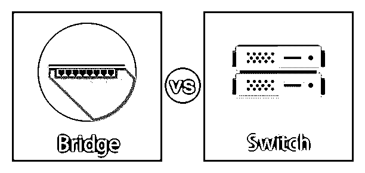

# 桥式 vs 开关

> 原文：<https://www.educba.com/bridge-vs-switch/>

## 网桥与交换机的区别

网桥是连接从小到大的网段的设备。网桥在帧上中继从一个局域网到另一个局域网。网桥可以在 OSI 模型的两层上工作。并且网桥可以在两层上执行不同的功能。在物理层，它充当中继器；网桥可以再生接收到的信号。在[数据链路层](https://www.educba.com/data-link-layer/)中，网桥可以识别帧的地址(从源到目的地)，而交换机有助于加快网内通信，它是网络的主要组成部分。它可以使用节点从一个连接到另一个。这些有助于速度，有效的沟通和转移。基本上，它在收到包时识别包的目的地址，然后包被转发到特定的目的地。

### 网桥与交换机之间的直接比较(信息图)

以下是网桥与交换机之间的主要比较:

<small>网页开发、编程语言、软件测试&其他</small>

### 网桥与交换机的主要区别

让我们从以下几点来讨论网桥和交换机之间的一些关键区别:

**1。**一个网桥连接几个网络。但是与网桥相比，交换机可以连接更多的网络。

**2。**网桥分为三种不同类型，切换到两种类型。

**3。**网桥不具备检查错误的智能，但交换机可以检查网络错误。

**4。**网桥无法缓冲收到的每条链路，但交换机能够缓冲连接到其网络的每条链路。

### 网桥与交换机对照表

下表总结了网桥与交换机 **:** 之间的比较

| **桥与开关的比较基础** | **桥** | **开关** |
| **服务目的** | 设备互连连接一个或多个局域网，称为网桥。 | 可以使用多台连接在一起的设备进行交换来创建网络。 |
| **OSI 模型层** | OSI 模型的两层:物理层和数据链路层。 | OSI 模型的第一层:数据链路层。 |
| **端口** | 网桥有 2 或 4 个端口。 | 交换机仅在特定端口可用，即端口 8、16、24、48、64。交换机也有数百个端口。作为多端口桥接。 |
| **设备类型** | 三种类型的网桥:简单网桥、透明网桥和多端口网桥。 | 两种类型的交换机:存储转发交换机和直通交换机。 |
| **缓冲** | 桥梁无法缓冲。 | 一个交换机可以缓冲，并且缓冲器被连接到每个链路。 |
| **错误检查** | 不能在桥中执行错误检查。 | 可以在交换机中执行错误检查。 |
| **连接能力** | 一个网桥只能连接较少局域网。 | 交换机比网桥连接更多的网络。 |
| **包转发** | 网桥是基于硬件的，在信号传递中不做决定。它接收并放大信号。 | 交换机是基于硬件的，使用 ASIC 芯片来决定和转发帧。它能够快速转发帧，因为它被称为多端口桥接。 |
| **数据传输** | 网桥连接到类似的两个网络，即局域网-局域网。它管理网络之间的数据流。当网桥工作在数据链路层时，网络的范围、可靠性、性能都是临时的和安全的。 | 在多个端口之间进行切换并配对。每个端口都可以体验全带宽网络，因为它连接到不同的网段。数据以帧的形式传输。
通过 L2 交换机——帧，
通过 L3 交换机——帧&分组 |
| **装置的方法** | 存储转发是网桥中的交换方法。 | 使用了许多方法。使用存储转发、直通和无碎片交换方法。 |
| **功能** | 两个 LAN 连接到网桥设备，网桥控制两个设备之间的数据流。 | 连接多台设备，并使用设备的 IP 地址管理端口。它还管理 VLAN 安全性中的设置。 |
| **广播域** | 网桥没有广播域。但是它可以有一个冲突域。网桥将冲突划分为域的两个部分。 | 交换机中允许广播域，广播域按端口冲突域传播。开关连接到工作站或系统。如果有一组工作站，则会为每个节点分配单独的碰撞。一个域在没有 VLAN 时使用。 |
| **网络过滤** | 当距离范围扩展时，网桥具有过滤流量并最小化流量的逻辑。 | 交换机还具有过滤功能，可以从较大的局域网创建较小的局域网。这也简化了管理。 |
| **实例** | 桥没有任何实例。 | 交换机在生成树中有多个实例。 |
| **用于数据传输的地址** | MAC 地址用于过滤内容和读取源目的地。中继器是访问过滤的附加功能。 | MAC 地址用于数据传输。 |
| **带宽** | MAC & IP 地址用于控制外部带宽的网络速度。 | 交换机没有单独的共享端口。 |
| **用于传输的表** | 网桥表包含由网桥使用和维护的 MAC 地址。使用 STP 可以避免循环。 | 该交换机使用内容可寻址存储器–CAM 表作为 MAC 地址到达目的地，并且该 CAM 由 ASIC 访问。 |
| **网络** | VLAN 标签用于传输信号。 | 交换机仅用于局域网 LAN。 |
| **变速器类型** | 网桥在广播和组播方面面临挑战，当单播有流量时，它经常被淹没。 | 交换机最初使用广播。单播和组播在后期使用。 |
| **传输模式的类型** | 网桥仅在半双工模式下工作。 | 交换机也可以通过全双工和半双工模式传输。可以通过偏好进行自动协商。 |
| **性能** | 网桥比交换机慢。 | 交换机比网桥更快。 |
| **网络拓扑** | 局域网的两个网段连接在同一个拓扑中。 | 交换机连接同一网络中的设备。 |

### 结论

网桥和交换机在网络中都很重要。两者都有独特的功能和进步，以帮助另一个设备即兴表演，并以高效率加快网络传输。当网桥[连接到以太网](https://www.educba.com/what-is-ethernet/)时；交换机被认为是连接更多网络的现代桥梁，比网桥更高效。

### 推荐文章

这是一个关于网桥和交换机之间最大区别的指南。在这里，我们还将通过信息图和比较表来讨论网桥和交换机的主要区别。您也可以看看以下文章，了解更多信息–

1.  [什么是桥？](https://www.educba.com/what-is-bridge/)
2.  [切换模式](https://www.educba.com/switching-modes/)
3.  [交换机 vs 路由器 vs 集线器](https://www.educba.com/switch-vs-router-vs-hub/)
4.  [网关 vs 路由器](https://www.educba.com/gateway-vs-router/)

