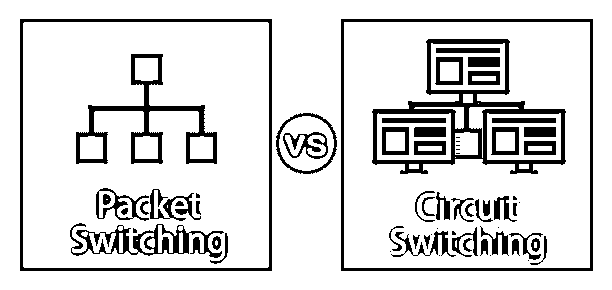

# 分组交换与电路交换

> 原文：<https://www.educba.com/packet-switching-vs-circuit-switching/>

## 分组交换和电路交换的区别

分组交换是用分组寻址的用于数据传输的信道。分组交换是一种路由方法，将数据分组为要在信道中传输的分组，其中分组信道可用于网络流量的下一次传输。它基本上是在流量中占用信道，以便将包含的数据包传输到网络的路由地址。为了正确传送数据，数据包的结构中包含报头和有效载荷。报头–用于将数据包定向到目的地，有效载荷–用于数据提取，是核心数据。分组交换被称为消息交换。在数据传输中，任何超过最大限制的消息都将被分成更小的单元，这些更小的单元被视为数据包。

电路交换与分组交换完全不同。因为该路径专用于整个数据传输。尽管数据被传输或不被传输，但它确保了预先建立通信。这会导致带宽浪费，并且交换机直到源设备向网络保证通信完成后才会被释放。电路交换的例子是电话交谈；只有当呼叫方和接收方结束通话时，已建立的连接才结束。

<small>网页开发、编程语言、软件测试&其他</small>

### 分组交换和电路交换的面对面比较(信息图)

以下是分组交换与电路交换的 13 大对比 **:**

### 分组交换和电路交换的主要区别

让我们从以下几点来讨论分组交换与电路交换之间的一些关键区别:

**1。**电路交换在连接期间是专用的，并且保持不可用于其他用户，直到连接结束。分组交换遵循这样的传统，即发送方和接收方之间的通信类型是无连接的。当数据传输时，通信被分解成数据包，它与同一网络中的各种用户共享同一数据路径称为无连接。

**2。最初，电路交换被设计用于语音通信目的，而分组交换被设计用于数据通信。**

**3。**在分组交换中，当链路断开或分组丢失时，分组具有使用路由器找到其目的地路径的智能。因此，在电路交换无法跟踪数据包何时丢失的流量中，数据包可以有效地传输，这是很有弹性的。

**4。**分组交换是网络高效的，因为每个分组都标识了自己到达目的地的路径，并且不需要任何专用连接进行传输。其中电路交换需要并设置特定的路径，并且在会话结束之前路径不会改变。

**5。**分组交换具有成本效益和可扩展性，因为分组有效地使用了数据传输路径，并且链路得到了有效的管理，在电路交换浪费了与数据传输无关的带宽的情况下，带宽不会被浪费。

**6。**在包交换中，包在传输中不丢失的网络是非常可靠的。因为数据包是有编号的，所以尽管它在不同的通信路径上传输，但它可以在接收端重组。其中电路交换按路径中的顺序发送；如果数据包在通信路径中丢失，则无法对其进行排列。

**7。**分组交换是一种无连接协议，用于传输不需要任何预先设置的分组传输。电路交换是一种面向连接的协议，用于复杂的数据事务。预先建立并从源路由到目的地。延迟时间与无连接交换中的数据传输时间相同。

### 分组交换与电路交换的比较表

下表总结了分组交换与电路交换的比较 **:**

| **分组交换与电路交换的比较基础** | **分组交换** | **电路切换** |
| **服务目的** | 用于传输数据。 | 用于语音交流。 |
| **通讯联动** | 连接是共享的，用于数据传输。因为数据可以在任何链路中传输，并由各种会话使用和共享。 | 当数据不在所提供的通信链路中传输时，容量仍然是浪费的和未使用的。 |
| **网络效率** | 网络的带宽没有被浪费，因为分组可以在各种链路中传输并被重组，从而导致网络的低效使用。 | 网络的带宽被浪费了，因为电路仍然被保留；事务正在进行，其他用户无法使用它。这导致了网络带宽的浪费。 |
| **数据编码** | 数据包内的数据由发送方和接收方通过报头识别，并指导路由，元数据被编码。 | 数据在整个网络中是相同的，并且在通过连接的链路发送之前进行编码。 |
| **容错** | 在这里，它是容错的，因为当路由器在网络通道中出现故障时，它会帮助路由数据包。并且分组被路由到目的地，因为它遵循不同的路由并且分组被编号。 | 如果路由器变慢，电路中的数据包就会丢失，因为数据包在通信时会遵循相同的路由。因此数据包可能会到达错误的目的地，从而导致更多的故障。 |
| **通信路径** | 没有物理路径。 | 在源和目的地之间有物理路径。 |
| **带宽预留** | 不预留任何带宽。 | 它预先保留了全部带宽。 |
| **变速器类型** | 这支持存储和转发传输。 | 这不支持存储和转发。 |
| **是面向连接的吗？** | 不，它是无连接的。 | 是的，它是面向连接的。 |
| **是编号数据吗？** | 数据包可以在接收端组装，尽管它在不同的路径上传输，并按照每个数据包的编号进行排序。 | 数据包不能被组装。因此，数据是按照从源到目的地的顺序发送的。 |
| **灵活吗？** | 是的，它很灵活，因为每个数据包都有到达目的地的路由。 | 没有灵活性，因为路径是预先定义的，并且所有分组都在相同的路径中传输。 |
| **OSI 模型层** | 使用网络层。 | 使用物理层。 |
| **接近** | 数据报和虚电路方法。 | 时分和空分方法。 |

### 结论

分组交换和电路交换都是非常重要的，在更广泛的网络中用作融合技术。它已经发展了一段时间，并为提高效率进行了优化。还检查网络是否能够处理连接并适合基础设施。保持网络中通信的质量也是至关重要的。从所有标准来看，分组交换高于电路交换。

### 推荐文章

这是分组交换和电路交换的主要区别的指南。在这里，我们还将讨论信息图和比较表的主要区别。您也可以看看以下文章，了解更多信息–

1.  [交换机 vs 路由器](https://www.educba.com/switch-vs-router/)
2.  [集线器 vs 交换机](https://www.educba.com/hub-vs-switch/)
3.  [R 中的 Switch 语句](https://www.educba.com/switch-statement-in-r/)
4.  [交换机 vs 路由器 vs 集线器](https://www.educba.com/switch-vs-router-vs-hub/)

