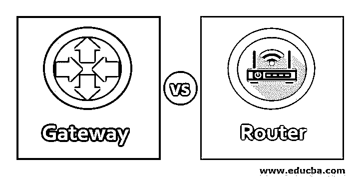

# 网关与路由器

> 原文：<https://www.educba.com/gateway-vs-router/>

## 网关与路由器的区别

网关和路由器是网络和安全组件。路由器是一个简单的网络组件，它将数据包从一个网络传输到另一个网络。如果有任何数据包到达一个端口，路由器会探索数据包的地址信息，并决定其终止路径。有了路由路径的知识，它引导并携带数据包到下一跳。网络中的网关将数据包从一种协议转换成另一种形式。网关充当网络的出口和入口点。两者在功能上有细微的差别，很少有路由器同时执行网关和路由器的功能。在本主题中，我们将学习网关与路由器。

### 网关与路由器的面对面比较(信息图)

以下是网关与路由器之间的 8 大区别。

<small>网页开发、编程语言、软件测试&其他</small>

### 网关与路由器的主要区别

网关与路由器的主要区别

#### 1.路由和管理流量

这两种设备都用于管理两个或多个不同网络之间的网络流量。但是如果用户发现在调节流量方面有困难，可以通过在设备中申请最少两个网卡来实现。简单地说，网关管理两个不同网络之间的流量，而路由器管理相同网络的流量。例如，如果用户运行 Windows 2000 网络，则使用 TCP 作为其基本协议，因为 TCP 是互联网连接的主要协议。

路由器将检查不会干扰网络其他部分的本地化网络流量。投射在互联网上的定向流量不应该在任务完成后为了互联网而停留在上面。路由器还可以对商业网络中的流量进行分段。当要求限制通过网络的流量时，这对大型网络很有帮助。

它使用路由器将网络分割成多个分段，并且只允许分配给各个分段的流量在网络系统中流动。类似地，网关连接不同的网络。最好的例子是，如果网关是连接 PC 网络和 3270 大型机系统的组件，使 windows NT 网络能够与 NetWare 网络交互。虽然可以部署它来减少流量，但它更经常地应用于在不同的环境中进行可能的通信。

#### 2.组件的复杂性

路由器和网关之间的主要区别在于，接入点在网络外部的网关中是单一的。根据网关的关键程度，它或者作为安装了网关应用程序的服务器，或者作为许多计算机网络之间的连接设备。如果任何网络 N 想要加入 M 网络，这两个网络应该拥有一个网关，该网关作为网络交互的入口和出口端点。网关是通向网络的大门，它定义了网络的边缘和边界。而路由器决定数据包从计算机 m 传输到计算机 n 的最小可能距离。

#### 3.网关和路由器的安全性

路由器需要与拥挤的大数据和大流量隔离开来。必须以适当的方式确保路由路径之间的拥塞得以缩短，因此应配置许多路由表来映射数据在网络中的传输过程。而网关是至关重要的，因为它是网络的端点，它应该是高度安全的，以防止病毒攻击。因为数据通过网关可以很容易地访问。如果单个路由器被淹没或让步，用户可以移除该特定路由器，以便另一个路由器决定通过网络获取数据的最短可能路径。如果用户移除网关，就会导致整个网络瘫痪。

#### 4.组件的配置

路由器是由路由表设计的，路由表包含一组路由器可以传递数据的 IP 地址。而网关是通过描述推荐的内部地址和外部 IP 来配置的，因此它有两个端口用于外部和内部 IP

要重复路由器和网关之间的区别，想象每 20 台计算机有两个网络。网络中的 20 台计算机之间不需要网关就可以进行交互。但是，如果他们想与不同的系统交互，网关是强制性的。

### 网关与路由器的对比表

为了便于理解，让我们通过一个比较表来看看网关与路由器之间的更多差异:

| **行为属性** | **网关** | **路由器** |
| **定义** | 简而言之，网关是一个网络组件，充当网络系统的入口和出口点。它将数据包的协议从一种类型转换为另一种类型。 | 路由器是一种网络组件，能够通过构建覆盖网络在多个网络之间传输数据包。 |
| **工作原理** | 网关作为网络系统的端点，从一个数据包解释到另一个数据包。 | 通常，路由器在协议的第三层工作，通过探索内部路由表将数据包从一个系统传输到另一个系统。路由器决定网络的路径。 |
| **部件的特征** | 将 IP 语音等协议转换为公共交换电话网络或网络访问控制。 | 路由器提供额外的属性，如 NAT、静态路由、DHCP 服务器以及 IPv6 地址和 MAC 地址上的无线路由。 |
| **部署** | 它被部署为虚拟或专用设备或物理服务器。 | 它部署在专用设备的路由器硬件上。 |
| **动态路由** | 网关不支持动态路由。 | 路由器支持动态托管。 |
| **开源互联** | 网关有能力工作到第 5 层层。 | 路由器只能在第 3 层和第 4 层运行 |
| **关联术语** | 它也被称为语音网关、代理服务器和网关路由器。 | 该路由器也称为互联网路由器和无线路由器。 |
| **部件的操作过程** | 它通过区分网络中存在的结构和网络外存在的组件来运行。 | 它通过为不同的网络安装各种路由数据来运行，流量依赖于目的地址。 |

### 推荐文章

这是网关与路由器的指南。在这里，我们通过信息图和比较表来讨论网关与路由器的主要区别。您也可以看看以下文章，了解更多信息–

1.  [SOA 与微服务](https://www.educba.com/soa-vs-microservices/)
2.  [Wi-Fi vs 以太网](https://www.educba.com/wifi-vs-ethernet/)
3.  [中继端口对接入端口](https://www.educba.com/trunk-port-vs-access-port/)
4.  [WebSockets vs WebRTC](https://www.educba.com/websockets-vs-webrtc/)

