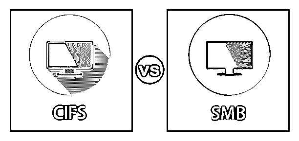

# CIFS vs 中小企业

> 原文：<https://www.educba.com/cifs-vs-smb/>

## CIFS 与中小企业的区别

**CIFS** 缩写为“通用互联网文件系统”。它首先由微软创建，然后由 IBM 增强。简而言之，我们可以说通过网络或服务器传输文件。CIFS 是一个非常安全和认证的文件传输协议系统。它是一个开放的平台，用于请求通过服务器进行文件传输。CIFS 基本上是用于文件共享的服务器消息块(SMB)的增强或临时版本。CIFS 也是文件、打印机等多种设备的组合共享。，在客户端之间访问网络的数据。

以下是 CIFS 的一些重要特征:

<small>网页开发、编程语言、软件测试&其他</small>

1.  认证文件传输协议。
2.  文件传输协议的高性能和可行使用。
3.  允许通过网络编辑文件。
4.  多个用户可以通过网络访问数据，而不会在服务器级别出现任何问题。

**SMB** 缩写为“服务器消息块”，也类似于共享网络传输文件的 CIFS。最初，它被 IBM 增强为 CIFS 的即兴版本。SMB 允许客户端编辑、读取和覆盖服务器上的文件。这个服务器被称为 LAN(局域网)。SMB 的引入是为了通过局域网编辑文件，以便以一种更安全和可行的方式在客户端之间共享。

随着 SMB 版本的不同，性能水平也有所提高。以下是中小型企业的重要特征:

1.  SMB 提供了一种经过认证的相互通信过程机制。
2.  SMB 为客户端提供共享文件、浏览网络、打印服务等。，通过网络。
3.  SMB 版本 2 减少了用于通过网络传输文件的命令和子命令的数量。
4.  SMB2 包括对符号链接的支持，作为 SMB 版本 1 的增强版本。

### CIFS 与中小企业的直接比较(信息图表)

以下是 CIFS 与中小企业之间的 6 大对比:

### CIFS 与中小企业的主要区别

以下是一些主要的关键区别:

基本上，CIFS 和中小型企业在功能上是相同的。我们也可以说 CIFS 是中小企业的一种形式。当 CIFS 由微软引入并在早期使用时，他们发现了一些错误，然后 SMB 进入了 IBM 的 CIFS 的增强版本。CIFS 通常用于大公司，那里的许多人需要处理客户或雇主需要访问的大量数据。

其中包括一组消息包，用于确定协议的特定版本，这被称为方言。据说 CIFS 是中小企业的一种方言。

据说使用 SMB 而不是 CIFS 的原因如下:

1.  与中小企业相比，CIFS 现在很少使用。借助文件传输过程中的高级预认证检查，SMB 接管了 CIFS。在 windows OS 的世界里，SMB 最有可能被使用。SMB2 是 Windows Vista 2006 的标准配置，SMB3 用于 Windows 8 和 Windows Server 2012。
2.  用于通过网络传输文件的命令和子命令的数量。仅仅是传输文件的命令就有一百多条。但是，SMB 将这些命令减少到了 19 条，这是一种非常可行的文件传输方式。
3.  与 CIFS 协议相比，数据存储容量也更大。
4.  SMB 是一种高级应用网络协议，而 CIFS 是一种 TCP/IP 协议。
5.  CIFS 被认为是一个“喋喋不休的协议”，是一个巨大的错误，有网络问题。SMB 通过流水线机制克服了这个问题。

### CIFS 与中小企业对比表

给出了 CIFS 与中小企业之间的比较:

| **比较的基础** | **CIFS** | **中小企业** |
| **初始建成** | CIFS 最初是在 20 世纪 80 年代早期由 IBM 开发的。 | SMB 是微软在 20 世纪 90 年代早期为 Windows 95 发布的 CIFS 的增强版本。 |
| **性能水平** | 由于它建于 20 世纪 80 年代，因此在网络上进行文件传输存在挑战。这些挑战包括安全性、文件传输速度慢、服务请求和响应花费大量时间。 | 为了解决 CIFS 的性能问题，SMB 应运而生。有预认证检查来保护服务器的文件，服务器中的快速文件传输等。SMB 增加了在服务器上共享文件的规模，大大提高了计算请求。 |
| **可行性** | 在 CIFS 协议中，有数百个命令和子命令用于通过系统传输文件。用户在维护这些命令时面临问题。 | SMB 将这些命令减少到了 19 个。所以 SMB 对于用户来说是足够简单和可行的。 |
| **认证** | 在文件传输过程中，CIFS 没有进行任何身份验证检查，因此文件在系统上没有受到保护。任何用户都可以通过系统访问该文件。高度机密的文件不那么安全，而且文件的透明度正在下降。 | AES 加密算法用于提供服务器中文件的安全性。在最新版本的 SMB 中，他们实施了预认证检查，用户必须提供用户名和密码才能访问特定文件。 |
| **数据存储** | CIFS 使用类似于 FTP 和 HTTP 协议的 TCP/IP 协议。 | SMB1.0 使用 16 位数据大小，而 SMB2.0 使用 32 或 64 位宽的存储数据字段。这有助于改进大文件数据的存储，并方便地通过网络传输大文件。 |
| **工作** | 客户端请求位于另一台计算机系统上的服务器中的文件，然后服务器做出响应。 | SMB 是一种客户端-服务器通信协议，用于共享对网络资源的访问。 |

### 结论

在上述两个安全级别中，密码在允许访问服务器之前被加密。这证明用户或客户端具有足够的凭证来访问网络中的文件。

### 推荐文章

这是 CIFS 与中小企业对比的指南。在这里，我们讨论 CIFS 与中小型企业之间的区别，以及主要区别、信息图表和比较表。您也可以浏览我们的其他相关文章，了解更多信息——

1.  [FTP vs TFTP](https://www.educba.com/ftp-vs-tftp/)
2.  [PHPStorm vs WebStorm](https://www.educba.com/phpstorm-vs-webstorm/)
3.  [WebLogic vs JBoss](https://www.educba.com/weblogic-vs-jboss/)
4.  [WebSocket vs Socket.io](https://www.educba.com/websocket-vs-socket-io/)

