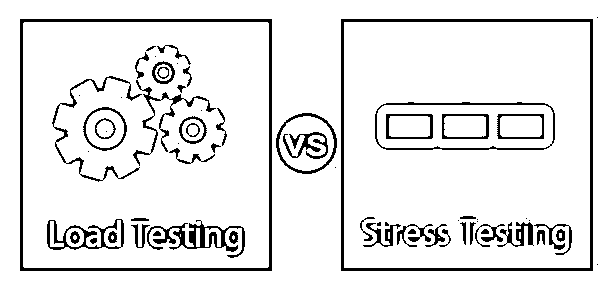

# 负载测试与压力测试

> 原文：<https://www.educba.com/load-testing-vs-stress-testing/>

## 负载测试和压力测试的区别

负载测试是一种性能测试，它确定系统、软件应用程序或软件产品在真实负载条件下的输出，而压力测试是一种检查系统可靠性和稳定性的软件测试。该测试确定系统的稳健性及其在极端重负载条件下的错误处理。

**什么是负载测试:**负载研究模拟任何网站或程序的真实负载。测量在正常和重负载期间进行。这种测试方法在开发项目接近完成时执行。执行负载检查是为了找出有多少用户可以管理该程序。您还可以查看各种场景，让您能够专注于系统的各个部分。就像您网站上用于 web 负载测试的网站或主页。它还帮助您决定如何创建和维护设备中的负载。

<small>网页开发、编程语言、软件测试&其他</small>

**什么是压力测试:**压力测试是确定系统稳定性和健壮性的研究。该技术不起作用。该测试方法使用自生模拟模型来评估任何假设场景。网站和应用程序上的压力测试对于大型活动至关重要，比如一场受欢迎的以人为本的音乐会的门票。因此，应定期测试机器耐用性的潜力。这还将帮助您为意外的高峰做好准备，并为您提供更多的时间和资源来纠正任何瓶颈。

### 负载测试和压力测试之间的直接比较(信息图表)

下面是负载测试和压力测试的 6 大对比 **:**

### 负载测试与压力测试的主要区别

让我们从以下几点来讨论负载测试和压力测试之间的一些关键差异:

*   负载测试旨在执行一定数量的系统请求，以不同的并发请求率测试系统的功能。压力测试旨在增加系统性能下降到完全失败的同时运行的应用程序的数量。
*   负载检查保证 web 系统能够处理预计的流量，因此也称为流量测试。当负载测试的并发用户数量达到峰值时，基本的压力检查会继续增加系统负载，直到资源过载。
*   测试人员必须将合理恶化的阈值确定为最终用户的适当值，这样用户就不会从网站上反弹。这允许系统查看系统如何处理它，以及系统是否能够执行正常的恢复。
*   我们认为，在负载测试或压力测试的这些概念中，它们肯定不是完全相互独立的。有时，当您运行负载检查的上限时，您实际上可以运行一个压力测试来驱动系统超出可用资源的限制。您可以开始看到负载测试失败，类似于执行压力测试时通常出现的失败。

### 对照表

下表总结了负载测试与压力测试的对比 **:**

| **负载测试** | **压力测试** |
| 网络、数据库和网站服务器使用负载测试来确定应用程序的性能。 | 通过应力来检验系统的响应时间和可靠性。 |
| 负载测试允许测试人员在产品服务器上部署之前识别瓶颈，也可以说出瓶颈的来源。 | 如果用户数量在系统故障或崩溃之前意外增加，压力测试允许测试人员监控设备功能。 |
| 每个应用程序或软件的负载都重复了这种类型的测试。 | 它用于评估应用程序的可靠性和健壮性。 |
| 负载监控用于测试云和数据库服务器上的程序表单。 | 它用于评估应用程序的可靠性。 |
| 在应用程序经过负载测试之后，以及在客户满意度提高之后，失败的成本可以降低。 | 代码经过应力检查后，如果系统出现故障，在早点发现断点的情况下会快速恢复，也会看到崩溃。 |
| 计算的属性是峰值功率、服务器数量以及负载检查中的响应时间。 | 这种类型的测试控制稳定性的响应时间等。 |

### 推荐文章

这是负载测试和压力测试之间最大差异的指南。这里我们讨论信息图和比较表的主要区别。您也可以看看以下文章，了解更多信息–

1.  [尖峰测试](https://www.educba.com/spike-testing/)
2.  [功能测试与非功能测试](https://www.educba.com/functional-testing-vs-non-functional-testing/)
3.  [软件兼容性测试](https://www.educba.com/compatibility-testing/)
4.  [系统测试](https://www.educba.com/system-testing/)

