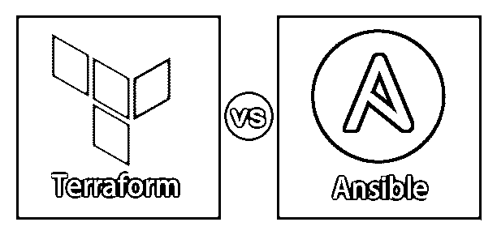

# 地形与地形

> 原文：<https://www.educba.com/terraform-vs-ansible/>

## Terraform 和 Ansible 的区别

Terraform vs Ansible 是 DevOps 世界的人们最常使用的名字。两者都是流行的产品，分别是配置管理工具(Ansible)和供应工具(Terraform)。这些工具将帮助我们在各种需要满足复杂需求的可重复环境中非常容易地部署我们的代码和其他基础设施。如果没有这些工具，这个过程在早期会非常复杂。

### Terraform 和 Ansible 的面对面比较(信息图)

以下是 Terraform 与 Ansible 之间的五大对比:

<small>网页开发、编程语言、软件测试&其他</small>

### Terraform 和 Ansible 的主要区别

下面是 Terraform 和 Ansible 之间的主要区别:

#### 将（行星）地球化（以适合人类居住）

Terraform 是一个开源的供应管理工具，它也有一个命令行界面，可以用简单的代码提供任何基础设施，即使它跨越多个服务提供商。从定义上来说，Terraform 是一个开源工具，可用于非常高效和安全地构建、版本控制和更改基础设施。Terraform 提供了这样的灵活性，它可以管理流行的和现有的服务提供商以及定制的内部解决方案。您的 DNS 可以来自 Cloudflare，[而服务器可以来自 AWS 和](https://www.educba.com/what-is-aws/)数据库，可以是任何传统的 RDBMSterraform 将在所有提供商之间并行构建所有这些资源。Terraform 可以管理网络和存储等底层实例，处理 DNS、SaaS 等高层实例。这是用 HCL 或 HashiCorp 配置语言编写的，非常容易学习和调试

#### Ansible

Ansible 是一个非常流行的 IT 自动化工具，可用于配置和部署软件、代码和/或执行许多更高级的 IT 任务。Red Hat 在 2012 年开发了 ansible，由于它是用动态编程(一种称为 Python 的语言)编写的，它立即在组织中流行起来，这是快速部署功能的催化剂。因为 ansible 是内置的 python，并且所有基于 Linux 和 Unix 的系统都已经预装了 python，所以在这个平台上获取和运行 ansible 要容易得多。Ansible 有许多受欢迎的子模块，可以支持大量的集成，如 Azure、AWS 等。YAML 是 ansible 用来在不同的复杂环境中推动变化的语法。

### Terraform 与 Ansible 对照表

以下是 Terraform 与 Ansible 之间的主要比较:

| **地形** | **可回答的** |
| Terraform 是完全声明性的；在声明式中，我们声明实际需要的是什么，而不是实现结果的过程。使用 terraform 时，我们将定义环境，如果环境在以后发生变化，它将仅应用于下一次“Terraform 应用”。这里由于是声明性的，代码总是表示基础设施的当前状态。 | Ansible 遵循程序风格，通过一步一步的过程来实现预期的目标，并且与 terraform 不同，它可以接受特定的更改查询。当我们实际处理程序类型的任务时，并没有完全考虑基础设施的状态。随着状态的变化，过程代码的可重用性非常有限。 |
| 如果我们使用 terraform 来部署由 Docker 或 Packer 形成的机器映像，那么“每一次更改”都是对新服务器的部署，就像函数式编程方法一样。这种方法大大降低了 ansible 所遵循的方法可能出现的配置错误的风险。这允许容易的追溯，以便我们可以在任何问题的情况下非常容易地回滚。这个配置管理工具也可以强制不可变的部署，但是不建议这样做。 | Ansible 是默认可变基础设施范例的工具。随着时间的推移，当我们应用越来越多的更改时，每个服务器都会建立一个更改历史，这导致了称为配置漂移的性能现象，每个服务器都会与其他服务器略有不同，从而导致一些错误，这些错误几乎不可能重现。 |
| Terraform 是一个配置工具，还有云形成，木偶等。很少有工具在使用中考虑到代码的声明形式，并暗示它们被设计成自己供应服务器。他们还负责其他基础设施，如负载平衡器、数据库网络等。我们应该意识到，大多数配置工具都能够在一定程度上进行配置管理，同样，大多数配置管理工具也能够在一定程度上进行配置，但是当我们专注于某个特定方面时，一些工具显然比另一些工具更适合。 | Ansible 是一个配置管理工具，其他类似的工具包括 chef、puppet 等。chef 是遵循这种程序方法的又一个工具。 |
| Terraform 也是无主的。Terraform 使用云提供商 API 与云提供商进行通信，因此在某种意义上，API 服务器看起来像是主服务器，只是它们不需要任何额外的基础设施或额外的认证机制。 | Ansible 是无主的。一些工具，如厨师，木偶，需要主服务器来存储更改和分发更新，但也有一些缺点，如额外的安全性和基础设施维护成本。 |
| Terraform 也不需要安装任何额外的代理。其中一些可能需要代理，但它们已经包含在软件包中，您不需要安装任何其他支持代理。 | Ansible 不需要在其运行的服务器上安装任何额外的代理。我们只需要运行 SSH 守护进程，这在大多数服务器上是最常见的，这不属于代理。 |

### 结论

我们已经看到了两个著名工具之间的比较，Ansible 主要用于配置管理，terraform 用于供应管理。我们也可以一起使用多种工具，比如使用 terraform。我们可以部署所有必需的基础设施，如 VPCs、子网、路由表、负载平衡器等。然后，您可以使用它们在开发的基础设施上部署您的应用程序。

### 推荐文章

这是一个关于 Terraform vs Ansible 的指南。在这里，我们讨论了 Terraform 和 Ansible 之间的区别，以及主要区别、信息图和比较表。您也可以浏览我们的其他相关文章，了解更多信息——

1.  [TeraData vs 甲骨文](https://www.educba.com/teradata-vs-oracle/)
2.  [数据 vs 信息](https://www.educba.com/data-vs-information/)
3.  [数据分析 vs 数据分析](https://www.educba.com/data-analytics-vs-data-analysis/)
4.  [数据科学家 vs 大数据](https://www.educba.com/data-scientist-vs-big-data/)
5.  [Saltstack vs Ansible |顶级差异](https://www.educba.com/saltstack-vs-ansible/)

