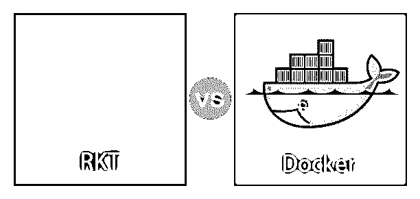

# 市场 vs 码头

> 原文:# t0]https://www . educba . com/market-vs 码头/

## RKT 和码头工人的区别

RKT(rocket) vs Docker 都是在虚拟机和基于容器的平台上工作的开发人员中广为人知的。Docker 是一个领先的基于容器的平台，支持持续的高速创新，使多个组织能够无缝地构建流程和共享应用程序，甚至可以是遗留应用程序。Docker 是 2013 年作为开源项目的一部分创建的，并因其隔离、快速集成和构建、可再现性和可测试性等特性而一举成名。RKT 在开发人员中被称为“运行时的应用程序容器”,是一个基于 CLI 的应用程序容器。Rkt 是 Rocket，以其快速、可组合和安全的提供特性而闻名。许多用户已经注意到 docker 的安全问题，因此 CoreOS 不得不在 2014 年发布 RKT 作为 docker 的竞争对手，这也因为其安全、可互操作等特性而变得流行。

### RKT 和 Docker 的正面比较(信息图)

以下是 RKT 和码头工人的五大对比

<small>网页开发、编程语言、软件测试&其他</small>

### RKT 和 Docker 的主要区别

让我们从以下几点来讨论 RKT 和码头工人之间的一些关键区别:

*   RKT 和 Docker 的主要区别是守护进程。Rocket 没有任何与之关联的守护进程，因此当用户运行“rocket run coreos/etcd”时，它直接在启动它的进程下执行。而 Docker 守护进程是将在主机操作系统上运行的服务，并且这个特定的守护进程在 Linux 上运行。不过，在 macOS 和 windows 上运行也是可行的。
*   由于 Rocket 是一个应用程序容器运行时，另一个主要的区别是 Rocket 可以在容器中运行多个应用程序，除非 docker。因此，我们将有一个主动的监控计划，确保当不止一次的处理共享同一个容器时，我们可以重新启动流程。
*   另一个主要区别是容器图像安全性。在 Docker 中，会有一个公共的图像注册表，可以下载和定制。因此，服务器镜像有可能被恶意软件替换，这将是巨大的隔离。但是在 RKT，签名验证已经完成，所以一旦服务器镜像被下载，它将检查签名以验证它是否被篡改。docker 的这个缺点通过一些附加的安全特性得到了缓解，但是它不像 RKT 那样安全。
*   Docker 从根运行它的容器，这将是超级用户特权，许多服务器所有者觉得这会使事情复杂化。在 RKT 中，新容器永远不会从根特权进程中创建，因此即使容器突破发生，攻击者也无法获得根特权。

### RKT 与码头工人对比表

下表总结了 RKT 与码头工人 **:** 的对比

| **功能** | **RKT** | **码头工人** |
| **易用性** | CoreOS 提供了一个构造平台，允许对容器进行可视化管理，并提供了更好的易用性。 | Docker 也有一个基于 GUI 的管理器来管理 docker 容器，被称为 Kitematic。 |
| **API 和扩展性** | GRPC 是 CoreOS 使用的 API，core OS 是一个高性能、开源和通用的框架。RKT 使用的 API 服务被设计为在没有 root 权限的情况下运行，并且具有只读界面。所使用的 API 服务对于运行 pod 是可选的；API 的启动或停止或崩溃不会影响任何 pod 甚至图像。 | 有一个用于与 Docker 守护进程交互的 API，以及用于 GO 和 Python 的 SDK，称为 Docker Engine API。SDK 可以让我们快速轻松地扩展和构建 docker 应用程序。Docker Engine API 也是一个 restful API，可以由 curl 或 weget 等 HTTP 客户端访问。 |
| **能力集** | 在容器平台中，docker 和 rkt 是主导者，两家厂商都通过突出各自的功能表现出了主导地位。Rcketr 或 RKT 是更注重安全的集装箱解决方案；它是一个基于 Linux 内核的开源轻量级 Linux 操作系统。 | 在 docker 中，为了获得高级功能，docker 数据中心解决方案提供了企业容器编排或分级安全功能或增强的应用程序管理。 |
| **社区支持** | 由于其受欢迎程度和主导地位，RKT 已经开发了一个强大的用户和开源开发者社区，在那里大多数问题都得到了解决。他们也有多种多样的文档支持。在#Coseos IRC 频道上也有一个 CoreOS 用户论坛。 | Docker 由于拥有庞大的用户数量，也拥有多功能的社区支持。在 docker 官方网站上，你可以了解更多关于 docker 的信息，了解很多问题以及它的社区支持。它还通过 docker 船长的名字向其多才多艺的用户提供赞赏，并鼓励他们与他人分享他们在 docker 中的知识。 |
| **安全** | Rkt 通过 KVM(代表基于内核的虚拟机基于容器的隔离)、与 TPM 的集成、SELinux 的支持(提供对可集成到容器中的细粒度访问的控制)、映像的签名验证功能以及独立权限等功能提供高级安全功能。有了这些特点，RKT 将成为有安全意识的人的唯一选择。 | Docker 有几个可以考虑安全性的主要方面，它们是带有名称空间和 cgroups 的内核的固有安全性。docker 守护程序的安全功能在用户自定义容器配置时会出现漏洞。命名空间提供了最直接和第一种形式的隔离。在 docker 中，每个容器也获得自己的网络堆栈，这意味着有问题的容器将无法访问套接字或另一个容器的接口。从而提供容器隔离。说到安全性，Cgroups 或 control groups 是 docker 的另一层关键组件。cgroups 提供了完整的指标，为每个容器提供了公平的系统资源共享，如 CPU、磁盘 I/O 等。 |

### 结论

因此，当谈到容器时，Docker 和 CoreOS RKT 将是我们会听到的流行名称，选择将纯粹取决于用例。如果我们在安全方面更加一体化，那么 RKT 将是我们的选择。Docker 被 PayPal、易贝、EBC、ADP、Spotify、GE appliance 等使用。同样，RKT 也用于威瑞森等组织。维亚康姆、Salesforce.com 等。

### 推荐文章

这是一个 RKT 和码头工人之间的主要区别的指南。这里我们讨论信息图和比较表的主要区别。您也可以看看以下文章，了解更多信息–

1.  [立方 vs 码头](https://www.educba.com/kubernetes-vs-docker/)
2.  [流浪汉 vs 码头工人](https://www.educba.com/vagrant-vs-docker/)
3.  [Docker 架构](https://www.educba.com/docker-architecture/)
4.  [码头工人备选方案](https://www.educba.com/docker-alternatives/)

