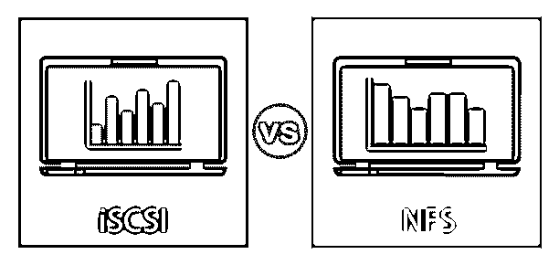

# iSCSI 对 NFS

> 原文：<https://www.educba.com/iscsi-vs-nfs/>

## iSCSI 和 NFS 的区别

iSCSI 或互联网小型计算机系统接口是块传输层协议，主要在块级协议接口上工作。块协议也可以直接访问存储器，并通过协议 SCSI 控制数据流入或流出。源和目标数据被加密，因为它们在 iSCSI 启动器(源)级别高度加密，并在到达 iSCSI 目标(目标)级别时解密。数据的并行访问在 iSCSI 接口中是不可能的，因为它允许数据在两跳之间共享。只有在 LAN(局域网)或 WAN(广域网)之间有数据传输时，才能考虑 iSCSI，因为数据访问速度非常快。

### iSCSI 的优势

*   它旨在使用客户端和服务器之间的会话在两者(客户端和服务器)之间传递流。
*   它支持多个会话连接。
*   它支持一种高级的错误恢复方法，使用服务器之间的连接忠诚切换。

NFS 或网络文件系统是由太阳微系统公司在 1984 年设计的。NFS 是一种分布式文件系统协议，允许连接到同一网络的不同机器共享数据。这与访问远程机器的数据来访问本地存储数据非常相似。多个客户端之间的并行访问由基于资源锁定的 NFS 服务来处理。NFS 还允许管理员插入服务器上文件系统的一部分，其他用户或客户端可以根据用户各自的权限在基于网络的界面中使用该部分。

<small>网页开发、编程语言、软件测试&其他</small>

### NFS 版本

以下是 NFS 的不同版本:

**1。NFSv3:** 随着版本的增加，这些版本都临时增加了增强功能。NFSv3 包括:

*   支持 64 位文件大小，以处理大于 2GB 的数据或文件。
*   支持服务器上的多次写入，从而提高了写入性能。
*   支持高级身份验证。

**2。NFSv4:** 版本 4 包括高性能的增强，对文件的高级安全性。它还为集群部署提供协议支持，以并行访问不同服务器之间的文件。NFSv4 的一些关键特性是:

*   它将 NFS、NLM、NSM 等多种协议集成到一个协议中，通过防火墙访问文件。
*   使用 GSS API 支持高级身份验证。

### iSCSI 和 NFS 的面对面比较(信息图)

以下是 ISCSI 与 NFS 之间的 7 大区别:

### iSCSI 与 NFS 的主要区别

NFS 和 iSCSI 彼此非常不同。让我们来看看主要的区别:

*   **定义** : NFS 用于在服务器内的多台机器之间共享数据。这是一个文件共享协议。ISCSI 被认为是在客户端和服务器之间共享数据。它基本上是一个共享文件的单通道体系结构。
*   **操作系统** : NFS 运行在 Linux 和 Windows 操作系统上，而 ISCSI 运行在 Windows 操作系统上。
*   **协议** : NFS 主要是一种文件共享协议，而 ISCSI 是一种基于数据块级别的协议。
*   **文件系统:**在服务器级别，文件系统在 NFS 处理。来宾操作系统负责管理文件系统。
*   **文件读取选项:**由于数据被 NFS 放置在服务器级，客户端将无权读取数据和元数据。这种读取数据和元数据的选项是在 ISCSI 中处理的，因为数据放置在客户端级别。
*   效率 : NFS 效率更高，因为它是一种共享协议，因此用户可以轻松实现。ISCSI 有点难以处理，因为我们需要配置主机参数和所有参数来实施它。

### iSCSI 与 NFS 对比表

让我们讨论一下 iSCSI 和 NFS 之间最重要的比较:

| **iSCSI** | **NFS** |
| 对于单通道架构(客户端-服务器)之间的数据共享，应考虑 iSCSI。 | NFS 用于在多台客户机之间同时共享数据。 |
| iSCSI 是用于视窗操作系统的。 | Linux 或 Windows 操作系统的 NFS。 |
| 基于块级别的共享。 | 基于文件的共享。 |
| 来宾操作系统负责管理文件系统。 | NFS 服务器负责文件系统。 |
| iSCSI 在数据块级别为每个卷启用一个客户端。 | NFS 支持在多台服务器之间共享文件。 |
| 在 iSCSI 中，文件系统位于客户端级别，因此可以读取数据和元数据。 | 在 NFS，文件系统位于服务器级。 |
| iSCSI 有点难以处理和实施，因为我们需要配置主机、存储选项、VLANS 等。，只是为了在我们的系统中配置 ISCSI。 | NFS 是一种更高效、更简洁的协议。由于它是一个共享的协议，它使得客户端或用户很容易实现它。 |

### iSCSI vs NFS 的特点

下面给出了 ISCSI 与 NFS 的特征:

#### iSCSI 的特色

*   **IP 路由:**ISCSI 的一个重要优势就是[使用 TCP/IP 协议](https://www.educba.com/what-is-tcp-ip/)。TCP/IP 允许长距离 IP 路由，而不需要外部网关硬件。它还提供了高度的灵活性和巨大的存储网络环境。
*   **安全**:互联网安全协议通过对网络中收到的每个数据包进行认证和加密，来保护网络中的 IP 流量。
*   **存储阵列:** iSCSI 目标所在的大型存储阵列。阵列可以是基于自由软件的产品或商业产品。它通常为几个客户或用户提供唯一的 iSCSI 目标。
*   标准以太网: iSCSI 使用标准以太网，正因为如此，它不需要为该协议构建昂贵的组件。

#### NFS 的特色

*   **远程过程调用(RPC):** RPC 可用于 NFS 的服务器和 NFS 的客户端。该服务取代了传输设备接口，以获得更好的支持和最佳可扩展性。
*   **Kerberos 化选项:** NFS 是一个 Kerberos 化的文件系统接口。我们还获得了额外的 Kerberos 隐私，如 Krb5p，以支持现有的 Kerberos 选项，如 krb5 和 krb5i。
*   **挂载卷点:**这允许您访问在 NFS4.1 V 下挂载的大型卷。
*   **多端口扩展:**此功能支持 RPC 端口，这些端口对防火墙友好，易于客户端使用。
*   **防火墙友好:**NFS v4 的优势在于它只使用一个 TCP 端口-2049 来运行服务，这简化了跨防火墙协议的使用。

### 使用哪一个——NFS 还是 iSCSI？

从上面的分析可以清楚地得出结论，NFS 协议要比 iSCSI 协议好得多。无论你使用小或大，或中等文件，NFS 工程非常无缝和有效的方式相比，iSCSI。从存储的角度来看，NFS 将是第一选择，然后 iSCSI 将排在 NFS 之后。

除了我们需要从 SAN 启动或运行任何 Hyper-V 的情况，从开发人员的角度来看，NFS 总是更好的选择。

*   **NFS 安全级别** : NFS 服务支持 Kerberos v5 客户端-服务器接口。对于 Kerberos V5 身份验证，在 NFS 版本 3 中修改了 mount 和 share 命令。Solaris 2.6 版本的发布是为了使文件系统可以通过服务器的防火墙进行访问。NFS 版本 4 完全集成了为安装协议而添加的所有安全性。
*   **iSCSI 安全等级**:iSCSI San 的主要安全风险是黑客可以通过系统或服务器传输存储数据。借助 ACL(访问控制列表)，存储管理员可以采取预防措施锁定用户权限信息。

### 结论

通过以上讨论，很明显，NFS 的用法要比 iSCSI 好得多。除非我们需要从 SAN 启动或运行任何 Hyper-V 文件，否则我们总是可以自由使用 NFS。最后，是基于你的要求；你可以用 iSCSI 或者 NFS。对这两种文件系统的优缺点进行了比较。

### 推荐文章

这是 iSCSI 对 NFS 的比赛指南。在这里，我们分别讨论信息图和比较表的主要区别和功能。您也可以看看以下文章，了解更多信息–

1.  [Ubuntu vs FreeBSD](https://www.educba.com/ubuntu-vs-freebsd/)
2.  [什么是网关？](https://www.educba.com/what-is-gateway/)
3.  [C 与 C++](https://www.educba.com/c-vs-c-plus-plus/)
4.  [CIFS vs NFS](https://www.educba.com/cifs-vs-nfs/)

