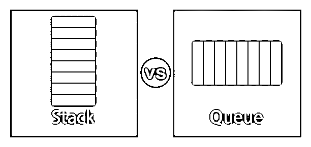

# 堆栈与队列

> 原文：<https://www.educba.com/stack-vs-queue/>

## 堆栈和队列的区别

堆栈和队列是最常用的线性数据结构之一。堆栈是一种抽象数据类型，通常在一种或多种编程语言中使用。堆栈是 LIFO(后进先出)数据结构，这意味着最后插入的元素将在堆栈中首先被访问。另一方面，队列也是一种抽象的数据类型和线性的数据结构，它是基于 FIFO(先进先出)的，这意味着首先插入的一个元素将在队列中首先被访问。在本文中，我们将详细讨论堆栈和队列之间的主要区别。

### 堆栈和队列之间的直接比较(信息图表)

以下是堆栈与队列之间的 11 大区别:

<small>网页开发、编程语言、软件测试&其他</small>

### 堆栈和队列的主要区别

以下是堆栈和队列之间的主要区别:

*   堆栈是一种线性数据结构，其中元素仅从称为 top 的一端插入和删除，并且基于 LIFO(后进先出)原则，这意味着最后插入的元素将首先被删除。另一方面，队列也是一种线性数据结构，其中元素从称为后端的一端插入，从称为前端的另一端删除。与堆栈不同，队列基于 FIFO(先进先出)原则，这意味着先插入的元素先被移除。
*   栈中的插入操作称为压入，而队列中的插入操作称为入队。
*   栈中的删除操作称为出栈，而队列中的删除操作称为出列。
*   在堆栈的情况下，只维护一个指针，而在队列中，我们需要两个指针。
*   堆栈数据结构是递归数据结构，用于解决基于递归的问题，而队列是顺序数据结构，用于解决涉及顺序处理的问题。
*   堆栈可用于解决基于递归的二叉树的前序、后序和有序遍历等问题，而队列可用于解决涉及底层数据顺序处理的生产者-消费者问题等问题。
*   堆栈数据结构可用于解决诸如反转字符串之类的问题，而队列可用于实现确保线程安全的阻塞队列。
*   栈被视为垂直的线性集合，而队列可以被视为元素的水平线性集合。
*   一叠叠放在一起的盘子是一个真实世界的例子，而排队支付电费的人是一个真实世界的例子。

### 堆栈与队列对照表

下面是一个比较表，显示了堆栈和队列之间的相似之处:

| **堆栈** | **队列** |
| 栈是一种抽象数据类型和线性数据结构。 | 队列也是一种抽象数据类型和线性数据结构。 |
| 堆栈是在数组或链表等基本数据结构之上实现的。 | 队列也是在数组或链表等基本数据结构之上实现的。 |
| 堆栈是一种线性数据结构，其中元素仅从称为 top 的一端插入和删除，并且基于 LIFO(后进先出)原则。 | 队列是一种线性数据结构，其中元素从称为后端的一端插入，从称为前端的另一端删除，并且基于 FIFO(先进先出)原则。 |
| 元素的插入和删除只发生在堆栈的一端。 | 元素的插入和删除是从队列的不同端执行的。 |
| 栈中的插入操作叫做压入。 | 队列中的插入操作称为入队。 |
| 栈的删除操作叫做弹出。 | 队列中的删除操作称为出列。 |
| 在堆栈数据结构中只维护一个指针，它指向堆栈的顶部元素。 | 队列数据结构需要维护两个指针，一个指向后端，一个指向前端。 |
| 堆栈数据结构是一种递归数据结构，用于解决基于递归的问题。 | 队列是一种顺序数据结构，用于解决涉及顺序处理的问题。 |
| 该堆栈可用于解决二叉树的前序、后序和有序遍历等问题。 | 生产者/消费者问题通过使用队列作为底层数据结构来解决。 |
| 书库可以被认为是一个垂直的线性集合。 | 队列可以被认为是一个水平的线性集合。 |
| 一个叠一个放置的盘子的集合是堆叠的真实世界的例子。 | 人们排队交电费就是现实世界中排队的一个例子。 |

### 结论

上述栈和队列都是非原语抽象数据结构，它们被定义为按顺序组织但基于不同操作原理的元素的集合。堆栈和队列都是非常重要的数据结构，因为它们都可以在不同的条件下有效地使用。

### 推荐文章

这是堆栈和队列的指南。在这里，我们讨论信息图和比较表的主要区别。您也可以看看以下文章，了解更多信息–

1.  [兔子队对 SQS 队](https://www.educba.com/rabbitmq-vs-sqs/)
2.  [BFS 与 DFS](https://www.educba.com/bfs-vs-dfs/) 的比较
3.  [堆栈与堆内存](https://www.educba.com/stack-vs-heap-memory/)
4.  [Java 堆 vs 栈](https://www.educba.com/java-heap-vs-stack/)

