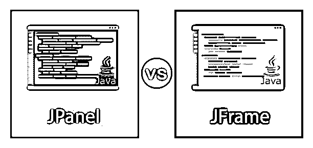

# JPanel vs JFrame

> 原文：<https://www.educba.com/jpanel-vs-jframe/>

## JPanel 和 JFrame 的区别

JPanel vs JFrame 都是 java 中常用的类；JPanel 可以被认为是一个通用容器，它用于需要将不同组件组合在一起的复杂或更大的功能的情况；另一方面，JFrame 通常用于托管窗口中使用的简单元素，如边框、标题栏、控件、事件处理程序等。

JPanel 是一个简单的容器类，它的父类是一个 JComponent 类，它提供了足够的空间来容纳任何其他组件。在 JPanel 中，我们可以在一个面板中容纳许多操作。JPanel 是 JComponent 的子类，JComponent 是容器的子级；因此，JPanel 也被认为是一个容器。JPanel 使用了许多方法，这些方法是从其父类继承而来的。一些操作示例包括图像观察器、可访问性和对齐。JPanel 允许我们将标签、复选框、按钮、字段、图像和其他功能放入其中。总而言之，JPanel 是一个你可以放置视觉和控件的地方。现在，要在我们的 java 源代码中使用一个 JPanel，我们需要通过调用它的构造函数 JPanel()来创建一个 JPanel 的对象；调用此构造函数后，将创建一个空白面板。我们可以通过调用 JPanel 类中合适的方法来改变面板的颜色。可以使用布局管理器来进一步定制 JPanel。布局管理器的一些例子包括网格布局、边框布局、流程布局等。JPanel 可以被认为是一个将不同组件组合在一起的通用类。在布局管理器的帮助下，我们可以控制 JPanel 中组件的对齐、大小和位置。为了提供颜色定制，可以使用 setColor (obj_color)、setForeGround (obj_color)和 setBackGround (obj_color)等方法。

<small>网页开发、编程语言、软件测试&其他</small>

**JFrame** : JFrame 在 javax.swing 包中可用，是一个父级为 java.awt.Frame 类的容器。JFrame 通常作为一个窗口，在这里添加按钮、文本字段和标签等重要组件。JFrame 基本上分为两个不同的子部分，即内容窗格和菜单栏。JFrame 基本上是一个用于独立应用程序的窗口，例如警告窗口或通知窗口，通常在屏幕上弹出。JFrame 利用了一个 windows 监听器，每当您在一个窗口上执行不同的操作时，这个监听器就会开始执行。另一个监听器叫做鼠标监听器，用来让你的框架按照鼠标动作。JFrame 可以有多个内部框架，但是它们完全依赖于父框架。

### JPanel 与 JFrame 的面对面比较(信息图)

以下是 JPanel 与 JFrame 的 5 大对比 **:**

### JPanel 和 JFrame 的主要区别

让我们从以下几点来讨论 JPanel 和 JFrame 之间的一些关键差异:

*   标题栏出现在 JFrame 中；另一方面，JPanel 不包含标题栏。
*   JFrame 继承 java.awt.Frame 类，而 JComponent 类是 JPanel 的父类。
*   JFrame 通常用作托管独立应用程序的窗口，如警告窗口或通知窗口，而 JPanel 类则用作托管组件的容器。
*   在 JPanel 的情况下，一个窗格可以容纳多个操作，而 JFrame 有不同的内部框架用于执行不同的目的，其中所有内部框架都完全依赖于父框架。
*   JFrame 是一个重量级容器，用作顶层窗口，而 JPanel 是一个轻量级容器，通常用于组织图形用户界面组件。
*   jpanel 被添加到 JFrame 之上，而图形用户界面组件被添加到一个或多个 jpanel 上。

### Jpanel 与 JFrame 的比较表

下表总结了 Jpanel 与 JFrame **:** 之间的比较

| **参数** | **JPanel** | **JFrame** |
| **标题栏** | JPanel 中没有标题栏。 | 标题栏出现在 JFrame 中。 |
| **父** | JPanel 的父类是 JComponent。 | JFrame 继承 java.awt.Frame 类。 |
| **申报** | public class JFrame扩展框架

实现 WindowConstants、Accessible、RootPaneContainer

 | 公共类 JPanel 扩展 JComponent 实现可访问的 |
| **功能** | JPanel 类作为一个容器来承载组件。 | JFrame 通常用作托管独立应用程序的窗口，就像警告窗口或通知窗口一样。 |
| **运营支持** | JFrame 有不同的内部框架，用于执行不同的目的。 | 在 JPanel 的情况下，一个窗格可以包含多个操作。 |
| **重量** | JPanel 一个轻量级容器，通常用于组织图形用户界面组件。 | JFrame 是一个重量级容器，用作顶层窗口。 |
| **如何使用** | 图形用户界面组件被添加到一个或多个 JPanels 上。 | JPanels 被添加到 JFrame 的顶部。 |

### 结论

上面的文章详细介绍了 Java Swing 包的两个重要组件。JFrame 和 JPanel 都很重要，因为没有这些顶级容器，swing GUI 就无法存在。JFrame 和 JPanel 都提供了不同的方法来执行不同的 GUI 相关功能。

### 推荐文章

这是 JPanel vs JFrame 的指南。在这里，我们讨论 JPanel 和 JFrame 的主要区别，信息图和比较表的重要组成部分。您也可以看看以下文章，了解更多信息–

1.  [Java 中的 JPanel](https://www.educba.com/jpanel-in-java/)
2.  jslider
3.  [Java 中的 JFrame](https://www.educba.com/jframe-in-java/)
4.  [时间节点](https://www.educba.com/jdesktoppane/)

