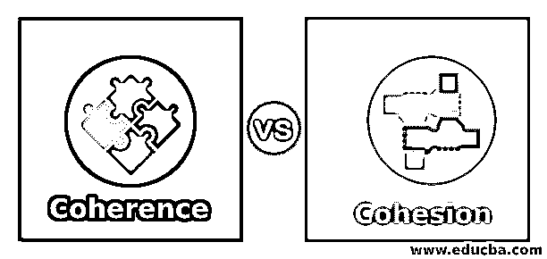

# 连贯与衔接

> 原文：<https://www.educba.com/coherence-vs-cohesion/>

## 连贯与衔接的区别

下面的文章提供了一个关于连贯和衔接的概要。每当我们写文档、文章、博客、描述、小册子或广告时，有必要确保内容是可理解的，并且书面材料流是完整的。当你从一个句子转换到另一个句子时，如何通过由逻辑转换组成的书面句子传达你的想法是另一个关键点。衔接和连贯是写作时要考虑的两个重要因素，也是语篇分析和篇章语言学要考虑的书面材料的属性。

凝聚力这个词来源于 cohere 这个词，意思是“粘在一起”。因此，在构建句子和短语时，衔接是你如何在构建句子时将你的想法和观点集中在一起，而连贯是衔接的超集，它包括连贯的句子以及其他属性，如内容的一致性和可理解性，以及如何在表达你的想法和从一个想法过渡到另一个想法时使用逻辑连接和相关的句子。

<small>网页开发、编程语言、软件测试&其他</small>

### 连贯性和凝聚力的直接对比(信息图)

以下是连贯性和凝聚力之间的 6 大区别:

### 连贯与衔接的主要区别

让我们讨论一些主要的关键差异:

*   让我们借助一个建筑物的比喻来看一看。建筑代表连贯性，而砖块代表凝聚力。砖块内部很坚固，因为它们的内容粘在一起。句子和段落也是如此，它们在语法上是正确的，并且代表了某种思想。但是，当这些句子和段落被放在一起形成我们的写作时，连贯性是在一些参数的帮助下确定的，如衔接成分的组织和思想的联系以及内容作为一个整体的可理解性。在我们上面的例子中，当砖块(内聚对象)被组织在一起时，那么只有建筑物(连贯性)被构建。
*   衔接只关注句子的语法和词汇结构，而连贯则关注语义。内聚的内容不需要总是连贯的。但是连贯的内容总是有凝聚力的，因为它是将有凝聚力的句子安排在一起，以构成一篇有意义和可理解的文章。
*   再举一个例子，把一些令人困惑的碎片连接起来，形成一幅特定的图画，就可以理解了。即使零件的形状和尺寸完全吻合，也不能断定图片是正确的。恰当的摆放和安排只会保证画面的形成。
*   重复的词/想法、参考词、过渡信号、替换和省略是用来实现衔接的一些技巧，而主题句、论文陈述、总结是用来实现连贯的技巧。使用内容提纲可以提高文章的连贯性，提纲可以在写文章之前写，甚至可以在写完之后写，让我们理解文章中的思想和概念的流动以及它们之间的关系。
*   同行评审也有助于增强一致性。你可以向你的同事征求对你的内容的反馈，看看他们是否能理解你试图通过你的内容传达的内容。

### 连贯与衔接对照表

我们来讨论一下最上面的对比:

| **连贯性** | **凝聚力** |
| 连贯主要处理句子的逻辑和适当的组织，以形成有意义和可理解的内容。 | 衔接更侧重于词汇句法和造句语法。 |
| 连贯性更多的是在作品的收集部分中的一种模式。 | 内聚就是将单个的部分收集在一起，然后粘在一起进行表示。 |
| 连贯性是由最终用户或读者决定的属性，它决定了内容是否有意义、可理解和有用。 | 衔接是作者的属性，它是通过使用不同的技巧来实现的，如重复的词语/想法、参考词、过渡信号、替换等。 |
| 一致性不是一个可测量的属性，也很难实现。 | 衔接是一种可测量的属性，可以通过检查词汇句法和语法规则来测量。 |
| 它是抽象的，因为它涉及的是思想。 | 当它处理实际的书面内容时，它是可观察的。 |
| 连贯性是一种质量属性。 | 内聚力是一种数量属性。 |

### 结论

衔接和连贯是语篇分析和语篇语言学中用来确定文章或任何书面内容质量的两个属性。衔接意味着把不同的句子、短语和段落粘在一起。衔接完全掌握在作者手中，可以通过使用不同的技巧来提高。连贯性是由读者决定的属性，它告诉读者文章的可理解性和思想是否被恰当地传达给读者。它决定了内容的质量。衔接是连贯的一个子集。因此，无论何时达到衔接，我们都不能说是否达到了连贯，但如果达到了连贯，那么内容也肯定是连贯的。

### 推荐文章

这是一个关于连贯性和内聚性的指南。在这里，我们用信息图和比较表来讨论连贯性和内聚性的主要区别。您也可以看看以下文章，了解更多信息–

1.  [Java vs C#](https://www.educba.com/java-vs-c-sharp/)
2.  [静态与动态网页](https://www.educba.com/static-vs-dynamic-web-page/)
3.  [C# vs JavaScript](https://www.educba.com/c-sharp-vs-javascript/)
4.  [Java vs .Net](https://www.educba.com/java-vs-dot-net/)

