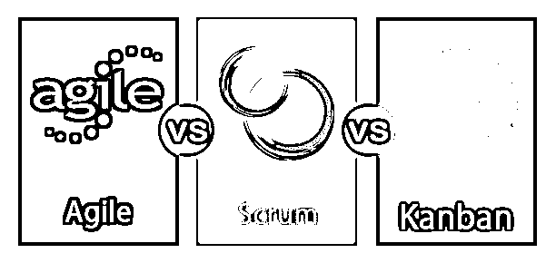

# 敏捷 vs Scrum vs 看板

> 原文：<https://www.educba.com/agile-vs-scrum-vs-kanban/>

## 敏捷、Scrum 和看板的区别

在开发任何软件项目的过程中，项目管理是关键，在这些领域中，许多管理工具已经出现。敏捷、scrum 和看板是被许多团队广泛采用的项目管理工具的几个例子。在本文中，我们将集中讨论这三个流行的术语，它们以这样或那样的方式与项目管理有着广泛的联系。敏捷是描述项目管理的一种更广泛的方法，它将较大的复杂项目分解成易于管理的较小任务，最终满足复杂的需求。scrum 和看板都是敏捷保护伞下独立的项目管理方法。

<small>网页开发、编程语言、软件测试&其他</small>

### 敏捷、Scrum 和看板的面对面比较(信息图)

以下是敏捷、Scrum 和看板的 6 大对比 **:**

### 敏捷、Scrum 和看板的主要区别

让我们从以下几点来讨论敏捷、Scrum 和看板之间的一些关键区别:

*   敏捷是一种项目处理方法，遵循软件开发生命周期 SDLC 中开发和测试工作的持续迭代。敏捷将复杂的系统分解成更小的构建或迭代。
*   Scrum 是一个敏捷的过程，它确保任务以最大的专注度交付。这确保了在最短的时间内满足所有的商业价值。Scrum 确保一个主要的任务被分解，并通过所有的 sprint 网络得到正确的处理，比如计划，回顾 backlog 精化等等。
*   看板是一种更好的可视化工具，它的主要目的是获得最大的效率。然而，类似于 scrum，看板也鼓励将需求分成可管理的部分。
*   Scrum 非常注重时间表，它期望所有的 sprint 任务在指定的时间框架内完成，这个时间框架可能是 2-4 周。每个任务都有一个基于复杂程度和所有团队成员的指示。
*   看板不太依赖时间盒或迭代。看板 thu 是一种迭代的方法，持续改进是一种进化的方式，工作是完成的。看板的主要焦点是实现最大效率。
*   Scrum 遵循两到四周的 sprint，一旦 sprint 结束，就清理掉板子，计划下一个 sprint，板子上写满了要在即将到来的 sprint 中采取的故事。
*   与看板不同，在迭代任务完成后，不需要重置看板。相反，董事会将继续工作，直到项目完成。这确保了员工总有一项任务需要完成。

### 敏捷、Scrum 和看板的对比表

下表总结了敏捷与 Scrum 与看板的比较 **:**

| **功能** | **敏捷** | **Scrum** | **中的“T1”** |
| **开发和管理** | 敏捷是一种基于迭代和增量模型的开发方法。 | Scrum 是敏捷实现中的一种，在这种实现中，增量开发或测试任务在指定的时间框架内交付，这个时间框架可能是两到四周。 | 看板也是敏捷实现的一种，在这种实现中，工作的组织方式可以达到最高的效率。同样，在这里，工作或需求被分成可管理的块。 |
| **炒锅板** | 工作板是以块或任务显示需求的地方，用于管理和更好的跟踪。例如，吉拉软件被用在敏捷中，它为更好的跟踪提供了平台。 | A dedicated scrum board is present where some stories are form requirements that need to handled are logged. Some will be a backlog, and some will work in the Active sprint.

该板有助于更好地安排任务的优先级并监控正在进行的工作。在回顾会议之后，当前的工作板被清理，并为下一个 sprint 中需要处理的下一个项目或需求做准备。

 | 此板用于管理和包含所有进行中的工作任务。板上还有看板积压。在看板板上，不是计划迭代，而是确保板上有连续的任务供员工处理。在看板上，每一栏都有标签，以记录工作流程。这也确保了每列允许的最大故事数。与需要清除的 scrum 板不同，看板板在项目完成之前不需要重置。 |
| **调度** | 在敏捷中，需求是基于你所遵循的方法安排的，不管是 scrum 还是看板。 | 基于 Scrum 的方法非常强调进度。它试图确保提交给 sprint 的所有工作都在 sprint 结束时完成。团队记录并有效处理任何障碍。Scrum 迭代过程确保我们对工作有一个好的估计，并且依赖于此，交付被安排。 | 看板对其工作没有任何特定的时间限制。更加强调效率，它确保在任何时间框架内都有可供员工处理的任务。看板也是迭代的，以进化的方式持续改进。 |
| **角色和职责** | 选择项目管理处理敏捷过程开发需求，可以是 scrum 或看板。 | 在 scrum 方法论中，有三个分工负责的角色。我们有一个 scrum master 来主持会议，并得到团队成员要求的所有东西，产品所有者是团队正在做的需求的主要利益相关者，最后，有一个由开发和测试成员组成的 scrum 团队处理时间表上的所有实现。 | 在看板板上，没有定义一组预定义的角色。可以有一个项目经理或主管来协调这些任务。从理论上讲，角色是基于任务的需求而演变的，因此效率对于看板来说是非常重要的。看板团队不是跨职能的，在这里，一个专家团队和另一个可以处理其他一般任务的独立团队可以处理同一看板需求的不同方面。 |

### 结论

scrum 和看板都被认为是 SDLC 敏捷过程中的强大工具。这两个工具都通过高质量的输出极大地改善了项目管理。选项的选择完全取决于需求和组织。如果你认为质量和更好的安排是我所需要的，你可以选择 scrum，如果主要考虑的是质量和效率，你可以选择看板。

### 推荐文章

这是敏捷 vs Scrum vs 看板的指南。在这里，我们用信息图和比较表来讨论敏捷与 Scrum 与看板的主要区别。您也可以看看以下文章，了解更多信息–

1.  [敏捷 vs 瀑布](https://www.educba.com/agile-vs-waterfall/)
2.  [敏捷 vs 瀑布项目管理](https://www.educba.com/agile-vs-waterfall-project-management/)
3.  [敏捷 vs 看板](https://www.educba.com/agile-vs-kanban/)
4.  [敏捷 vs Scrum vs 瀑布](https://www.educba.com/agile-vs-scrum-vs-waterfall/)

