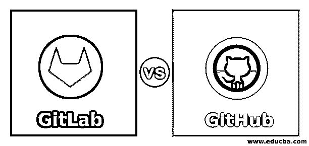

# GitLab vs GitHub

> 原文：<https://www.educba.com/gitlab-vs-github/>

## GitLab 和 GitHub 的区别

下面这篇文章提供了 GitLab vs GitHub 的概要。它允许用户存储代码，公开地或在一个受限的组内共享它们，以及保持版本控制，以便运行时发生任何事情；人们可以撤销更改并返回到代码的运行版本。在这里我们将看到两个最广泛使用的版本控制库管理服务 GitLab 和 GitHub。

你知道“Git”本身有含义吗？Git 是指帮助跟踪对特定文件所做的更改的程序。一旦我们安装了 git，就会初始化一个项目来创建一个 Git 存储库。这个“存储库”是帮助跟踪的元素。这两个软件 GitHub 和 GitLab，顾名思义，都是基于 web 的 git 库。接下来，我们还应该了解两种版本控制模型。其中之一是客户机-服务器；开发人员有一个带有单点故障的单一存储库，另一个是分布式的，其中每个开发人员处理他们自己的本地版本的存储库，并且单独共享更改，同时保留源代码的主副本。

<small>网页开发、编程语言、软件测试&其他</small>

在当今的软件开发生命周期中，我们对基于 git 的存储库所起的作用感激不尽，因为它试图将自己置于一个复杂的环境中，有许多协作团队成员，频繁地修改代码，以及团队成员之间共享技术需求。这项服务有一些主要优势。第一个是关于简化软件开发的过程。在一个团队处理多个项目的情况下，所有的项目都集中到这个地方，这是基于 Git 的存储库的第二个好处。另一个主要优点是有一个清晰的变更历史，这样任何需要撤销的与特性相关的变更只需点击一个按钮。在许多相似之处中，如跟踪、集成策略、描述模板、合并批准流程图等。

### GitLab 和 GitHub 的面对面比较(信息图)

以下是 GitLab 和 GitHub 的 7 大区别:

### GitLab 和 GitHub 的主要区别

让我们讨论一下 GitLab 和 GitHub 之间的一些主要区别:

*   更多地了解这两者的区别，在需要从两者中做出选择的时候，会更容易选择正确的一个，尽管要小心，两者在各自的领域都很棒！
*   第一个也是最显著的区别是持续集成和交付(CI/D)的特性。对于 GitLab，我们有一个免费的内置 CI/D 功能，它可以按预期完成工作，而 GitHub 依赖于第三方集成工具，如 Jenkins 和其他人来执行 CI/D 任务。这是 GitLab 与 GitHub 不相上下的最显著的特点之一，尽管后者的发布早于前者。从时间的角度来看，CI 的工作方式对开发团队帮助很大。
*   从认证的角度来看，GitHub 只提供对存储库的读写权限，而 GitLab 则更上一层楼，在这里人们可以根据组织中的角色授予权限。
*   第三大区别是数据的导入和导出。有了 GitLab，我们可以通过详细的文档处理如何从外部供应商导入或导出数据。GitLab 可以导入或导出更多的资源。但这还不是结束；GitHub 提供了一个名为 GitHub Importer 的本地工具来导入数据。简而言之，当涉及到可以导入或导出的源代码时，我们可以说 GitHub 有点保守。举个例子，GitLab 允许从 wikis、webhooks 等导出。
*   接下来是关于一个部署平台，GitHub 缺乏这个平台，它需要开发者使用第三方解决方案来部署应用程序。相反，GitLab 在所有部署活动中都利用了 Kubernetes。
*   下一个区别是关于报告的问题或 bug 权重分配，这有助于项目经理使用敏捷实践进行跟踪和管理，GitHub 目前还没有这样做。
*   现在，随着新一轮“分析”热潮的到来，GitLab 也有了用于按时执行分析、计划和监控活动的仪表板。GitLab 遵循的一个重要原则是每个月的 22 号和 1 号发布一个新的特性。
*   需要记住的一点是，GitHub 侧重于高可用性和基础设施性能，而 GitLab 侧重于在一个罩下拥有尽可能多的功能，以拥有一个用于 DevOps 的集成平台！

### GitLab 与 GitHub 对比表

我们来讨论一下 GitLab 和 GitHub 的顶级对比:

| 型 | **GitLab** | **GitHub** |
| **CI/D(持续集成和交付)** | GitLab 为其用户提供了内置的 CI/D 特性。 | 用户不得不依赖第三方应用。 |
| **认证** | 身份验证可以在人员的角色级别进行，其中不需要为每个存储库申请访问权限。 | 身份验证授权是在存储库级别，对于每个存储库，访问可能是不同的。 |
| **数据导入/导出** | GitLab 中有很多导入和导出数据的选项。 | GitHub 在导入或导出数据方面有点保留，尽管 GitHub Importer 作为一个独立的工具存在。 |
| **部署平台** | Kubernetes 作为内置部署平台的一部分。 | 用户不得不依赖第三方平台。 |
| **报告的错误/问题** | 根据敏捷方法，从项目的角度来看，人们可以分配权重来帮助轻松跟踪。 | 不存在这样的方法。 |
| **分析** | 仪表板执行分析有关时间，计划和活动相关的监测是可能的。 | 没有仪表板。 |
| **意图** | 高可用性和以基础设施性能为中心的产品。 | 一个屋檐下的许多功能，希望成为一个完整和集中的 DevOps。 |

### 结论

在本文中，我们浏览了 GitHub 和 Gitlab 之间的区别，并牢记这一点；我们将能够在选择什么最适合我们的用例以及什么最适合我们的用例上做出合理的决定！这里是我们的两分钱，如果你正在寻找一个有众多开发人员的大型项目，GitHub 将是你的首选，但如果该项目本质上是开源的，并且你不想承担 Ci/D 的头痛，那么显而易见的选择是 GitLab。

### 推荐文章

这是 GitLab vs GitHub 的指南。这里我们讨论信息图和比较表的主要区别。您也可以看看以下文章，了解更多信息–

1.  [Zabbix vs Nagios](https://www.educba.com/zabbix-vs-nagios/)
2.  [GitLab vs 吉拉](https://www.educba.com/gitlab-vs-jira/)
3.  [Gitlab CI vs Jenkins](https://www.educba.com/gitlab-ci-vs-jenkins/)
4.  github vs SVN

