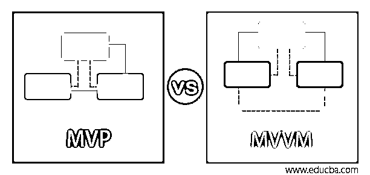

# MVP vs MVVM

> 原文：<https://www.educba.com/mvp-vs-mvvm/>

## MVP 和 MVVM 的区别

模型视图呈现器(MVP)架构是从模型视图控制器表单派生出来的，它有助于根据用户需求构建界面。呈现者充当中间人的角色，以可呈现的格式向用户呈现逻辑。这是开发人员熟知的设计模式。模型-视图-视图-模型(MVVM)模式有助于在架构模式中开发图形用户界面。这可以通过标记语言或 GUI 代码来完成。该层可以是软件的业务逻辑或后端逻辑。它主要用于显示 GUI 开发的分离。

### MVP 与 MVVM 的对决(信息图)

以下是 MVP 和 MVVM 之间的 11 大区别:

<small>网页开发、编程语言、软件测试&其他</small>

### MVP 和 MVVM 的主要区别

以下是 MVP 和 MVVM 的主要区别:

*   从数据状态中检索和操作数据，数据状态存在于模型层中。这些数据被传输到表示层。在 MVP 中没有与视图状态的交互。MVVM 有一个位于业务逻辑本身的模型，数据存储在存储库中。从视图模型接收请求，并相应地定位数据。
*   MVP 中的视图模型有用户界面、活动和数据片段，它与演示者交互。MVVM 的视图模型根本没有业务逻辑，只有用户界面。
*   业务逻辑所在的 MVVM 有一个视图模型。这有助于在视图和业务逻辑之间建立一座桥梁，并且善于测试和耦合。UI 必须在两者之间更新。然而，这个视图模型在 MVP 中并不存在，业务逻辑直接存在于视图中。
*   来自模型的数据通过一个表示器来表示，它控制 MVP 架构中应用程序的行为。它指导视图层并管理模型和视图之间的交互。数据也会保存回模型中。MVVM 中不存在 presenter 层，观察对象是在每个 UI 组件中创建的。
*   MVP 中的视图并不重要，或者与自身紧密耦合，因此用户很容易忽略视图层。视图图层非常重要，因为它在 MVVM 创建了视图和视图的桥梁模型，因此不可能在 MVVM 刷走视图图层。
*   MVP 中的视图层和表示层是可重用的，因此很容易维护这种架构。此外，它可以在用标记语言或其他编码语言编写的可读代码的帮助下进行维护。在 MVVM 中，视图和模型之间没有交互，因此代码是由单元运行的。这有助于在 MVVM 进行单元测试。
*   整个单元可以在 MVP 中进行集成测试，而在 MVVM 只能进行单元测试。这是因为代码在 MVP 中很容易维护，而在 MVVM 中却不是。
*   代码非常庞大，在 MVVM 不容易管理。这在进行测试和创建层间交互时产生了问题。但是在 MVP 中，代码很小，很容易管理。

### MVP vs MVVM 对比表

让我们来讨论一下 MVP 和 MVVM 的顶级对比:

| **MVP** | **MVVM** |
| 在 MVP 中不需要 Observables，因为在体系结构中有一个表示层来显示开发人员的用户界面。 | 由于演示者的缺席，每个用户界面组件都需要可观察性。 |
| 视图和演示者之间存在紧密的耦合，视图的变化会影响演示者的用户界面。 | 视图和视图模型不是紧密耦合的，这有助于各层在每一层中独立工作并进行单元测试。 |
| 由于用户界面用得比较多，很多界面使得架构很重。 | 没有用户界面，因此使用的界面较少。与 MVP 相比，这个架构是轻量级的。 |
| 业务逻辑和 UI 是分离的，因此测试在分离层和集成层上很容易完成。 | 业务逻辑和 UI 没有分开，这使得测试很困难。在这种情况下，只能进行单元测试。 |
| 对于 MVP 应用程序来说，调试很容易，使用该架构进行编译不会花费太多时间。 | 由于复杂的分层模式和架构风格，调试在 MVVM 并不容易。 |
| 层是分离的，因此片段和活动类被确保以它们自己的方式工作。 | 这些层没有分离，因此不能保证这些类产生用户期望的输出。 |
| 在 MVP 体系结构中，新版本不容易完成，而且在体系结构中，维护和可用性也不总是能得到保证。 | 新版本可以很容易地在架构中完成，并且层的维护也非常可观。 |
| 逻辑和应用程序位于模型层中的业务逻辑中。在这种情况下，无法进行核心测试。 | 逻辑和应用位于 MVVM 架构代码中，这有助于在核心层进行测试。 |
| UI 和自动化会在测试阶段制造麻烦，最好在进行核心逻辑测试之前进行测试。 | 用户界面不进入这些层的阶段，这有助于对代码本身进行维护。 |
| 在架构中有各种方法可用，因为接口只覆盖了交互的一小部分。 | 不同的方法不可用，因为没有接口来分割架构的交互。 |
| MVP 架构不太适合 android 应用程序或软件，并且在生命周期的每个阶段都有活动。 | MVVM 架构与 android 应用程序配合良好，并使用系统中的新补丁更新软件。这有助于软件保持最新。 |

MVP 使用不同的库来帮助使用该架构的用户。MVVM 遵循一种模式，预计将发展成为许多人使用的通用工具。用户在创建应用程序时不需要使用模式。可以在应用程序中使用两种体系结构来使它更有用。

### 推荐文章

这是 MVP 对 MVVM 的比赛指南。在这里，我们还用信息图表和对比表来讨论 MVP 和 MVVM 的主要区别。您也可以阅读以下文章来了解更多信息—

1.  [MVC 视图数据](https://www.educba.com/mvc-viewdata/)
2.  [敏捷 MVP](https://www.educba.com/agile-mvp/)
3.  [MVC vs MVP](https://www.educba.com/mvc-vs-mvp/)
4.  [MVC vs MVP vs MVVM](https://www.educba.com/mvc-vs-mvp-vs-mvvm/)

