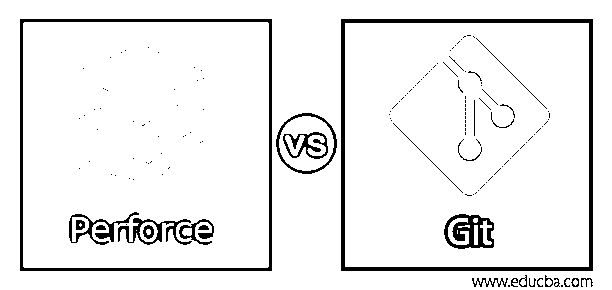

# 穿孔 vs Git

> 原文：<https://www.educba.com/perforce-vs-git/>

## Perforce 和 Git 的区别

这里我们讨论 Perforce 和 Git 的区别。

Git 是一个源代码控制管理工具，这是一个免费的开源代码版本控制工具，旨在基于性能和灵活性来管理小型或大型项目中的代码。Git 有助于使用公司标准，这是团队功能开发中的一个重要需求。Git 更容易学习，并且很容易合并回购中构建的代码。Git 能够在团队中轻松地克隆和共享代码。

<small>网页开发、编程语言、软件测试&其他</small>

**Git 的特性:**

*   **性能** : Git 有很多有利的特性，可以提交源代码，在 repo 中合并代码，与现有版本的代码进行比较，优化其性能。
*   **安全性**:SHA1 算法用于保护代码。它还保护已经推送到 Git 的代码的文件、版本和提交。它还跟踪更改历史中的恶意或意外更改。
*   灵活性:Git 支持不同种类的非线性工作流，在小型和大型开发公司中都很有效，并且与当前系统兼容。
*   **开源:** Git 是一个免费的开源代码版本控制工具，旨在基于性能和灵活性管理小型或大型项目中的代码。

**Perforce:** Perforce 是一个企业版本管理工具，用户连接到一个集中式文件存储库，源代码在集中式存储库和用户的本地工作区之间共享。主 repo 位于一个中央服务器上，您构建的源代码将位于系统的本地工作区中。开发人员可以将几个或整个文件放在源代码管理空间的工作区中。当您尝试执行版本控制任务时，代码会保留在您的本地，并且 Perforce 会根据系统的要求进行读取或写入。

### Perforce 与 Git 的面对面比较(信息图表)

以下是 Perforce 和 Git 之间的 6 大区别:

### Perforce 和 Git 的主要区别

以下是 Perforce 和 Git 之间的主要区别:

*   **集中式 vs 分布式:**Git 的用户可以将带有完整版本历史的源代码下载到他们的本地计算机上，并可以在本地进行修改。因此，Git 是一个分布式模型，可以帮助开发人员轻松地更改源代码、提交、推送和合并。Perforce 是一个集中式模型，它帮助开发人员重用代码并轻松合并它们。集中式模型帮助开发人员将代码提交到中央服务器。
*   **性能**:在 Git 中，本地提交和合并比 perforce 快，但是源代码的拉和推在 Git 中较慢，而在 Perforce 中较快。这表明 Git 的性能和生产率比 Perforce 更高。
*   **管理文件:**Git 中较小的团队使用 Git LFS，但大多数大型团队在其存储库工具中使用大型二进制文件，这对于构建管道来说相当复杂。在 Perforce 中，工件和源代码存储在一个集中的存储库中，这有助于开发人员更简单地使用工作流。
*   **分支**:在 Git 中，当一个分支在本地被创建时，你可以合并或者改变历史。然而，当多个开发人员处理同一个文件时，当您试图推动源代码更改时，可能会在合并时导致冲突。当用户和回购数量增加时，Git 分支变得复杂。Perforce 分支是在层次级别上创建的。Helix Core 帮助开发人员了解正在进行的代码，并在合并时给出通知，以简化工作流程。
*   **速度:** Perforce 需要连接一个服务器，以便在 repo 中进行任何更改。当每个开发人员试图访问服务器以查看所做的更改时，会降低工作效率。与 Perforce 相比，Git 有助于在更短的时间内访问 repo 中的代码。Git 中的代码合并和构建要快得多，因为它是在本地完成的。
*   **协作:**作为一个存储库工具，Git 和 Perforce 都需要协作。在 Perforce 中，当您在团队之间共享文件时，接收团队必须手动分离他们正在项目中实现的更改。在 Git 中，它能够在团队中轻松地克隆和共享代码。
*   **成本:** Git 是一个完全免费的存储库管理工具，无论分支中有多少数据，都可以随时访问。而 Perforce 是一个收费的回购工具，随着团队规模的增加，收费也会增加。

### Perforce 与 Git 对照表

让我们讨论一下 Perforce 和 Git 之间的主要比较:

| **被迫** | **去** |
| Perforce 是一个收费回购工具，随着团队规模的增加，收费也会增加。 | Git 是一个完全免费的存储库管理工具，无论分支中有多少数据，都可以随时访问。 |
| 在 Perforce 中，当您在团队之间共享文件时，接收团队必须手动分离他们正在项目中实现的更改。 | Git 能够在团队中轻松地克隆和共享代码。 |
| Perforce 需要连接一台服务器才能在 repo 中进行任何更改。当每个开发人员试图访问服务器来查看所做的更改时，就会降低工作效率。 | 与 Perforce 相比，Git 有助于在更短的时间内访问 repo 中的代码。Git 中的代码合并和构建要快得多，因为它是在本地完成的。 |
| Perforce 分支是在层次级别上创建的。Helix Core 帮助开发人员了解正在进行的工作中有哪些代码，并在合并时给出通知以简化工作流程。 | 在 Git 中，当在本地创建一个分支时，您可以合并或改变历史变更。然而，当多个开发人员处理同一个文件时，当您试图推动源代码更改时，可能会在合并时导致冲突。当用户和回购数量增加时，Git 分支变得复杂。 |
| 在 Perforce 中，工件和源代码存储在一个集中的存储库中，这有助于开发人员更简单地使用工作流。 | Git 中较小的团队使用 Git LFS，但大多数大型团队在其存储库工具中使用大型二进制文件，这对于构建管道来说相当复杂。 |
| Perforce 是一个集中式模型，它帮助开发人员重用代码并轻松合并它们。集中式模型帮助开发人员将代码提交到中央服务器。 | Git 的用户可以将带有完整版本历史的源代码下载到他们的本地计算机上，并可以在本地进行修改。因此，Git 是一个分布式模型，可以帮助开发人员轻松地更改源代码、提交、推送和合并。 |

### 结论

在这个新技术的时代，一些公司正带着更大的团队进入市场，以扩大他们的市场。由于 Git 是不收费的，并且可以存储大量数据，Git 已经从 Perforce 获得了一个设备。在某些情况下，当团队规模很小，并且代码不依赖于其他团队时，使用 Perforce。因此，根据需求基础，Git 更适合大公司使用，也更灵活。

### 推荐文章

这是一个关于 Perforce 和 Git 的指南。在这里，我们还讨论了 Perforce 和 Git 在信息图和比较表方面的主要区别。您也可以看看以下文章，了解更多信息–

1.  [詹金斯 vs 哈德森](https://www.educba.com/jenkins-vs-hudson/)
2.  [Git 替代品](https://www.educba.com/git-alternatives/)
3.  [詹金斯 vs TeamCity](https://www.educba.com/jenkins-vs-teamcity/)
4.  [Apache Hive vs Apache Spark SQL](https://www.educba.com/apache-hive-vs-apache-spark-sql/)

