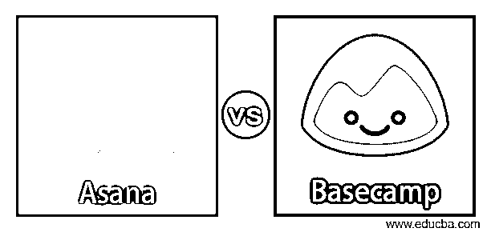

# Asana vs Basecamp

> 原文：<https://www.educba.com/asana-vs-basecamp/>

## Asana 和 Basecamp 的区别

使用 Asana、Basecamp、Trello 等工具中的软件可以成功地进行项目管理。这个软件可以根据团队的规模和需求来实现。Asana 适合小型企业，用于简单的任务管理、通信和包含在单个应用程序中的基于项目的工具。而 Basecamp 是在较小的团队或个人中实现的，他们有清晰的界面来处理他们的任务。本文讨论了体式和基础营在重要元素上的区别和比较。

### Asana 和 Basecamp 的面对面比较(信息图)

以下是体位法和大本营的 7 大对比

<small>网页开发、编程语言、软件测试&其他</small>

### Asana 和 Basecamp 的主要区别

Asana 和 Basecamp 的显著区别可能是它们的功能、价格、界面、集成、限制和优势将在下面讨论。

#### 1.特征

Asana 和 Basecamp 都提供了一个用户友好的界面，并且很容易访问。它们拥有大量有用的特性，这使得任务变得更加容易。两者的界面太相似了。Asana 提供无限的存储空间，而 Basecamp 可以存储巨大的文件。Basecamp 有许多桌面应用程序和有效的通信工具。Asana 提供了一个具有许多依赖管理和子任务的高级结构。它支持项目的详细规划，并且在业务中，它还将任务分配给相关员工，以偏好选择视图和工具。与 Basecamp 相比，Asana 提供了多种功能，这增加了难度。Asana 有一个传统的用户界面，而 Basecamp 有一个强大的 block 系统。它有三个控制台和窗格来显示用户的工作状态。

#### 2.客户

Asana 有一组有限的可靠客户，如 NASA、索尼和谷歌，以及大约 5 万名个人客户，现在最近的收入超过 15 亿美元。Basecamp 有大约 300 万注册账户的剩余客户。它有许多积极的客户，但不愿意吹嘘太高调的客户。它是用 Ruby on Rails 编写的。

#### 3.用户界面

Asana 有一个甘特时间表，以列表或日历格式或时间表显示整个任务，在项目名称下有标题和描述。用户界面提供了简单的导航，有助于更好地理解。它在项目规划时提供了多种选择。当谈到用户友好，Asana 赢得第一名。软件中的每个模块都有清晰的标签，并在它自己的模块中描述，如待办事项、文件、文件夹、时间表、清单、篝火论坛和面板。用户在 Basecamp 中给予高安全性并防止数据丢失。在 Basecamp 中，一些工具对用户来说很简单，其中一些重要的部分比较复杂，如账单、预算、报告和发票。basecamp 是一个协作软件，具有许多有效的项目管理软件的基本功能。

Basecamp 没有甘特图，也没有校准任何工作负载。它不以看板格式显示任何任务。它用于构建项目、待办事项列表、上传项目材料、讨论进度、安排任务。它不提供任何高级要求，但使功能更容易和简单。

#### 4.价格

Basecamp 有一个包含所有伟大定价价值的尺寸。Asana 有一个免费的廉价计划，但如果用户想使用所有的高级功能，那么他应该选择一些高级订阅。basecamp 的速率等于一个容纳十个人的团队。至少有五个企业帐户可以使用 Basecamp 的高级计划。最后，basecamp 为教育工作者提供了更好的价值和免费的服务。它也有免费试用选项。教育工作者将他们的兴趣延伸到大学、学校和指南的最佳云存储。当谈到价格时，basecamp 获得了最高排名，因为它为用户提供了最大限度的节省，并通过其免费试用坚定地努力支持不同的群体。

#### 5.集成工具

Asana 提供了管理项目不同方面的多种应用程序。它包括没有 Asana 显著特征的工具来补偿业务需求。少数集成包括 Dropbox、Microsoft Outlook、Adobe creative cloud、Slack、Everhour reporting、Google calendar、Mailchimp、Trello 和许多其他有效的应用程序。而 Basecamp 提供了不同的集成，封装了不同的集成工具，涵盖了所有的项目和用户需求。它包括了一些 Basecamp 没有提供的动作。一些集成工具是 Hubstaff、Ganttify、ScrumDo、Akita、Project Buddy、Everhour reporting、Zapier 和其他应用程序。

### Asana 与 Basecamp 对比表

下表总结了 Asana 和 Basecamp 的对比 **:**

| **属性** | **体式** | **基地营** |
| **特性** | 它可以用来确定优先级和截止日期。它可以通过电子邮件通知自动更新。它可以提供自定义视图和日历。它支持多个工作空间。 | 它提供了有效的项目组织以及与许多消息传递和通信服务的集成。它可以管理待办事项列表、文件、文档、议程、日历视图和通知。 |
| **移动应用** | 可以在 iOS 和 Android 中实现。 | 可以在 iOS 和 Android 中实现。 |
| **API** | 它有强大而可靠的 API 支持。 | 它有定制的 API 支持。 |
| **价格** | 15 名成员组成的团队可以免费试用。每月订阅费是 10 美元。可以根据企业定制。 | 十个项目收费 10 美元，100 个项目收费 100 美元。无限项目收费 150 美元。无限量优惠收费约 3000 美元。 |
| **支持** | 它有一个高级知识库、在线提交表单和许多常见问题。 | 它有许多常见问题、Twitter 支持、指南、教程和在线提交表格。 |
| **优势** | 它有多种功能的团队管理，可以很容易地同步到谷歌。它有一个简单的用户界面，内置了所有选项。 | 它可以很容易地配置和安装。它有多种视觉资产、甘特图、方便的技巧和快捷方式。它有很多集成和插件。 |
| **缺点** | 它没有离线功能，不支持任何图形和多方协议。单一加密的学习曲线很陡。 | 项目管理过于简单，没有提供任何跨团队协作。需要多种功能来添加任何集成工具，并且具有受限的包。 |

**结论:**与所有特性相比，Asana 是比 Basecamp 更好的项目管理工具。

### 推荐文章

这是一个关于 Asana 和 Basecamp 的主要区别的指南。在这里，我们用信息图和比较表来讨论 Asana 和 Basecamp 的主要区别。您也可以看看以下文章，了解更多信息–

1.  [IPS 工具| 7 大不同的 IPS 工具](https://www.educba.com/ips-tools/)
2.  [IDS 工具介绍|简要说明](https://www.educba.com/ids-tools/)
3.  [网络安全攻击的类型](https://www.educba.com/types-of-network-security-attacks/)
4.  [网络安全工具](https://www.educba.com/cyber-security-tools/)

