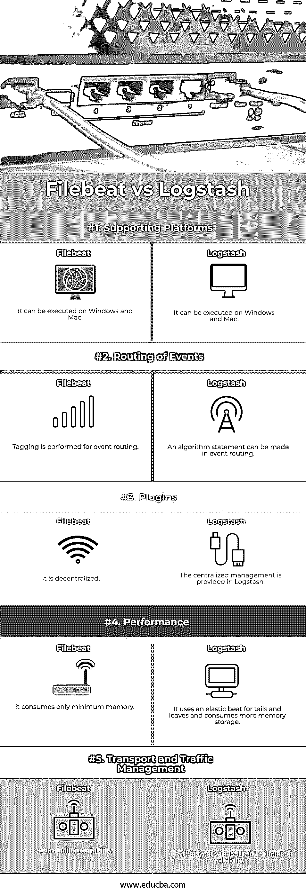

# 无礼无耻代言

> 原文：<https://www.educba.com/filebeat-vs-logstash/>

## Filebeat 和 Logstash 的区别

Filebeat 和 Logstash 为集中和转发日志信息提供了无关紧要的发送器。它通过提供一种非常简单的方式来管理和集中文件、文件夹和日志，从而支持维护简单的对象。换句话说，Logstash 被描述为收集、解析和扩充数据。Logstash 和 Filebeat 的重要区别在于它们的功能，而 Filebeat 消耗的资源更少。但是总的来说，Logstash 消耗各种输入，专门的 beats 用最少的 RAM 和 CPU 完成收集数据的工作。本文讨论了两者之间的主要区别和比较。

### Filebeat 与 Logstash 的面对面比较(信息图)

以下是 Filebeat 与 Logstash 的五大对比 **:**

<small>网页开发、编程语言、软件测试&其他</small>

### Filebeat 和 Logstash 的主要区别

下面讨论了它们的主要区别，如功能、优势、使用案例和限制。

#### 1.定义

老掉牙的说法非常适合 Logstash，因为它具有传统的功能。它有各种插件，编解码器，过滤器，输入和输出。消费的数据量可以是巨大的，并根据消费者的要求而丰富，而且还可以将数据分发到许多目的地。作为 beat 家族的重要成员，filebeat 是一个轻量级的托运人日志，它的诞生克服了 Logstash 的缺点。这是专门为无关紧要的日志托运人强行进入 Kafka，Elasticsearch 或 Logstash。

#### 2.应用和使用案例

它通常用于收集、解析和保存日志，以备将来作为日志管理系统的解决方案使用。灵活性和丰富性使 Logstash 成为原型化和解析复杂数据对象的可靠工具。如果用户有大型服务器，就必须在不需要更多缓冲的服务器上安装 Logstash。如果用户想要定制文件，应该手动完成，因为文件不能使自己成为缓冲区，因为它记得应该在哪里恢复。如果用户有小型服务器，安装 Logstash 是没有其他选择，因为它需要一个轻量级的日志船，迫使数据到一个或多个 Logstash 服务器的弹性搜索桶。如果用户希望转发日志记录项目，由于成本或性能的原因，必须更改日志发送器。假设用户希望 Elasticsearch 摄取解析和丰富，因为它假设摄取的功能或性能正好符合用户需求。它限制他们进入 Redis 或 Kafka 来运送其他 Logstash 或定制 Kafka 的消费者来运送和增强。它假设并选择适合性能和功能的托运人。也可以出货到 Logstash，依赖的是 buffer 而不是 Redis 或者 Kafka。它是容错的，因为刚性是柔性的。

#### 3.优点

Logstash 的关键点是它的灵活性，因为插件数量众多。它拥有广泛的社区支持，文档简洁，配置简单明了，适用于不同的用例。它为一个有价值的循环铺平了道路，用户可以获得执行任何过程的在线解决方案。Filebeat 是一个最小的二进制文件，没有其他依赖性，因为它只占用很少的资源，而且非常可靠。这很简单，因为只需要考虑几件事情，而且没有出错的可能。有许多旋钮需要考虑功能。它积极地搜索任何更新的文件来跟踪关闭的文件，并且在文件中没有任何改变。当它有一个启动选项时，Filebeat 会用模块进行更新，并有一个准确的日志类型。

#### 5.缺点

Logstash 最大的缺点是它的资源消耗，默认的存储大小是 1GB。虽然它的性能已经更新了几年，但与它的有效替代品相比，它的工作速度很慢。但是开发人员的团队找到了一些重要的基准来测试 rsyslog 和 file beat elastic search 的摄取节点。filebeat 的范围非常有限，因为如果出现任何问题，它都需要解决。假设用户希望在出现任何性能问题时使用 Logstash 的管道。因此，文件节拍的更新范围受到限制。它只将日志数据发送到 Elasticsearch 和 Logstash，现在可以将数据传输到 Redis 和 Kafka。它还可以执行一些过滤并丢弃事件，以将元信息附加到其中。

#### 6.表演

当 Logstash 的服务器需要与 Elasticsearch 进行比较时，如果有高流量部署，Logstash 就有点复杂。它通过维护简单的日志服务器，只消耗和配置较少的资源，简化了到多个中心日志存储盒的艰难过程。它支持 Logstash，前提是它具有已配置的磁盘缓冲区和内存缓存。而 filebeat，Apache 模块有一个点，它有一个默认选项来访问错误日志路径和配置日志类型。要解析的摄取节点可以配置、编辑和映射 Elasticsearch，以部署 Kibana 的仪表板来分析响应代码和时间等对象，从而计算休息时间。

### Filebeat 与 Logstash 的比较表

下表总结了 Filebeat 与 Logstash **:** 之间的比较

| **属性** | **Filebeat** | **日志存储** |
| **支撑平台** | 可以在 Windows 和 Mac 上执行。 | 可以在 Windows 和 Mac 上执行。 |
| **事件路由** | 为事件路由执行标记。 | 可以在事件路由中创建算法语句。 |
| **插件** | 它是分散的。 | Logstash 中提供了集中管理。 |
| **性能** | 它只消耗最少的内存。 | 它对尾巴和叶子使用弹性拍子，消耗更多的存储空间。 |
| **运输和交通管理** | 它有内在的可靠性。 | 它与 Redis 一起部署，以增强可靠性。 |

### 结论

在选择 Logstash 的性能时，用户应该考虑对吞吐量和估计的需求，因为它预测了花费在 Logstash 硬件上的成本。filebeat 的用例限制了应用程序选择将日志记录到文件中或者两者都不选。它还可以即时进行弹性搜索。当用户想要 grep 或者将它们记录到 JSON 或者解析 JSON 时，它就工作了。

### 推荐文章

这是 Filebeat 和 Logstash 之间主要区别的指南。在这里，我们用信息图和比较表来讨论 Filebeat 和 Logstash 之间的主要区别。您也可以看看以下文章，了解更多信息–

1.  [IPS 工具| 7 大不同的 IPS 工具](https://www.educba.com/ips-tools/)
2.  [IDS 工具介绍|简要说明](https://www.educba.com/ids-tools/)
3.  [网络安全攻击的类型](https://www.educba.com/types-of-network-security-attacks/)
4.  [网络安全工具](https://www.educba.com/cyber-security-tools/)

