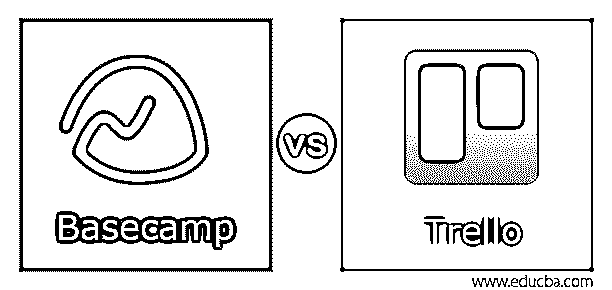
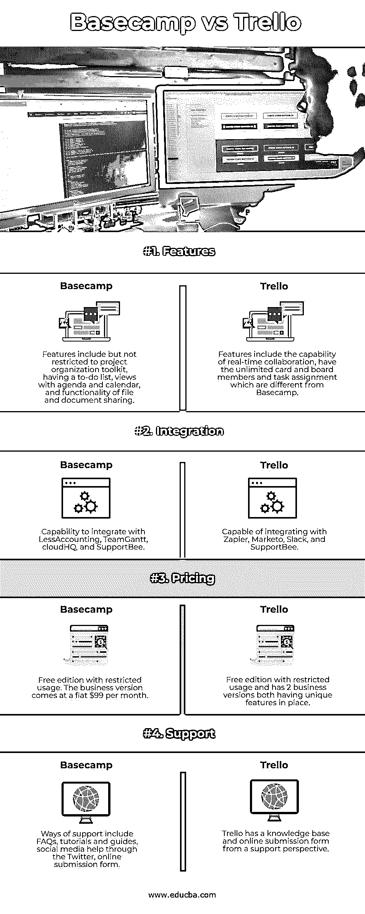

# 基地营 vs 特雷洛

> 原文：<https://www.educba.com/basecamp-vs-trello/>

## Basecamp 和 Trello 的区别

在这篇文章中，我们将学习两个广泛使用的项目管理工具之间的区别，但是首先，让我们看一个为什么需要这样一个工具的情况。假设你正在领导一个项目，并与不同的团队合作，如软件、销售、IT 等。，使项目到位。管理每件事会有大量的工作要做，这将使你不得不记住所做的每一个细节。这就是项目管理工具派上用场的地方，它可以帮助您有效地组织工作，并帮助整个团队成为一个团队。在这种类型的项目管理工具中，Basecamp 和 Trello 是当今场景中广泛使用的工具。在本文中，我们将首先浏览一些关于什么是项目管理的概念，然后深入了解 Basecamp 和 Trello 之间的区别。在本主题中，我们将了解 Basecamp vs Trello。

### Basecamp 与 Trello 的对决(信息图)

以下是 Basecamp 和 Trello 之间的主要区别

<small>网页开发、编程语言、软件测试&其他</small>

### 概念和术语警报

为了更好地理解这两种工具，了解数据管理工具及其特性至关重要，这样我们就可以很容易地理解我们将要讨论的不同类型。

所有工具最有可能提供的几个功能是:

1.  帮助创建计划或时间表:所有的任务，子任务，文件夹等。易于访问，并且将帮助用户根据需要计划和委派工作
2.  增加协作:当互联网蓬勃发展时，电子邮件被认为是最快的沟通方式，现在随着项目管理工具的发展，这些工具成为所有者、利益相关者和项目工作人员之间最有效的沟通方式。
3.  简单的文档:通过不断更新正在开发的特性来编写测试用例，它可以作为一个拥有精心制作的详细文档的地方。
4.  评估:一个项目的生产力和成长很容易被评估和跟踪，从表面水平到颗粒水平。

项目管理领域被认为是开创性的，因为人们需要评估项目的复杂性，规划在这种竞争环境中所需的预算和资源，并帮助组织利用新技术快速实现变革，同时允许他们以强势地位进入市场！

项目经历的阶段有:

1.  启动:第一阶段是为项目定义一个目标。
2.  计划:下一个阶段是建立一个每个人都必须遵循的路线图，它将标记项目中的主要里程碑。
3.  执行和监控:第三阶段是建立一个团队，在团队的帮助下，创建可交付成果。
4.  项目的结束:一旦特性被发布，项目的回顾有助于发现在下一个项目的实现中是否有任何新的有用的知识。

### Basecamp 与 Trello 的主要区别

以下是 Basecamp 和 Trello 之间的一些主要区别:

现在，我们已经对项目管理有了公平合理的理解，并且项目管理工具中需要重要的特性，现在正是深入探讨 Basecamp 和 Trello 的差异的时候，以便从更深的角度了解更多信息，这些比较将有助于做出正确的决定，决定采用哪一种。

第一个区别点是从功能角度。Basecamp 具有以下功能列表，这些功能使其与 Trello 不同，从项目组织工具包开始，具有待办事项列表、带有议程和日历的视图以及文件和文档共享的功能。并行地，Trello 有一些不同于 Basecamp 的令人兴奋的特性，即实时协作、无限的卡和板成员以及任务分配的能力。

第二个不同点是从集成的角度。Basecamp 能够与其他软件集成，如 LessAccounting、TeamGantt、cloudHQ、SupportBee，另一方面，Trello 具有与 Zapier、Marketo、Slack 和 SupportBee 集成的能力。这一点上的不同将使你更具体地知道你将使用哪一个，这是基于你将用于其他任务的软件。

现在来看第三个不同点，在决定采用哪种项目管理工具时，人们会高度关注哪一点，这一点就是价格。Basecamp 的免费版本的使用受到限制。在这种情况下，您可以有 3 个项目，20 个用户，只有 1 GB 的存储空间。如果需要更多的功能，你需要升级到 Basecamp business，每月 99 美元。这个商业版提供了无限的项目，无限的用户，和 500 GB 的存储空间。

除此之外，它还提供了一个运行组织的专用空间，为每个团队提供了他们自己的协作空间，与无限的客户端合作，完全控制客户端的可访问性，免费模板，最后是优先级支持。现在来到 Trello，它也带来了一个免费版本，但商业版本的价格为每个用户每月 9.99 美元，按年计费。有一个企业版，它是基于每个用户的，随着用户数量的增加，每个用户的价格会降低。企业版和商业版有很多功能。

最后一点不同是每个人提供的支持论坛。Basecamp 通过 Twitter 提供一系列常见问题解答、教程和指南、社交媒体帮助和在线提交表格，而 Trello 在支持方面有一个知识库和在线提交表格。

### Basecamp vs Trello 对比表

为了便于理解，让我们通过一个比较表来看看 Basecamp 和 Trello 之间的更多差异:

| 型 | **基地营** | 特雷罗 |
| 特征 | 功能包括但不限于项目组织工具包、待办事项列表、议程和日历视图以及文件和文档共享功能。 | 与 Basecamp 不同的是，它的特点包括实时协作的能力，拥有无限的卡和板成员以及任务分配。 |
| 综合 | 能够与 LessAccounting、TeamGantt、cloudHQ 和 SupportBee 集成。 | 能够与 Zapier、Marketo、Slack 和 SupportBee 集成 |
| 定价 | 限制使用的免费版本。商务版每月固定价格为 99 美元。 | 限制使用的免费版，有两个商业版，都有独特的功能。 |
| 支持 | 支持方式包括常见问题解答、教程和指南；社交媒体通过 Twitter 提供帮助；在线提交表单。 | Trello 有一个知识库和从支持角度来看的在线提交表单。 |

### 结论

有了上面的区别，当涉及到像项目管理工具这样的投资时，人们很容易选择正确的产品，因为它在组织中有很长的路要走，因为它不仅会停留很长时间，而且还会决定项目经理在管理项目方面的效率。两者都有透明的计划和定价，它只是取决于用户在项目的拼图中还有哪些其他组件，以及这两个组件中哪一个最适合那个拼图！

### 推荐文章

这是一个基地营 vs 特雷罗的指南。在这里，我们讨论了 Basecamp 和 Trello 的主要区别，通过信息图和比较表进行了面对面的比较。您也可以看看以下文章，了解更多信息–

1.  [格雷洛与基巴纳](https://www.educba.com/graylog-vs-kibana/)
2.  [围棋 vs 红宝石](https://www.educba.com/go-vs-ruby/)
3.  [吉拉 vs 特雷罗](https://www.educba.com/jira-vs-trello/)
4.  [支尔格对汇合](https://www.educba.com/jira-vs-confluence/)

