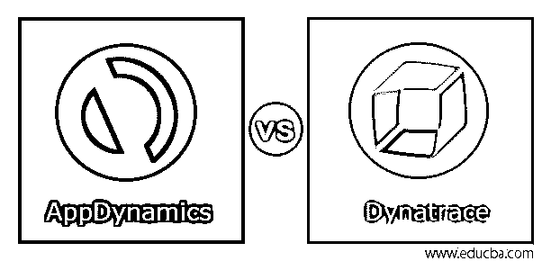

# AppDynamics 与 Dynatrace

> 原文：<https://www.educba.com/appdynamics-vs-dynatrace/>

## AppDynamics 与 Dynatrace 的区别

应用程序性能监控是一个全球性的趋势话题，它弥补了对软件应用程序的所有依赖。当人们讨论应用程序时，话题将主要集中在性能上。因此，所开发的管理应用程序的软件工具应满足业务环境中运行的应用程序、服务、服务器和网站的性能，并且需要监控所有已实现的应用程序，并在出现任何问题时通知用户。因此，本文将讨论用于应用程序性能监控的两个主要工具 AppDynamics 和 Dynatrace，并列出它们的主要比较点。

### AppDynamics 与 Dynatrace 的直接对比(信息图表)

以下是 AppDynamics 与 Dynatrace 的 7 大对比 **:**

<small>网页开发、编程语言、软件测试&其他</small>

### AppDynamics 与 Dynatrace 的主要区别

让我们讨论一些关键差异，如功能、价格、仪表盘、监控，此处讨论 AppDynamics 与 Dynatrace 的可用性:

#### 1.分析学

从 6.3 版开始实现的新 Dynatrace 获得了纯解析特性。优化的流设置为将实时情况下的信息传输到 ElasticSearch 进行分析，这涉及用户的操作和访问，由外部部件上的 Kibana 仪表板构建。而 AppDynamics 推出了一款名为 Log Analytics 的工具。它涉及日志文件和索引，与 ELK 和 Splunk 类似。它收集所有有组织的、非结构化的、结构化的数据，这些数据显示所有应用程序问题并实时通知所有错误。它可以探索发生的错误，并为仪表板和重复警报开发定制的列，以分析应用程序和错误。

#### 2.用户友好的仪表板

在 Dynatrace 中，企业提供了两个仪表板，一个是 web 仪表板，另一个是本地桌面客户端，这是 Wintel 2000 的一个困难版本。web dashboard 查看高级级别的数据，包括用户在移动和 web 的 app 渠道中的体验和满意度。它列出了运行作业的整个过程。如果用户捕获到一个错误或问题，它会分析受影响的流程以收集更多数据，用户应该将其编辑到桌面仪表板中。而 AppDynamics 并不基于 Flash dashboard。但这不是少数企业的主要需求，因为仪表板中的一些组件需要微调。所有细节都基于 web 仪表板，并提供了一个概览来获取用户所需的数据。因此，根据要求，Dynatrace 中的两个仪表板现在已经过时，对于一些在不同环境下收集数据的人来说，在两个仪表板之间切换的要求是一个麻烦，而统一的用户界面是由 AppDynamics 提供的，它具有 flash 仪表板的所有基本组件。

#### 3.生态系统的集成和插件

Dynatrace 插件页面中显示的类别包括 SharePoint、docker、生态系统、Splunk、Apache Cassandra、大数据工具、通知系统(如 PagerDuty)和 JIRA。但是设计入围了，这个库就成了一个熟悉的基础工具。AppDynamics 为开发者提供了开放平台，使他们能够向全球市场添加合适的插件和扩展，全球市场总共包括 140 个插件。它帮助用户分享对插件的请求，即使他们觉得很难做到。但是现在社会会更喜欢基于社区的插件，它会不断更新。

#### 4.组件和服务的监控

AppDynamics 和 Dynatrace 上的工具提供了指标和堆栈跟踪，这成为一项强大的能力。HP、CA、IBM 和 Microsoft 等其他一些传统供应商的变体在应用程序性能管理中被认为是可靠的。但是这两个工具有相同的代码来查找标准平台。NET 和 Java。如果用户提前检查工具，了解他们正在运行的作业和用 Node.js、Python、PHP 和 metrics 等编程语言编写的服务，或者堆栈跟踪上的数据可能会发生变化，这将更有帮助。

#### 5.用户定义交易的配置文件

Dynatrace 使用称为 PurePaths 的受限跟踪来存储用户的所有请求。它用于可视化每个请求的状态。事务中的概要分析是 Dynatrace 的主要优势，它是第一个在运行时领域(如 CLR 体系结构和混合 JVM)跟踪事务的企业。它还从一个提供的 PurePath 中提供了不同的下钻选项，以从不同的角度削减和组织数据。而 AppDynamics 显示业务中的交易异常，并提供完整的堆栈跟踪。它更加直观，没有任何经常深入的策略。用户对更好的视图的需求已经自动产生。

### AppDynamics 与 Dynatrace 对比表

下表总结了 AppDynamics 与 Dynatrace 之间的比较 **:**

| **属性** | **AppDynamics** | **Dynatrace** |
| **用户界面** | 它基于闪存，提供内部部署和 SaaS 支持。 | 用户界面有点复杂，并且提供内部部署和 SaaS 支持。 |
| **交易追踪** | 它在事务跟踪方面提供了更好的性能。 | 它为事务中的每个进程提供一个状态，在跟踪进程中是最好的。 |
| **数据的相关性** | 数据的相关性不如 Dynatrace 可靠。 | 它在数据关联方面有非常好的流程。 |
| **支持** | 他们提供广泛的端到端支持。 | 支持不如 AppDynamics 有效。 |
| **代理人** | 它有几个代理，也可以手动定制。 | 它有单一代理和端到端自动化。 |
| **网络的可见性** | 它仅基于聚合主机的指标。 | 它提供了从每一个过程到过程的完整和清晰的可视性。 |
| **根本原因分析** | 它可以基于图表和相关性指标。 | RCA 是基于因果关系和人工智能的力量。 |

### 结论

Dynatrace 和 AppDynamics 拥有丰富的高级功能，给用户带来了激烈的竞争。Dynatrace 构建代理来查找事务上每次执行的受限堆栈，而 AppDynamics 被选择用于诊断技术，这意味着找到完整的堆栈只是为了检查阈值级别以分析性能值。每种技术都有优缺点，这取决于监控需求和案例。外部供应商通过不同的方法在业务交易中获得成功。这两个应用程序都可以跟踪不同环境下的响应时间。

### 推荐文章

这是 AppDynamics vs Dynatrace 的指南。在这里，我们用信息图和一个比较表来讨论 AppDynamics 和 Dynatrace 的主要区别。您也可以看看以下文章，了解更多信息–

1.  [IPS 工具| 7 大不同的 IPS 工具](https://www.educba.com/ips-tools/)
2.  [IDS 工具介绍|简要说明](https://www.educba.com/ids-tools/)
3.  [网络安全攻击的类型](https://www.educba.com/types-of-network-security-attacks/)
4.  [网络安全工具](https://www.educba.com/cyber-security-tools/)

