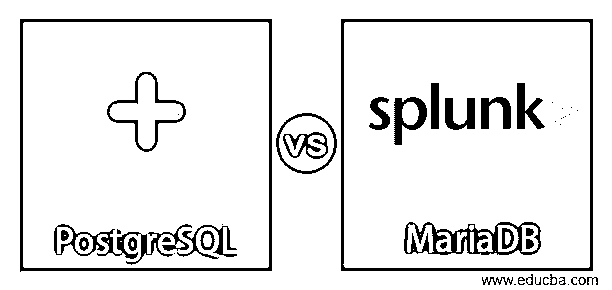

# 相扑逻辑 vs Splunk

> 原文：<https://www.educba.com/sumo-logic-vs-splunk/>

## Sumo Logic 与 Splunk 的区别

直到前一段时间，信息技术(IT)还被企业用作支持工具。它将运行工资单、库存和财务会计应用程序，业务部门将获取运营数据以进行决策。但是现代的 IT 应用程序被集成和吸收到业务中，并由 IT 来管理业务。因此，IT 应用程序需要强大、稳定、24×7 小时不间断运行。应用程序性能中的任何小故障都会影响业务成果，并损害客户忠诚度。

应用程序必须在安全的环境中运行，并且应该遵守监管标准。包括硬件功能在内的整个应用程序环境应无访问违规、数据异常、不合规和主动威胁。

<small>网页开发、编程语言、软件测试&其他</small>

由于复杂的环境，组织的内部团队无法无缝地监控应用程序的性能、安全性和合规性，因此需要一种工具来完成这项工作。市场上有各种应用程序监控工具，即。、Dynatrace、New Relic、Splunk 和 Sumo logic。

本文分析了 Splunk 和 Sumo 逻辑的特点，并比较了它们的优缺点。

**Sumo Logic:** 一家数据分析机构，专注于 BI、运营、合规性和安全性。它提供了一个基于云的解决方案来处理由应用程序环境创建的大数据和日志，并通过分析数据来开发洞察力。由 Arcsight 的专家于 2010 年创立的一家初创公司，在众多投资者的风险投资下蓬勃发展。

该工具通过云的 SaaS 模型提供了全面的安全信息和事件管理(SIEM)解决方案。其弹性日志处理引擎可以收集、分析数 Pb 的数据，并为用户实时提供见解。它可以与大约 150 个应用程序连接，并从它们那里收集数据进行分析。其服务包括云中的 SIEM、IT 运营管理、数据分析和安全分析。

**Splunk:** Splunk 是一家总部位于加利福尼亚州的美国跨国公司，专门从事大数据分析。他们的产品可以使用 API 从多个来源收集机器生成的数据，分析数据并提供见解以监控应用程序的性能。Splunk 还使用存储在索引中的数据提供强大的搜索平台。

该工具能够处理应用程序的安全性和法规遵从性。利用这些工具提供的数据，用户将能够对报告的任何问题进行根本原因分析，并快速解决它们。它管理所有类型的数据，并为用户提供操作智能。

Splunk 提供三个产品系列，即。,

1.  面向大公司的企业版。
2.  免费提供具有有限功能的轻型版本。
3.  云版本作为托管服务。

### Sumo Logic 与 Splunk 的面对面比较(信息图表)

以下是 Sumo Logic 与 Splunk 的 12 大对比 **:**

### Sumo Logic 与 Splunk 的主要区别

让我们从以下几点来讨论 Sumo Logic 与 Splunk 之间的一些关键差异:

#### 1.目标市场

*   Sumo logic 和 Splunk 都面向日志管理和数据分析领域。
*   Splunk 是没有更多数据源的理想选择。从所有来源收集的数据可以很容易地关联起来，并且该过程可以根据需要自动进行。
*   Sumo logic 迎合了中小型组织的需求，并且在用户和服务器代理数量上的可伸缩性受到限制。

#### 2.平台

*   Sumo logic 是一个纯云平台，以 SaaS 模式提供服务。这个工具的实现很简单，就像任何其他云产品一样。该工具的最新版本由于其云托管而可供用户使用。
*   Splunk 主要遵循内部部署模式。但它也有一个功能有限的云选项。

#### 3.搜索机制

*   Splunk 在日志数据搜索引擎中提供了一个强大的平台，它使用 Splunk 处理语言(SPL)。SPL 可以选择操作/过滤索引数据，并执行条件/上下文搜索。SPL 允许用户添加自定义查询。Splunk 平台还能够扫描历史数据，并使用 MapReduce 工具进行统计计算和分析。
*   Sumo 逻辑在搜索操作中的功能有限。

#### 4.仪表盘

*   Splunk 允许用户使用 Splunk 仪表板编辑器设计定制的仪表板、图表、应用程序小部件、表格和扩展，或者开发他们自己的 XML 脚本。Splunk 为用户提供了各种可视化功能，使监控和日志管理成为简单而出色的体验。
*   Sumo logic 中的仪表板特性对用户很有吸引力，并且配置这些特性很简单。用户可以选择多个仪表板主题。这些仪表板背景主题会长期影响报告的可读性。用户可以自定义图表、仪表板和表格。

#### 5.应用程序

*   Splunk 有自己的应用商店，名为 Splunkbase，包含 600 个应用和插件。Splunk 在应用商店方面遥遥领先于竞争对手。这些应用程序可以简单地用于提取数据或设计仪表板。
*   Sumo logic 中的应用数量可能与应用丰富的 Splunk 不匹配。但它仍然没有几个应用程序来监控性能。

#### 6.可量测性

*   由于其大数据管理功能，Splunk 在处理日志数据方面提供了很好的可扩展性。任何数量的服务器都可以很容易地动态添加。分布式文件系统具有独立的索引服务器和搜索终端服务器，允许多达 48 个用户每天搜索 300 GB 的数据。
*   相扑逻辑处理较低级别的用户。

**数据模型**

*   Splunk 只是存储数据，并允许用户在运行时动态建模。
*   在相扑逻辑中，模型需要被预先冻结。

### Sumo 逻辑与 Splunk 对比表

下表总结了 Sumo Logic 与 Splunk **:** 之间的比较

| **相扑逻辑** | **Splunk** |
| 最好的基于云的日志管理解决方案之一。仅作为 SaaS 提供给云用户。 | 企业版在内部提供，它也有一个使用受限的云产品。 |
| 数据模型的设计应该提前完成，数据提取遵循这个模式。 | Splunk 允许将数据存储在索引中，用户可以在运行时灵活地进行数据建模。 |
| 经济高效的解决方案，成本是一段时间内每个用户的成本。中型组织的理想选择。 | 最昂贵的平台，最适合拥有更多用户群的大型组织。 |
| 他们的应用程序很少。 | 拥有自己的应用商店，有 600 多个应用。 |
| 在云上提供应用集成工具。 | 云版本 Splunk 不提供集成。 |
| 它提供搜索功能，但达不到 Splunk 的水平。 | 它通过自己的语言 Splunk 处理语言(SPL)提供广泛的搜索选项，并利用 MapReduce 进行统计分析。 |
| 可扩展性有限，因此非常适合中小型组织。 | 由于其大数据架构，具有高度可扩展性。 |
| 社区参与还达不到 Splunk 的水平。 | 强大的文档和社区的参与是这个论坛解决用户问题的全部内容。 |
| 对输入到该工具的数据进行机器学习有助于用户深入了解景观表现并解决问题。 | 在问题的根本原因分析中使用人工智能技术。 |
| 广泛的 API 接口可用于访问数据、配置数据源和返回报告。 | 有限的 API 功能。 |
| 仅存储聚合数据。 | 随着原始数据的存储，存储可能会更快耗尽。 |
| 更侧重于应用程序和基础设施功能的安全性和法规遵从性方面。 | 侧重于更多的应用程序监控以及安全性和合规性方面。 |

### 结论

这两种产品之间没有明显的赢家，工具的选择取决于组织的规模和预算支出能力。这些解决方案并不便宜，用户在选择产品时必须非常小心。

### 推荐文章

这是一个相扑逻辑 vs Splunk 的指南。在这里，我们讨论了这两种工具的优缺点和主要差异，并提供了一个比较表。您也可以看看以下文章，了解更多信息–

1.  [Splunk 与 Nagios–主要差异](https://www.educba.com/splunk-vs-nagios/)
2.  [Datadog 与 Splunk |大对比](https://www.educba.com/datadog-vs-splunk/)
3.  [格雷洛与基巴纳](https://www.educba.com/graylog-vs-kibana/)
4.  [Splunk vs Tableau](https://www.educba.com/splunk-vs-tableau/)

