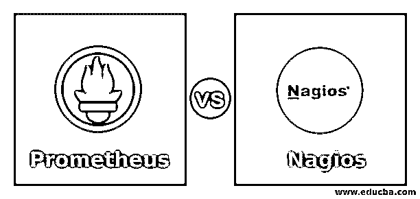

# 普罗米修斯 vs 纳吉奥斯

> 原文：<https://www.educba.com/prometheus-vs-nagios/>

## 普罗米修斯与纳吉斯的区别

Prometheus vs Nagios 是一个基于拉的系统，通过监控集群来与 Kubernetes 合作，称为 Prometheus。检查部署的配置，并发送相同的 HTTP 请求。数据访问是通过 Prometheus 完成的，因此这使得用户可以直接检查数据，而无需进入其他应用程序。监控系统、网络或基础设施的开源软件称为 Nagios。除了监控，还为应用程序、服务、服务器或交换机提供警报服务。使用 Nagios 对任何关键服务或应用程序进行定期检查，这些检查有助于确定和解决问题。

### 普罗米修斯 vs 纳吉奥斯的对决(信息图)

以下是普罗米修斯和 Nagios 之间的 7 大比较:

<small>网页开发、编程语言、软件测试&其他</small>

### 普罗米修斯和纳吉奥斯的主要区别

让我们研究一下普罗米修斯和纳吉奥斯之间的一些重要的关键区别:

*   Prometheus 提供基于时间的监控解决方案，而 Nagios 不提供基于时间的监控。此外，Prometheus 中有警报，而 Nagios 中没有。基于时间的监控有助于 Prometheus 根据时间表监控和管理应用程序，并根据提供的时间表触发它们。但是，如果监控工作不顺利，或者存在任何严重问题，Prometheus 会发出警报，提醒用户。
*   Nagios 监控服务器、网络和应用程序，而 Prometheus 不擅长这些活动。服务器监控有助于找到记录的数据，如果有任何错误，这种监控有助于解决它们。
*   在 Prometheus 中使用警报的缺点是没有警报它就不能工作。应该在应用程序中使用日志和查询来运行警报，因此会占用存储空间。考虑 Nagios 时，不需要这些查询，因为 Nagios 中不存在警报。但是日志应该在应用程序中可用，以运行对服务器和应用程序的监控。
*   可以在 Prometheus 的任何操作系统中进行监控，因为它设计为支持任何操作系统。在 Nagios 中，操作系统应该要么是 Linux，要么是 Windows，因为它被设计为与 Linux 一起工作，并且已经更新为与 Windows 一起工作。
*   普罗米修斯是免费的，而纳吉奥斯不是。Prometheus 的企业版是定价的，而基本版是免费提供的。企业版与许多其他应用程序一起提供，与 Nagios 相比价格更低。Nagios 企业版以每月 3500 美元的价格提供。普罗米修斯的价格是每月不到 200 美元。
*   Prometheus 的维度模型包含带有指标名称和标签的指标，因此存储、图表和警报由应用程序负责。Nagios 中没有标记，它们也不需要警报。Nagios 中没有提供存储空间，也没有提供什么插件来存储可视化模型。
*   与普罗米修斯相比，Nagios 的基础设施和工作方式是不同的。它是基于 It 的传统基础架构，更侧重于网络、服务器以及监控应用程序。Prometheus 致力于监控 Kubernetes 中运行的应用程序，并且更加关注数据。
*   警报之后，在 Prometheus 中完成分组、重新路由和复制，而这些选项在 Nagios 中不可用。Nagios 有一些脚本来做插件，并在需要时提供警报。

### 普罗米修斯 vs 纳吉奥斯对比表

下面是对比表:

| **普罗米修斯** | **纳吉奥斯** |
| 查询语言用于执行监控并在应用程序中提供日志。 | Nagios 在主机的帮助下提供服务，并且可以运行脚本来执行检查。 |
| 服务器独立运行，本地存储不受关注。仅对于警报和规则处理，使用本地存储，并且 Prometheus 的副本可用于检查可用性模式。 | 独立服务器与系统配合得很好，配置检查是在系统文件的帮助下完成的。 |
| Prometheus 在基于云的虚拟环境中运行良好，因为服务器是基于 Kubernetes 的。白盒监控可以用这个应用程序来完成。 | 使用 Nagios 可以很容易地完成基本的监控，它有助于寻找小型的静态系统。通过 Nagios 可以计算出更多的细节，这有助于监视和记录细节，以便在系统面临问题时使用。 |
| 这些问题是未知的，在警报的帮助下，可以通过调度警报来解决已知的问题。 | 问题是已知的，甚至在问题出现之前就通知给用户，这有助于用户解决问题。这是通过监控整个 IT 基础设施来实现的。 |
| Prometheus 是不可定制的，应用程序中不提供插件。但是初始设置很容易，任何人都可以在 Prometheus 的帮助下轻松进行监控。此外，借助查询很容易扩展应用程序。 | Nagios 是可定制的，有一个灵活的监控系统。监控易于使用，而且由于其灵活性，客户更喜欢这种方式。免费的可视化插件也吸引了顾客。 |
| 在使用 Prometheus 时，我们可以集成不同的应用程序，因此工作模型是不同的，也是很好的。 | 我们不能在使用 Nagios 时与任何其他系统集成，因为它提供插件和免费检查。 |
| 用户界面不好，主要用于度量。此外，配置并不容易，因为它似乎通过设置很容易。在应用程序中工作的代理非常少，因为它只与主动代理而不是被动代理一起工作。不同的应用程序必须与 Prometheus 一起使用才能使其工作。 | 交互式 UI 和简单的配置让 Nagios 很舒服。但是应用程序不是用任何特定的编程语言编写的，这在检查代码中的问题时会产生问题。 |

### 结论

有些人更喜欢 Prometheus，因为它简单且易于实验，而另一些人更喜欢 Nagios，因为它界面简单且存储空间少。此外，许多其他监控应用程序会查看用户是否在寻找不同的用例。在云环境中工作对 Prometheus 来说是一个优势，因为现在云技术更受青睐。

### 推荐文章

这是普罗米修斯 vs 纳吉奥斯的指南。在这里，我们讨论普罗米修斯与 Nagios 之间的差异，关键差异，以及比较表。您也可以浏览我们的其他相关文章，了解更多信息——

1.  [立方注释](https://www.educba.com/kubernetes-annotations/)
2.  [Kubernetes 自动缩放](https://www.educba.com/kubernetes-autoscaling/)
3.  [立方控制平面](https://www.educba.com/kubernetes-control-plane/)
4.  [Kubernetes 选择器](https://www.educba.com/kubernetes-selector/)

