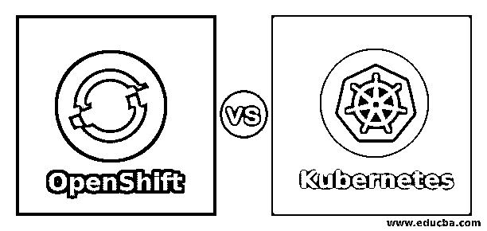

# openshift vs kubernetes(开启 hift vs kublets)

> 原文：<https://www.educba.com/openshift-vs-kubernetes/>

## OpenShift 与 Kubernetes 的区别

下面的文章提供了 OpenShift vs Kubernetes 的概要。将在 Docker 容器中使用并在 Kubernetes 等平台中编排的容器化软件称为 OpenShift。它是由 RedHat 在 2011 年开发的，用 Go 和 AngularJS 语言编写。它只在 Linux 系统下运行，不需要虚拟机。用于管理应用程序和部署的开源容器编排系统称为 Kubernetes。它是用 Go 语言写的，2014 年发布。谷歌开发 Kubernetes。它用于自动化手动流程。

### OpenShift 与 Kubernetes 的面对面比较(信息图)

以下是 OpenShift 和 Kubernetes 之间的 10 大区别:

<small>网页开发、编程语言、软件测试&其他</small>

### OpenShift 与 Kubernetes 的主要区别

让我们讨论一下 OpenShift 和 Kubernetes 之间的一些主要区别:

*   OpenShift 用于应用程序的部署和持续管理。许多工具通过 OpenShift 添加到 Kubernetes 平台，以帮助应用程序的持续开发。这也有助于根据用户需求扩展应用程序。Kubernetes 基本上用于自动化应用程序的部署，并在系统中扩展容器化的应用程序，以便应用程序工作得更快。
*   OpenShift 是一个产品，Kubernetes 是一个项目。为安装 OpenShift 的用户提供应用部署和维护方面的支持。用户还可以选择产品的功能。Kubernetes 是一个包含不同产品、完整项目和整个工作平台的框架。Kubernetes 的一个社区解决了用户的问题。
*   由于模板的原因，Kubernetes 提供了很大的灵活性，并且比 OpenShift 好得多。在 Kubernetes 中，舵图用于实现高灵活性。在 OpenShift 中使用模板，因此灵活性较差。
*   OpenShift 比 Kubernetes 更安全。容器图像或其他官方图像不能在 OpenShift 上运行。由于安全问题，简单的应用程序不能在 OpenShift 上运行。只有在 Kubernetes 才需要最低安全级别。简单的应用程序虽然可以在 Kubernetes 上运行，但由于 OpenShift 的原因无法运行。
*   通过在两个应用程序中执行基于角色的访问控制，在两个应用程序中以不同的方式完成授权。授权是在 Kubernetes 的容器规范中完成的。OpenShift 的授权是通过单独的安全上下文约束来完成的。这使得 OpenShift 比 Kubernetes 更安全。
*   OpenShift 使用部署配置来部署系统中运行的项目或应用程序。必须设置配置，并且安装必须正确，以便在系统中执行配置管理。在 Kubernetes 中，配置是通过部署对象完成的，它是在控制器的帮助下安装的。这也可用于更新系统中的 pod。
*   部署配置永远不能通过控制器安装，OpenShift 配置的有效性比 Kubernetes 更强。配置是通过管理良好的专用 pod 来设置的，客户喜欢相同的配置以便于管理。
*   通过路由器向 OpenShift 提供外部访问。路由器的功能比入口少得多。Ingress 在 Kubernetes 中用于许多服务器，使用起来更加灵活。此外，还可以在 Kubernetes 中进行不同增强。路由器的性能优于入口。

### OpenShift 与 Kubernetes 对比表

我们来讨论一下 OpenShift 和 Kubernetes 之间的顶级对比:

| **OpenShift** | **Kubernetes** |
| 为了管理容器图像，它使用了 ImageStreams，这样就可以很容易地更改图像的标签。这也使得用户可以轻松上传图片和标签。 | Kubernetes 中没有上传图像的特权，因此与 OpenShift 相比，容器图像的管理较差。 |
| 不需要外部工具，应用程序向用户提供集群，以便于记录和检查图像。 | 用户需要外部工具来登录和使用容器，这使得应用程序对用户不太友好。 |
| 从项目到名称空间的转换很容易，反之亦然。在不同的环境中使用较少的命令来上传图像。 | 从项目到名称空间的转换并不容易，反之亦然。在不同的环境中上传图像需要更多的命令。 |
| Jenkins 与 CI/CD 应用程序的应用程序集成在一起，这种同步使用户能够更快地使用软件。 | Jenkins 没有与 Kubernetes 集成，用户需要花时间在系统中同步和上传图像。 |
| 网络应用程序中显示了插件，这使得系统在网络问题上更加可信。 | Kubernetes 在插件的帮助下处理网络，这并没有透露给用户。这使得用户能够发现应用程序中发生的错误。 |
| 提供带有服务代理的服务目录，以便用户能够轻松使用集群和托管服务。这对用户来说比 Kubernetes 更好。 | 服务目录不容易提供，需要在系统中单独安装。此外，为集群提供的供应少于服务。 |
| 订阅必须在中间更新，随着集群的增长，要支付的钱会更多。这使得应用程序成本很高。 | Kubernetes 没有订阅，它依靠许多用户的分发和社区支持来工作。这个不用 OpenShift 也能自撑。 |
| 该应用程序提供了许多内置功能，用户发现在系统中使用该应用程序很容易。 | 用户必须安装许多功能，这使得系统需要处理网络和图像。用户觉得比 OpenShift 复杂。 |
| 只有 RedHat enterprise Linux 可用于安装 OpenShift。CentOS 也可用于安装。 | 任何 Linux 发行版都可以用来安装 Kubernetes，它不会给应用程序带来任何问题。 |
| OpenShift 可以通过其新版本和更新的灵活性在云中使用。 | Kubernetes 可以很容易地安装在许多平台上，并且比 OpenShift 应用程序更标准。 |

### 结论

在这两个应用程序中有许多共同的模式，两者的正确工作对于一个成功的项目是必需的。OpenShift 中的集成和工作更好，但 Kubernetes 为应用程序提供了平台。由于这些方面，用户对 OpenShift 的要求更高。

### 推荐文章

这是 OpenShift vs Kubernetes 的指南。在这里，我们讨论了 OpenShift 与 Kubernetes 的主要区别，并提供了信息图表和比较表。您也可以看看以下文章，了解更多信息–

1.  [OpenStack vs OpenShift](https://www.educba.com/openstack-vs-openshift/)
2.  [立方 vs 码头](https://www.educba.com/kubernetes-vs-docker/)
3.  [Kubernetes 自动缩放](https://www.educba.com/kubernetes-autoscaling/)
4.  [Openstack 与虚拟化](https://www.educba.com/openstack-vs-virtualization/)

