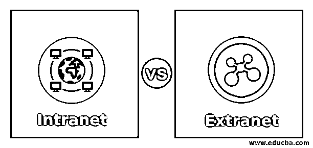

# 内部网与外部网

> 原文：<https://www.educba.com/intranet-vs-extranet/>

## 内部网与外部网的区别

下面的文章提供了内部网和外部网的概要。外联网被定义为本质上是私有的计算机网络系统，其可以在组织、机构或任何团体中使用，以便他们可以共享敏感信息、知识并且还可以执行操作，并且仅向授权用户提供访问。内部网也是一种类型的计算机网络系统，其本质上是私有的，可由特定地点的组织的特定组访问，使得信息和知识可以在使用网络的组之间共享。

### 内部网与外部网的直接比较(信息图表)

以下是内部网与外部网之间的 9 大区别:

<small>网页开发、编程语言、软件测试&其他</small>

### 内部网与外部网的主要区别

让我们讨论一下内部网和外部网之间的一些主要区别:

*   外联网和内联网的主要区别之一是可以访问网络的用户数量。内部网用户是非常特殊的，因为内部网网络只能是可访问的特定组织团体。而在外联网网络中，用户的数量更多，因为信息可以被组织的特定组和组织的外部成员(包括组织的利益相关者和客户)访问。
*   这两种网络的另一个区别是网络的安全性。内联网网络可以具有定义的防火墙，该防火墙可用于为网络访问内联网网络提供安全性。在外联网网络中，防火墙必须帮助隔离外部成员和组织成员，以便组织可以很容易地访问他们。
*   内部网源自互联网，而外联网源自外联网网络。组织的人力资源和首席信息官管理内部网网络，以便合法用户可以访问网络。该组织的通信部门管理引渡网络。
*   当基于安全性比较内部网和外部网时，内部网总是比外部网更安全。在内部网中，只有特定的团体或组织才能访问更安全的信息。另一方面，在外联网网络中，由于信息是在组织和组织的外部成员之间共享的，因此会产生未经授权访问组织敏感信息的风险。组织决定策略和访问权限，以便只有合法用户才能访问包含外联网和内联网的网络。由于内部网网络使用有限的接口，它为内部网网络的用户提供了更好的安全性。向外联网用户提供安全性比内联网网络更困难，因为在外联网网络中，外部用户也存在，这产生了安全漏洞的风险。
*   外联网和内联网的另一个区别是资源的利用。与外联网相比，内联网用户可以更好地利用资源。存在于外联网上的信息和知识是非常有限的，并且是网络专用的。而在内联网网络中，信息对于网络用户来说是足够的，从而可以容易地为组织执行业务操作。
*   内部网和外部网的另一个区别是网络的可访问性。内部网网络只能由单个团体或组织访问。相反，另一方面，外联网网络可以被特定组和该组的外部成员访问。
*   内网和外网的另一个区别是实现网络公司服务器，而系统可以实现内网。在外联网网络中，需要使用互联网，因为连接到网络是经济的。

### 内部网与外部网比较表

让我们来讨论一下内部网和外部网之间的主要比较:

| **因子** | **内部网** | **外联网** |
| **描述** | 内部网被定义为一个专用网络，特定的群体可以访问这个网络，因此特定的用户只能访问这个网络来共享信息和知识。 | 外联网被定义为使用公共网络与组织的利益相关者和客户共享知识和信息的专用网络。 |
| **网络规模** | 内部网网络规模很小，如在这种类型的网络中；只有少数用户相互连接。 | 网络的外联网规模也很小，因为只有少数用户相互连接。 |
| **目的** | 使用内部网的主要目的是在组织内部共享机密和敏感信息。 | 外联网网络用于在组织和外部成员(包括客户和利益相关者)之间共享信息。 |
| **网络上的内容** | 网络上的内容和信息只能被一些用户和组织成员访问。 | 组织成员和外部组织成员(如客户和利益相关者)可以访问外联网网络上的内容和信息。 |
| **法规和机制** | 内部网网络只能由某个特定的组织来管理。组织策略用于管理内部网网络；多个组织可以管理外联网网络 | ns。合同协议用于管理外联网网络。 |
| **网络所有权** | 内部网网络所有权由一个组织维护。 | 外联网网络所有权由一个或多个组织维护。 |
| **访问** | 互联网可以很容易地访问内部网网络；唯一的要求是密码，因为只有合法用户才能访问网络。 | 外联网也可以通过互联网访问。 |
| **安全** | 防火墙机制用于为内部网网络提供安全性。 | 防火墙机制用于在外网网络中隔离外网和互联网。 |
| **信息** | 内部网只包含某些特定群体的信息。 | 外联网网络还包含特定组织团体的信息。 |

### 结论

内联网和外联网都在组织中广泛使用，与外联网相比，组织成员之间的知识网络更加安全，对于任何组织来说，信息的安全性总是主要关注的问题。因此，组织应该实现一个内部网网络，以便在组织成员之间共享信息。

### 推荐文章

这是内联网与外联网的指南。在这里，我们用信息图和比较表来讨论内部网和外部网的主要区别。您也可以看看以下文章，了解更多信息–

1.  [编程 vs 网页开发](https://www.educba.com/programming-vs-web-development/)
2.  [宽带 vs DSL](https://www.educba.com/broadband-vs-dsl/)
3.  [以太网 vs 互联网](https://www.educba.com/ethernet-vs-internet/)
4.  [TestNG vs JUnit](https://www.educba.com/testng-vs-junit/)

