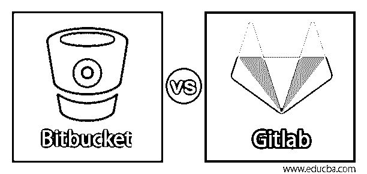

# Bitbucket vs Gitlab

> -= the last fantasy =-荣誉出品本字幕仅供学习交流，严禁用于商业途径

## Bitbucket 与 Gitlab 的区别

在这个主题中，我们将了解 Bitbucket vs Gitlab。

GitLab 是一个基于在线的开源库管理系统，它允许用户集成代码，冗余代码，然后组合代码以适应当前项目，从而更好地改进代码。客户端安装 GitLab，将其代码与 AD 服务器集成，并通过其 LDAP 组连接到服务器，以获得受保护的授权密钥和加密。存储库系统的安装和集成设置非常简单有效。

<small>网页开发、编程语言、软件测试&其他</small>

Bitbucket 是一个基于在线的版本控制库，对于使用 Mercurial 或 Git 版本控制系统的敏捷团队和开发团队来说都是通用的。Bitbucket 允许用户从项目的第一阶段开始构建他们的项目，比如计划项目、集成代码、构建测试代码，最后部署它。

### GitLab 是什么？

GitLab 也有自己的官方移动应用。IBM、阿里巴巴、索尼、NASA 以及甲骨文、SpaceX 和 CERN 等公司都使用 GitLab。该设置提供了 wiki 和问题跟踪特性，这些特性对于寻求扩展存储库管理系统使用的团队来说是通用的。GitLab 是一个 DevOps 工具，它提供了一个 Git 存储库管理器，以及作为开源服务一部分的 CI 管道特性。

GitLab repository 有两种形式，一种是免费注册网站的 SAAS，另一种是 GitLab 社区版的个人服务。它们都可以很好地优化，以集成任何服务。

**下面列出了 GitLabare 的特性**

1.  问题跟踪
2.  集成代码和报告工具功能。
3.  从问题板创建新问题
4.  源代码的灵活迁移和构建后代码的集成。
5.  开发团队还会在 GitLab 中找到无限数量的私有存储库来构建他们的代码。这个存储库服务完全免费，使用起来非常灵活。

**git lab 的缺点**

GitLab 的几个缺点是:

*   GitLab 的接口有点慢，从构建接口到集成接口的切换需要时间。
*   GitLab repo 的技术问题经常发生。

### 什么是 Bitbucket？

Bitbucket 类似于澳大利亚著名公司 Atlassian 的 GitLab 存储库管理系统。Bitbucket 提供了许多独特的特性来推进开发过程。例如，用户可以构建他们的代码，并通过 pull requests 等功能有效地审查代码，或者直接在源代码中暂停讨论，并在内联框中添加注释。Bitbucket repo 是一种服务，它提供了一个通道，从构建、测试和部署代码开始，集成了 CI/CD 管道。

Bitbucket 还允许访问社交媒体，并通过 GitHub 进行认证。

**下面列出了 Bitbucket 的特性**

1.  问题跟踪和解决。
2.  REST APIs 是在用于任何开发语言的第三方应用程序上创建的
3.  可以在存储库中搜索代码
4.  使用代码修改和内联注释来拉取请求有一个优势
5.  Bitbucket 使用吉拉软件来创建敏捷团队的分支。

**比特桶的缺点**

下面列出了 Bitbucket 的一些缺点:

*   在 Bitbucket 中启动存储库的方法是在本地找到它，然后通过外部应用程序使用它。
*   如果团队规模超过五人，您需要为团队的每个新成员付费。

### Bitbucket 与 Gitlab 的面对面比较(信息图表)

以下是 Bitbucket 和 Gitlab 的主要区别

### Bitbucket 和 Gitlab 的主要区别

以下是 Bitbucket 和 Gitlab 的主要区别:

1.  **源服务:** GitLab 是一个免费的自托管服务开源。一群商品编码员可以免费访问它，而 Bitbucket 是一个付费的开源自托管服务。它只对五个用户免费，当超过五个用户时按用户收费。
2.  **CI 访问:** GitLab 向其客户提供免费 CI 访问，而 Bitbucket 不向其客户提供免费 CI 访问。
3.  **API 服务:** GitLab 有自己的应用开发 API。然而，Bitbucket 集成了几个 API 及其服务。
4.  服务支持者: GitLab 支持 Git、Google code、Bitbucket 和 FogBigz，而 Bitbucket 支持 HG、Source Forge、SVN、Google Code 和 Git。
5.  **问题追踪器:** GitLab 可以用来在线编辑代码，与 bug 追踪器一起开发高质量的代码。但是，Bitbucket 使用语义搜索方法来分析任何代码的语法，以便更好地改进代码。

### Bitbucket 与 Gitlab 对比表

为了便于理解，让我们通过一个比较表来看看 Bitbucket 和 Gitlab 之间的更多差异:

| **Bitbucket** | **GitLab** |
| Bitbucket 是一个付费的开源自托管服务。它只对 5 个用户免费，超过 5 个用户时按用户收费。 | GitLab 是一个免费的自托管服务开源。一群商品编码员可以自由访问它。 |
| Bitbucket 对其客户端的 CI 不免费。 | Gitlab 向客户提供免费的 CI 访问 |
| bitbucket 集成了几个 API 及其服务 | Gitlab 有其用于 app 开发的 API。 |
| Bitbucket 支持 HG、SourceForge、SVN、Google Code 和 GIt。 | Gitlab 支持 Git、Google code、Bitbucket 和 FogBigz |
| bitbucket 使用语义搜索方法来分析任何代码的语法，以便更好地改进代码。 | Gitlab 可用于在线编辑代码，并带有一个 bug 跟踪器，用于开发高质量的代码。 |
| Bitbucket 允许您构建代码并将其集成到同一个接口中。这有助于用户在集成代码时不在界面之间切换。 | GitLab 允许在任务和集成任务之间进行上下文切换。这增加了构建和集成代码的复杂性。 |
| Bitbucket 使用吉拉软件来创建敏捷团队的分支。 | GitLab 没有遵循敏捷方法论。 |

### 结论

每个想要将他们的项目部署到生产环境中的用户都了解存储库管理解决方案在他们的项目设计中的影响。它是一个集成软件开发系统的重要单元。储存库管理系统允许软件开发团队通过在一个特定位置创建和维护多个版本来处理在源代码和相关修改文件中做出的改变。

开发 Bitbucket 的 Atlassian 也开发了吉拉，开发团队使用它来构建代码和跟踪问题。当这两者合并时，每当比特桶存储库中完成任何新的提交时，JIRA 将自动更新代码问题。

GitLab 是一个开源项目库，在 MIT 下获得许可。BitBucket 提供了基于多个 VCS 的存储库的导入。GitLab 只支持 Git 平台。

### 推荐文章

这是 Bitbucket vs Gitlab 的指南。这里我们用信息图和比较表来讨论 Bitbucket 和 Gitlab 的主要区别。您也可以看看以下文章，了解更多信息–

1.  [Gitlab CI vs Jenkins](https://www.educba.com/gitlab-ci-vs-jenkins/)
2.  [Git Fetch vs Git Pull](https://www.educba.com/git-fetch-vs-git-pull/)
3.  github vs SVN
4.  [Git ReBase vs Merge](https://www.educba.com/git-rebase-vs-merge/)

