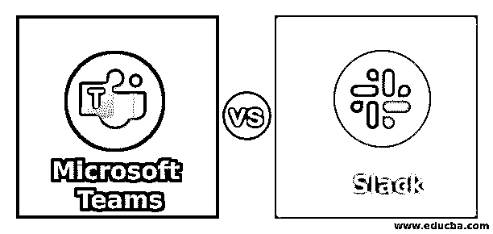

# 微软团队 vs Slack

> 原文：<https://www.educba.com/microsoft-teams-vs-slack/>

## 微软团队与 Slack 的区别

下面的文章提供了微软团队和 Slack 的概要。微软团队被定义为大企业用来聊天、进行视频会议、集成应用程序和文件存储的统一通信平台。微软团队可以与 Office 365 集成，并增强该平台提供的功能。Slack 也被定义为在工作场所使用的沟通工具。Slack 是一个用户可以聊天、共享文件和进行视频会议的平台。Slack 定义为组织使用的即时通讯平台。slack 可以用作电子邮件系统的替代方案，也可以用作通信平台。

### 微软团队与 Slack 的面对面比较(信息图)

以下是微软团队和 Slack 之间的 7 大区别:

<small>网页开发、编程语言、软件测试&其他</small>

### 微软团队与 Slack 的主要区别

让我们讨论一下微软团队和 Slack 之间的一些主要区别:

*   微软团队和 slack 平台的主要区别之一是设置。与微软团队相比，slack 平台的设置要容易得多。由于微软团队是大型组织的首选，该工具的设置非常复杂。但是与 slack 平台相比，微软团队提供的功能要好得多。与 slack 平台相比，微软团队的设置时间更长，需要更多的耐心。微软团队在注册时需要大量个人数据，包括电子邮件、电话号码和信用卡信息。另一方面，slack 平台的安装比微软团队更容易，也快得多。松弛平台设置中不需要任何个人信息，松弛平台设置总共只有 7-8 个步骤。
*   两个平台之间的另一个区别是向其他用户发送邀请。在 slack 平台中，这个特性很容易实现。当 slack 平台中的设置过程完成时，该工具要求向同一工作区的其他人发送邀请。slack platform 还提供了一个功能，即邀请标签，用户可以通过它向其他用户发送邀请。另一方面，在 Microsoft team 中执行相同的功能是相当复杂的。第一步是使用 Office 的起始页在 Office 365 管理面板中添加用户。之后，注册链接将被发送到用户提供的电子邮件 id。在完成所有这些手续后，用户将登录微软团队的平台，并可以向其他用户发送邀请。
*   两者的另一个主要区别是平台的设计和布局。与 slack 平台相比，微软团队的布局和设计更加清晰可见。设计和布局比 slack 平台专业得多。与 slack 平台相比，微软团队提供了更多的功能和额外的面板。与 slack 平台相比，team 应用程序中的搜索框有更多选项。
*   两个平台之间的另一个主要区别是消息传递。在 Microsoft teamsapp 中，该平台为用户可以发送的消息提供了高级格式。slack 平台不提供这种功能。字体颜色可以改变，单词可以变成斜体或粗体，项目符号列表和更多的功能都是由微软团队提供的。的。gif 消息也可以在 Microsoft team 中发送，而 slack platform 不提供这种功能。
*   另一个区别是目标受众。微软团队平台被大型组织使用，而 slack 平台被中小型组织使用。

### Microsoft 工作组与时差比较表

让我们来讨论一下微软团队与 Slack 之间的主要对比:

| **功能** | **微软团队** | **松弛** |
| **定价模式** | 微软团队的基本版是免费的，用户可以使用。微软团队的基本版每个用户每月花费 5 美元。 | slack 是组织可以使用的免费平台。slack 的标准版本每个用户每月花费 6.67 美元。 |
| **消息历史限制** | 在 Microsoft 团队中，邮件存储限制是无限的。微软团队的所有版本都具有在平台中无限存储消息的功能。 | slack 提供的免费计划能够存储多达一万条消息。和信息存储限制是免费的是标准和高级计划。 |
| **视频/音频通话** | 视频和音频通话限制为单次通话最多 250 个用户。由于微软团队被大型企业所使用，该平台所提供的特性也相当令人印象深刻。 | 用户可以免费进行一对一的视频会议。对于音频呼叫，15 个用户可以在标准计划中添加单个呼叫。 |
| **分享屏幕** | Microsoft 团队计划的所有计划中都提供了屏幕共享。用户可以将屏幕共享给其他用户使用。 | 免费版中缺少共享屏幕功能。在标准版和高级版中，该功能由 slack 平台提供。 |
| **整合** | 微软团队有能力在微软平台上集成 180 多个应用程序和工具。 | slack 平台能够在免费计划中集成多达 10 个应用程序，在付费计划中集成多达 800 个计划。 |
| **限制存储文件** | 在微软团队中，文件的存储限制是每个用户 2 GB，共享存储 10 GB。在付费计划中，每个组织的容量为 1 TB。 | 在免费计划中，用户可以存储高达 5 GB 的文件。在标准计划中，用户最多可以存储 10 GB 的文件，在增强计划中，用户最多可以存储 20 GB 的计划。 |
| **界面颜色选项** | 微软团队平台提供了三种主题，即亮主题、暗主题和高对比度主题。 | slack 平台的侧边栏有自定义主题，可以由用户设置。 |

### 结论

微软团队平台和 Slack 平台都是组织用来在员工之间进行交流的工具。这两款工具都提供了发送消息、音频和视频通话以及其他功能。选择合适的平台完全取决于组织的需求。

### 推荐文章

这是微软团队 vs Slack 的指南。在这里，我们用信息图和比较表来讨论微软团队和 Slack 的主要区别。您也可以看看以下文章，了解更多信息–

1.  [Yammer vs Slack](https://www.educba.com/yammer-vs-slack/)
2.  [特雷罗 vs 斯莱克](https://www.educba.com/trello-vs-slack/)
3.  [懈怠 vs 不和谐](https://www.educba.com/slack-vs-discord/)
4.  [Asana vs Basecamp](https://www.educba.com/asana-vs-basecamp/)

