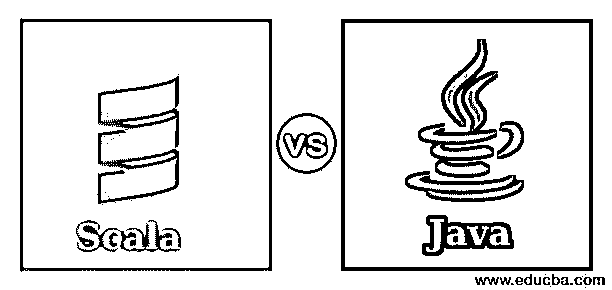
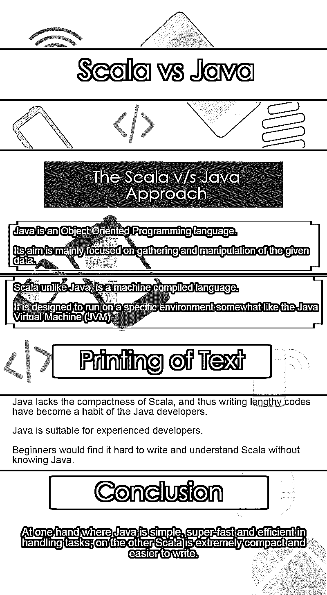

# Scala 与 Java 性能的对比

> 原文：<https://www.educba.com/scala-vs-java-performance/>

## Scala 与 Java 性能的区别

**Scala vs Java Performance—**欢迎来到世纪终极之战。Scala 对全能的 Java。甚至有人会问为什么？有些人甚至会说 scala 实际上是 java 本身的一部分，那么为什么要进行 Scala 和 Java 的比较呢？原因是因为 Scala 不完全是 Java。见鬼。它甚至不在爪哇附近。虽然它使用 JVM (Java 虚拟机)编译器，但它与 Java 只有部分相似。

你可以说 Java 是 Scala 的始祖。原因是，它具有 Java 的一些特性，比如用字节码编译简单的代码，集成性差等等。这是一个原因，尽管 Scala 有 Java，但它“不是”Java。迷茫？是啊，我也是。这就是我写这篇针对初学者的博客的原因，以免被弄糊涂。

<small>网页开发、编程语言、软件测试&其他</small>

已经谈得够多了；让我们开始，看看在我们已经有了 Java 的情况下，Scala 编程发展如此之快的差异、相似之处和原因。

您可以查看 Scala 和 Java 的图表对比信息图。

**阅读时间:90 秒**

### 【Scala 与 Java 的面对面比较(信息图表)

这里我们已经分别讨论了 scala 和 java 之间的主要比较。

 

### Scala vs Java 方法

Java 是一种面向对象的编程语言。它的目标主要集中在给定数据的收集和处理上。它试图在图形用户界面和面向对象模式的帮助下使应用程序对日常用户可用，然而，另一方面， [Scala 编程](https://www.educba.com/what-is-scala/)完全遵循传统的函数式方法。

与 Java 不同，Scala 是一种机器编译语言。这意味着它被设计成在某种类似于 JVM 的特定环境上运行，并在编译器(类似于 dos)和类型系统的帮助下提供了函数式和面向对象方法的组合，该类型系统在编译时进行统计扫描，这也与 Java 相同，只是它具有 Ruby 等高级语言的表达语法。

但是，不要忽视那些让 scala 版本如此高效的特性，这会阻碍 Scala 与 java 的性能，并使其变得更加灾难性。

### Scala 诞生的必要性

什么是 Scala？Scala 是专门为了成为比 Java 更好的语言而开发的。开发人员想留下 Java 的这些部分，这阻碍了高效的编程，过于耗时，并使开发人员感到沮丧。重点是，尽管代码和方法上的变化有所不同(与 Java 相比),但这会让 Scala 语言变得更加困难；尽管如此，其结果是非常干净和结构良好的，最终更容易使用和阅读类似于 [Python](https://www.educba.com/software-development/courses/python-certification-course/ "Python Training Course Bundle") 之类的。你甚至可以在我的下一篇博客中讨论 Scala 和 Python 的对比。

让我们来看一个简单的两种语言的文本打印:

**Java:**

`public class IamJava {
public static void main(String[] args) {
System.out.println("I am Java!");
}
}`

**Scala:**

`object IamScala {
def main(args: Array[String]): Unit = {
println("I am Scala!")
}
}`

嗯……几乎没有什么区别。别担心。我还没有在这里炫耀。现在让我们看一个更准确的例子。下面是一个例子，说明如何用 Java 编写一段很长的代码；可以只是 Scala 中的一行代码:

**Java:**

`public class People
{
private String start;
private String stop;
String getstart() { return start; }
void setstart(String start) { this.start = start; }
String getstop() { return stop; }
void setstop(String stop) { this.stop = stop; }
int hashCode() ....
boolean equals(Object o) { ....  }
}`

**Scala:**

`case class People(start:String, stop:String)`

因此，Scala 中的一行等于 Java 的十一行。更具体地说，Java 缺乏 Scala 程序的紧凑性，因此编写冗长的代码已经成为 Java 开发人员的习惯。实际上，我们甚至可以这样写:

`public class People extends DTOBase
{
public String start;
public String stop;
}`

Scala 编程语言的紧凑性确实值得一提。即使没有 getters 和 setters 的帮助，我也可以编写一个字段，甚至不会遇到瓶颈。也就是说，Java 语言的发展也趋向于紧凑。

不用说，Java 也有一些锦囊妙计。它主宰编程世界是有原因的。然而，Java 可以稍微缩短代码，但显然不是在标准用法中。

现在让我们来看看这个普通的 Java 对象。让我们假设你是一个了不起的程序员(显然我不是……呃..开个玩笑)；也就是说，你设法减少了代码，但是减少了多少呢？5 到 6 行？….让我搞清楚…如果你打算写一段像这样大的代码该怎么办:

`public class Group {
private String value;
private record<tokens> tokens;
public Group() {
tokens = new Arrayrecord<tokens>();
}
public String getvalue() {
return value;
}
public void setvalue(String value) {
this.value = value;
}
public record<tokens> gettokens() {
return tokens;
}
public void settokens(record<tokens> tokens) {
this.tokens = tokens;
}
}
public class tokens {
private int id;
private record<item> items;
public tokens() {
items = new Arrayrecord<item>();
}
public int getId() {
return id;
}
public void setId(int id) {
this.id = id;
}
public record<item> getitems() {
return items;
}
public void setitems(record<item> items) {
this.items = items;
}
}
public class item {
private int id;
private String characteristic;
public int getId() {
return id;
}
public void setId(int id) {
this.id = id;
}
public String getcharacteristic() {
return characteristic;
}
public void setcharacteristic(String characteristic) {
this.characteristic = characteristic;
}` 

zzzz…我已经觉得困了。现在，让我们来看看 Scala 的。这里只是为了确定，让我告诉你，我并没有试图减少这里的任何代码。我只是用 Scala 以最基本的格式(就像一个初学开发的人会写的那样)写了上面写的那段代码(我用记录作为列表或数组列表):

`class Group {
var value: String = _
var tokens: record[tokens] = Nil
}
class tokens {
var id: Int = _
var items: record[item] = Nil
}
class item {
var id: Int = _
var category: String = _
}`

你可能听过有人说 Java 比 Scala 简单多了。现在让我问你；你现在觉得哪种语言更复杂，嗯？所以，下次你和 Java 开发人员争论时，请随身携带这个简单的程序。

不要害怕。尽管 Java 代码看起来很大，但实际上并不复杂。理解 Java 实际上比理解 Scala 容易得多。Scala 太紧凑了。我能说的最好的是，这适合有经验的开发人员，他们在用 Java 开发应用程序方面有多年的经验。如果不了解 Java，初学者会发现很难编写和理解 Scala。

有经验的程序员甚至可能会认为 Java 比 Scala 可读性更好，原因是 Scala 的深度嵌套代码。在 Scala 中，你可以在函数内部、在另一个函数中、在类内部的另一个对象中定义函数，等等。所以你看，关于紧凑性有这么多要说的。尽管 Java 需要紧凑性，但如果写得不好，有时会带来毁灭性的影响。破坏性如此之大，以至于你甚至不理解你自己的代码。

尽管 Scala 在这里是不败的，但是这是以牺牲性能为代价的。我们从来没有讨论过 Scala 的性能基准，不是吗？我最近在我的 AMD-A8 CPU 上测试了 Scala 和 Java 的基准。我得到的结果其实出乎意料。虽然你可以用 Scala 写紧凑的代码，但是性能，也就是速度，比 Java 慢两倍。

### 结论

归根结底，Scala Java 是一枚硬币的两面。两者各有利弊。这就是为什么你永远不能用 Java 代替 Scala，反之亦然。一方面，Java 在处理任务时简单、超快且高效；另一方面，Scala 非常紧凑，更容易编写(尽管难以理解和调试),同时也牺牲了效率。

Scala 的优势和劣势经常受到影响，因为他们在编写应用程序时没有发现任何问题，或者是不成功的。要正确评价这一点，理解这种观点背后的原因和事实实际上很重要。

Java 和 Scala 之间的主要区别在于它们编写代码的哲学和本质。Java 是纯面向对象的，专注于类、封装之类的东西，而 Scala 基于函数式方法。一旦你知道了这种区别，学习它们只是时间问题。

### 推荐文章

这是 Scala 与 Java 的对比指南。在这里，我们分别讨论了信息图表与职业机会的直接比较。您也可以看看以下文章，了解更多信息–

1.  [Java 性能 vs Python](https://www.educba.com/java-performance-vs-python/)
2.  [大一新生 Java 面试问题](https://www.educba.com/java-interview-questions/)
3.  [Java 生涯](https://www.educba.com/career-in-java/)
4.  [Scala vs Java](https://www.educba.com/scala-vs-java/)

