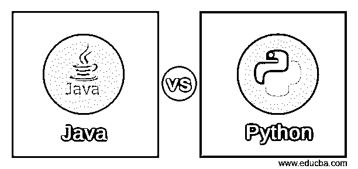
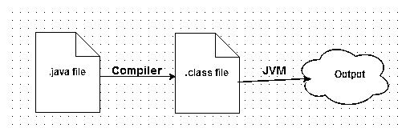
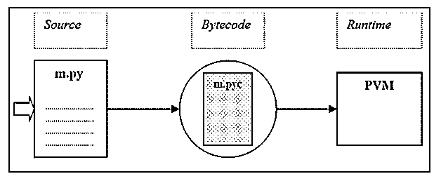

# Java vs Python

> 原文：<https://www.educba.com/java-vs-python/>

## Java 和 Python 的区别

Java 和 Python 都是面向对象的编程语言，可用于网站或基于 web 的应用程序开发过程。就编码和实现而言，Java 代码冗长，每行末尾需要一个分号，数据类型的声明是静态的，需要深入的编码知识。另一方面，Python 简单而简短，不需要分号来表示行尾，数据类型声明在这里是动态的，并且不需要深入的编码知识，因为任何人都很容易学习。

### Java 和 Python 的面对面比较(信息图表)

以下是 Java 与 Python 的 9 大对比:

<small>网页开发、编程语言、软件测试&其他</small>

### Java 和 Python 的主要区别

以下是最重要的区别:

*   Java 语言更多的是语法；如果忘记添加花括号或分号，输出结果将显示一个错误。但是 python 没有这样的东西；最后不需要分号和花括号，但是 python 遵循缩进过程，因此它将使您的代码可读。
*   Java 编程是静态类型的。必须明确提到变量的数据类型；如果 data (int，float，double，character)没有提到它，那么程序中就会出现错误。Python 具有动态类型意味着在运行时直接给变量赋值；它将采用数据类型。
*   Java 代码比 python 代码更复杂。如果一个人可以用两种语言编写 hello world 程序，那么你可以观察代码的复杂性；Java 中的 4 行代码和 python 中的 hello world 程序都只有 1 行代码。
*   如果有人从事一个需要快速的项目，那么 java 是最好的选择，因为 python 是一个解释器，它在运行时会采用变量的数据类型，因此它比 java 慢。
*   Java 有 JDBC (Java DataBase Connectivity，Java 数据库连接),广泛用于连接不同的数据库，如 SQL、SQOOP 等。JDBC 也很受欢迎，但是 Python 的数据库访问层比 Java 的 JDBC 弱。这也是为什么在企业中很少使用的原因。
*   由于 Java 的静态类型系统和 IDE 在开发中的通用性，它比 python 享有更多的重构支持。Python 一直在人才空间中存在，并因为许多原因而受欢迎，包括数据科学和 DevOps 运动。
*   Java 架构:-JVM ( [Java 虚拟机](https://www.educba.com/what-is-jvm/))是一个引擎，它给出了运行 Java 代码的运行时环境。它将 Java 字节码转换成机器语言。JVM 是 JRE (Java 运行环境)的一部分。

                             Source – http://geekrai.blogspot.com/2013/03/jvm-architecture.html

**Python 架构—**

                          Source – http://www.oznetnerd.com/interpreted-bytecode-just-time/

*   Python 解释器将你的源代码翻译成独立于机器的字节码(。pyc)。
*   商店。pyc 文件 __PyCache__ 文件夹。
*   当你运行同一个程序时(没有改变)，它将使用它而不需要再次翻译它。
*   字节码(。pyc)将被运往 PVM。它执行代码。

### Java 与 Python 对照表

以下是积分列表；描述这些比较:

| **比较依据** | **Java** | **Python** |
| **代码** | Longer lines of code as compared to Python`public class EduCba
{
public static void main (String [] args)
{
System.out.println(“Hello EduCBA”);
}
}` | `print (“Hello EduCBA”)` |
| **语法** | 在语句的结尾，如果遗漏了一个分号，就会抛出一个错误。在 Java 中，你必须用花括号定义一个特定的块；没有它，代码就无法工作。 | 在 python 中，状态不需要分号来结束。在 python 中，你从未见过花括号，但缩进在 python 中是强制的。缩进也提高了代码的可读性。 |
| **动态** | In java, you must declare the type of data.`class Example
{
public static void main (String [] args)
{
int x=10;
System.out.println(x);
}
}` | Python codes are dynamic typed. This means that you don’t need to declare a type of variable; this is known as duck typing.

`X = 45
site = “educba.com”`

 |
| **速度** | 从速度上来说，Java 更快。在项目中，只要速度重要，java 就是最好的。 | 它比较慢，因为 python 是一个解释器，而且它在运行时决定数据的类型。 |
| **便携性** | 由于 Java 的高度普及，JVM (Java 虚拟机)几乎随处可见。 | Python 也是可移植的，但是在 java 面前，python 并不流行。 |
| **数据库** | (JDBC)Java 数据库连接是最流行和广泛使用的数据库连接。 | Python 的数据库访问层比 Java 的 JDBC 弱。这也是它很少在企业中使用的原因。 |
| **易于使用** | 与 python 相比，Java 不容易使用，因为没有动态编程概念，而且代码比 python 长。 | Python 代码比 java 短。python 遵循动态编程 python 代码不仅易于使用而且因为缩进而易于理解。 |
| **实际灵巧度** | 由于 Java 的静态类型系统和 IDE 在开发中的通用性，它比 python 享有更多的重构支持。 | Python 一直在人才空间中存在，并因为许多原因而受欢迎，包括数据科学和 DevOps 运动。 |
| **遗产** | Java 在企业中的历史及其略显冗长的编码风格意味着 Java 遗留系统通常比 python 的系统更大、数量更多。 | Python 的遗留问题较少，所以组织发现脚本很难复制和粘贴代码。 |

### 结论

从上面的讨论中，我们可以得出结论，Java 和 Python 语言都有各自的好处。为你的项目选择一种特定的语言真的取决于你。Python 简洁明了，而 Java 快速且更易移植。Python 代码是动态编码的，而 Java 是静态编码的。从我们的角度来看，Python 的未来非常耀眼，我们认为它的未来是自信的。Python 远非完美，但如果我们说 python 是一种未来的新兴语言，那么我们不得不同意 Java 是存在的，它的 API 被广泛使用。

Java 和 Python 在各自领域都很强大。Java 和 Python 语言都与可访问性有关，因此公司、部门和开发人员在决定时最好保持开放的心态。

### 推荐文章

这是一个关于 Java 和 Python 之间的区别、它们的意义、头尾比较、关键区别、比较表和结论的指南。您也可以阅读以下文章，了解更多信息——

1.  [Java vs JavaScript](https://www.educba.com/java-vs-javascript/)
2.  [Java vs PHP](https://www.educba.com/java-vs-php/)
3.  [Java Vector vs ArrayList](https://www.educba.com/java-vector-vs-arraylist/)
4.  [Scala vs Java](https://www.educba.com/scala-vs-java/)

