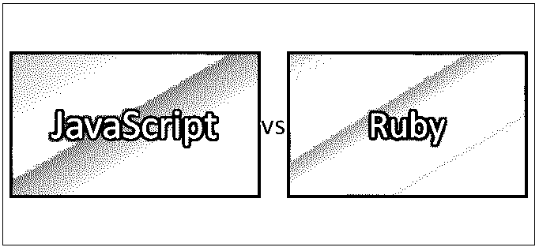

# JavaScript vs Ruby

> 原文：<https://www.educba.com/javascript-vs-ruby/>

## JavaScript 和 Ruby 的区别

[JavaScript 是一种](https://www.educba.com/what-is-javascript/)面向对象的脚本语言，允许您在网页中创建具有交互效果的动态 HTML 页面。JavaScript 允许您在浏览器中处理和维护数据。它只能在网络浏览器上运行，并且是一种[解释编程语言。](https://www.educba.com/mobile-app-programming-language/) Ruby 是一种开源编程语言，面向对象的语言，注重简单性、可移植性、可扩展性和生产力。由于它是开源的，我们可以根据我们的需要和用途自由修改、编辑。

### JavaScript 是什么？

在谷歌 chrome 发布其 JavaScript 引擎“node.js”之前，浏览器中一直有 JavaScript。我们可以在 node.js 的帮助下跨全栈开发使用 JavaScript，帮助前端开发者处理后端逻辑和应用编程接口，无需学习新的编程语言。Brendan Eich 在网景公司创建了 JavaScript，它于 1995 年问世。

<small>网页开发、编程语言、软件测试&其他</small>

### 什么是 Ruby？

它主要是在 Linux 上开发的，可以在所有平台上运行，比如 UNIX、Windows、DOS 和 Mac OS 等。如果我们熟悉 python 之类的其他编程语言，那么它简单的语法就很容易阅读和编写。Ruby 由松本幸宏创作，于 1995 年首次发布。Ruby 类似于 Smalltalk 和 Perl，因为它像 Smalltalk 一样面向对象，像 Perl 一样方便，更容易维护。

### JavaScript 和 Ruby 的直接比较(信息图表)

以下是 JavaScript 和 Ruby 之间的 7 大对比:

### JavaScript 和 Ruby 的主要区别

下面解释了 JavaScript 和 Ruby 之间的一些关键差异:

*   JavaScript 和 Ruby 是面向对象的动态通用脚本语言，在运行时被解释而不是编译。
*   JavaScript 可以作为前端和后端语言使用同一种语言，而 [Ruby](https://www.educba.com/install-ruby/) 作为后端编程语言使用。
*   JavaScript 比 Ruby 更具可伸缩性，因为在某些情况下它比 Ruby 快 20 倍。
*   Ruby 更适合高 CPU 密集型应用程序开发，包括图形、图像处理等。，而节点。JS 不适合高 CPU 的应用开发。
*   JavaScript 可以与许多应用程序集成，如 Auth0、Parcel、Yarn、Buttercup、cell 和 Apache Open whisk 等。而 Ruby 可以和很多应用集成，比如 Rails，Bitrise，Auth0，Sinatra，Pow，Lita，Carrier Wave 等等。
*   很多公司使用 JavaScript 其中有 Instagram，易贝，Codecademy，Firebase，Groove shark，Square，sentry 等。尽管许多公司使用 Ruby，其中一些是 Intuit，Rap Genius，Instacart，Task Rabbit，Fab，Scribd 等等。
*   JavaScript 没有监控内存利用率的能力，而 Ruby 有。
*   JavaScript 应用程序很容易开发，而对于 Ruby 应用程序开发，优秀的程序员需要高薪。
*   Ruby 通过在线社区获得支持，这是开源框架中最活跃的，而 JavaScript 也有文档，但缺少 npm 中几个模块的文档。
*   Ruby 应用程序很难调试，因为它有多个抽象层，这需要花费更多的时间来修复错误，而 JavaScript 应用程序比 Ruby 容易调试。
*   JavaScript 由于其节点可以用于全栈开发。JS 框架，而 Ruby 不能用作完整的堆栈。
*   JavaScript 的缺点是对 CPU 密集型任务效率不高，不一致，不能监控内存利用率，而 Ruby 的缺点是性能差，内存占用大，代码可读性差。

### JavaScript 和 Ruby 对照表

下面是 JavaScript 和 Ruby 的对照表

| **比较的基础** | **JavaScript** | **红宝石** |
| **哎呀** | JavaScript 是一种面向对象的脚本语言，是在运行时被解释而不是编译的动态语言。我们可以创建称为对象的元素，并由程序员操纵对象数据。 | Ruby 是一种面向对象的、动态的、通用的脚本语言，它在运行时被解释而不是编译，支持对象的创建，用户可以使用程序员的对象一次修改多个数据。 |
| **句法差异** | 在 JavaScript 中，变量声明和赋值比 Ruby 稍长一些，如下所示
var var_name= value
散列被定义为对象，并以 hash_name.key- >值的形式访问其值 | 在 Ruby 中，变量的声明和赋值比 JavaScript 简单，如下所示:
var_name=value
，散列被定义为
hash_name={key:value，key1:value1}，访问键的值为
hash_name[:key]- >值 |
| **编程语言** | JavaScript 是一种前端编程语言，主要用于客户端应用程序、服务器端、浏览器级的交互和修改。 | Ruby 是一种后端编程语言，通过它我们可以生成运行在服务器端的 JavaScript 和 HTML 页面，并且可以与数据库进行交互。 |
| **学习曲线** | JavaScript 有大量的文档、在线资源、在线论坛和社区，人们可以很容易地学习，因为我们可以立即在浏览器中看到它的执行。如果我们想做网站或者 web 应用，可以学习 JavaScript。 | Ruby 也有各种在线学习资源，在线论坛和社区，我们可以通过它们自学。多被顶级网站，应用使用。 |
| **性能** | 由于其高度优化的引擎，JavaScript 在某些情况下比 Ruby 快 20 多倍。 | Ruby 的性能非常慢，这是它的一个瓶颈。由于 Ruby 应用程序的抽象本质，有时调试 Ruby 应用程序是一个耗时且困难的过程。 |
| **可扩展性** | 由于节点的原因，JavaScript 比 Ruby 更具可伸缩性。JS，因为它用更少的服务器提供更好的性能。 | Ruby 不像 JavaScript 那样具有可扩展性，所以很多公司因为可扩展性而从 Ruby 迁移到 JavaScript，比如纽约时报、LinkedIn、优步、PayPal 等等。 |
| **何时使用** | 如果您的应用程序需要在更少的时间、性能和可伸缩性方面进行开发，可以使用 JavaScript。 | 如果我们开发的应用程序是 CPU 密集型应用程序，用很少几行代码就能快速开发应用程序，那么就可以使用 Ruby。 |

### 结论

最后，概述了 JavaScript 和 Ruby 之间的比较。我希望你对 JavaScript 和 Ruby 语言都有很好的理解。学习 JavaScript 和 Ruby 都有好处，因为两者各有优缺点。我们可以根据项目需求选择 JavaScript 和 Ruby。在我看来，JavaScript 比 ruby 更有用，考虑到它的特性，如可伸缩性，性能，前端，后端，灵活的文件结构，尽管 Ruby 也有优势，如数据库迁移，快速开发，一个非常活跃的伟大社区，简单，元编程。我们可以编写功能强大的一行程序，所以如果我们想开发需要可伸缩、高性能的应用程序，就不要考虑 JavaScript。相比之下，对于 CPU 密集型应用，快速应用开发，我们可以使用 Ruby。

### 推荐文章

这是 JavaScript 和 Ruby 的有用指南。在这里，我们还将讨论 JavaScript 与 Ruby 的直接比较、主要区别以及信息图和比较表。您也可以阅读以下文章，了解更多信息——

1.  [JavaScript 应用并调用](https://www.educba.com/javascript-apply-vs-call/)
2.  [Java 性能和 Python](https://www.educba.com/java-performance-vs-python/)
3.  [Java vs Node JS](https://www.educba.com/java-vs-node-js/)
4.  [Java vs Python](https://www.educba.com/java-vs-python/)

