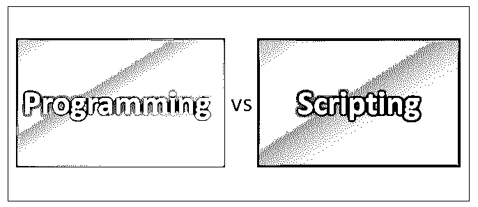

# 编程与脚本

> 原文：<https://www.educba.com/programming-vs-scripting/>

## 编程与脚本的区别

[编程语言定义了一套](https://www.educba.com/what-is-a-programming-language/)特定的指令，可用于产生各种输出。编程语言描述基本分为两部分:语法和语义。语法提供了一种形式，而语义为程序提供了意义。脚本语言本质上是动态的高级通用语言。脚本语言是一种不需要显式编译步骤和支持脚本的编程语言。脚本语言通常是解释的，而不是编译的。

### 编程；编排

*   编程语言被编译成机器代码，并在底层操作系统的硬件上运行。人们必须使用特定的 IDE(集成开发环境)来使用编程语言。程序员为计算机提供一套指令来实现某个目标。某些算法也可以通过编写程序来实现。
*   市场上有许多由特定文档主导的编程语言，而其他语言有一个作为参考的主导实现。Example- C 编程语言有一个相关的 ISO 标准，而像 Perl 这样的语言属于后一种。
*   编程语言基本上用于转换数据。这实际上是通过创建将输入数据写入输出的 CPU 指令来实现的。示例–根据一组条件求解一组方程。像 Java，Scala，C，C++等编程语言。，被认为是通用语言。这些是编译程序语言。人们需要通过添加一些文本来写下源代码，然后通过编译器运行它们，编译器将创建二进制指令。

### 脚本

*   [软件应用](https://www.educba.com/system-software-tools/)、网络浏览器中的网页、操作系统外壳的使用可以通过脚本语言自动化。像 Javascript、Perl、VBScript 等脚本语言。不需要被编译，并且由于它们运行在原始编程语言的子集上，所以对计算机的本地能力的访问更少。例如，Javascript 将无法访问您的文件系统。
*   脚本语言一般是解释型的。脚本语言的主要焦点不是构建应用程序，而是为现有的应用程序提供行为。它用于编写针对软件系统的代码。它可以使软件系统的操作自动化。编写的脚本基本上是针对软件系统的一组指令。
*   脚本语言已经变得越来越强大。现在，他们不再局限于创建小脚本来自动化软件系统上的操作。人们也可以用脚本语言构建丰富的应用程序。它可以操纵、定制和自动化现有系统的设施。有用的功能已经可以通过界面获得；脚本语言提供了一种将功能暴露给程序控制的机制。

**推荐课程**

<small>网页开发、编程语言、软件测试&其他</small>

*   [在线 C++和 DirectX 课程](https://www.educba.com/python-3-vs-python-2/)
*   [完成胡迪尼训练](https://www.educba.com/design/courses/houdini-training-course/)

### 编程和脚本之间的直接比较

下面是编程和脚本之间的 8 大区别:

### 编程和脚本之间的主要区别

下面是编程和脚本之间最重要的区别:

1.  用编程语言编写代码需要更长的时间，因为需要编写更多的代码，而用脚本编写代码需要更少的时间，因为它需要更少的代码。
2.  编程语言不需要宿主；它们是可执行的，而脚本语言需要宿主。
3.  编程语言学习起来既复杂又乏味，而脚本语言比编程语言更容易学习、编写和掌握。
4.  编程语言通常被编译并创建可执行文件，而脚本语言被解释并不创建可执行文件。
5.  编程语言代码被编译，二进制代码被一次性转换成机器代码，而在脚本中，高级指令被直接转换成机器语言。
6.  编程语言通常用于从头开始构建，而脚本语言可以用于组合现有的组件或模块。
7.  编程语言的设计方式使得开发人员可以充分利用语言的特性，而脚本语言旨在使编码更快更简单。
8.  对于编程语言，每个函数都需要许多行代码，而脚本语言编写函数需要的代码比编程语言少。
9.  编程语言增加了维护成本，而有了脚本，维护成本就大大降低了。
10.  C，C++，C#，Java，VC++，COBOL，Pascal 等。是编程语言的例子，而 JavaScript、VB Script、Python、Ruby 等。是脚本语言的例子。

### 编程和脚本比较表

下面是编程和脚本比较表。

| **的基础**编程与脚本的比较**** | **编程** | **脚本** |
| **例题** | Java、C、C++等 | JavaScript、Perl、Python 等 |
| **执行** | 编辑 | 解释 |
| **学习** | 这可能需要很长时间 | 比编程语言更容易学习 |
| **性质** | 代码密集型 | 与传统编程语言相比，代码量更少 |
| **要求** | 创建从系统内存执行的二进制文件或可执行文件 | 不创建任何二进制文件或可执行文件；不会分配任何内存 |
| **复杂度** | 对于初学者来说，理解这一点可能是件棘手的事情 | 与编程语言相比，更容易编写和理解代码 |
| **队形** | 这个程序有一组转换成可执行文件的指令 | 基于编写脚本来控制另一个程序的想法 |
| **运行中** | 独立于外部程序运行 | 在另一个程序中运行 |

### 结论

今天，编程和脚本语言之间的区别变得越来越模糊，因为编译可能是非常快的现代硬件和编译技术。没有理由不能编写一个 C 解释器并把它用作脚本语言，同样，也没有理由不能把 JavaScript 编译成机器码并存储在可执行文件中。

编写脚本或编写脚本就像在程序中编程一样。编写脚本的传统方法是编写脚本来自动化另一个程序中的某些功能。脚本会执行一个非常特殊的任务，比如遍历一个文本文件来提取所有的数字。使用编程语言，人们可以编写独立于父程序运行的软件。使用编程语言，开发人员通常会参与到一个项目中，这个项目创造了比传统脚本更多的功能。

今天线条模糊；如今，脚本非常强大，可以执行曾经属于编程领域的任务。脚本是编程的一个子集。一个人应该只关心语言本身以及它是否适合所需的工作。每种语言都有它的长处和短处。归根结底，它的需求和程序员的技术专长才是最重要的。

### 推荐文章

这是编程语言和脚本语言之间区别的指南。在这里，我们讨论了编程语言与脚本语言的直接比较、关键差异、信息图和比较表。您也可以阅读以下文章，了解更多信息——

1.  [硒或幻象](https://www.educba.com/selenium-vs-phantomjs/)
2.  [Azure Paas vs Iaas](https://www.educba.com/azure-paas-vs-iaas/)
3.  [Java vs Node JS](https://www.educba.com/java-vs-node-js/)
4.  [AWS vs AZURE](https://www.educba.com/aws-vs-azure/)

