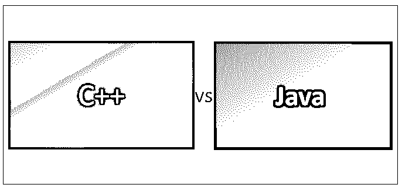

# C++与 Java

> 原文：<https://www.educba.com/c-plus-plus-vs-java/>

## C++和 Java 的区别

作为 C 语言的扩展而创建的通用编程语言可以说是 C 语言，具有称为 C++的类。该语言提供了对系统和内存的高级控制，并作为一种跨平台语言开发高性能的应用程序。比雅尼·斯特劳斯特鲁普创造了这种语言。一种面向对象和基于类的通用编程语言叫做 Java。这有助于设计互联网上的分布式环境。与 C++相比，Java 易于使用，因为它用于在单个系统中创建整个应用程序。

**让我们更详细地学习 C++和 Java:**

<small>网页开发、编程语言、软件测试&其他</small>

C++和 Java 有不同的设计目标。和 C++一样，Java 也是一种类似于不兼容语法的统计类型的面向对象编程语言。Java 也有大量的文档，称为 Javadoc。

[C++使用指针](https://www.educba.com/pointers-in-c-plus-plus/)，Java 不涉及指针。Java 使用了“受限指针”的概念。运行一个 C++程序，并使用其编译器进行编译。C++中的编译器将源代码转换成机器级语言，这使得 [C++成为一种平台相关的语言](https://www.educba.com/c-plus-plus-commands/)。在 java 中，Java 源代码在编译时首先被转换成字节码。然后解释器和运行时解释这个字节码，产生使 Java 成为独立于平台的语言的输出。

C++不提供对线程的内置支持，而 Java 隐式地支持线程。尽管在 C++11 的最新实现中，它也支持线程。Java 很像 C++，但不涉及复杂的概念，如结构、操作符重载、指针、模板、联合等。另外，Java 不支持条件编译(#ifdef/#ifdef 类型)。

除了基本类型，每个实体都是 java 中的对象。Java 有一个单一的根层次结构，因为所有的东西都来自 java.lang.Object。

### C++和 Java 的直接比较(信息图表)

以下是 C++和 Java 之间的 8 大对比:

### C++和 Java 的主要区别

下面解释了一些要点，展示了 C++和 Java 之间的区别:

*   C++只使用编译器，而在 Java 中，编译器和解释器都使用。
*   C++支持运算符重载和多重继承，但 Java 不支持。
*   与 Java 相比，C++与硬件更相关。
*   C++不提供对互联网的内置支持，而 Java 有内置支持。然而，C++支持[套接字编程](https://www.educba.com/socket-programming-in-python/)，可以用来实现同样的功能。
*   C++使用头文件的概念在程序中包含不同的库。Java 使用导入功能在程序中包含不同的类及其方法。
*   [C++为](https://www.educba.com/rust-vs-c/)[默认参数](https://www.educba.com/python-default-arguments/)提供支持，而 Java 没有。
*   C++有范围解析操作符(:: )的概念，用于定义类外部的方法，而 Java 使用单个点(。)，它可用于用类来自的命名空间来限定类。
*   Java 不像 C++那样使用 go-to 语句。
*   Java 没有[析构函数](https://www.educba.com/destructor-in-java/)；因此，异常处理机制和[垃圾收集](https://www.educba.com/c-plus-plus-garbage-collection/)与 C++不同。
*   Java 支持方法重载，而 C++支持方法重载和操作符重载。
*   Java 有传值的概念。
*   Java 没有无符号整数的实现，而 C++有。
*   C++使用指针，并具有操作内存地址的能力。
*   Java 不使用使其成为类型安全编程语言的指针。
*   Java 使用泛型，而 C++使用模板。
*   JVM 有助于高效的代码优化，因此程序的执行性能比 C++更好。
*   C++使用在对象析构时自动调用的析构函数。
*   Java 有一个内置的线程类，创建新线程时需要继承它。程序员必须重写它的 run()方法。
*   C++ has no support for Threads like Java; C++ achieve the functionality of thread using external libraries.

    **推荐课程**

    *   [c++和 DirectX 在线认证培训](https://www.educba.com/design/courses/directx-course/)
    *   [胡迪尼训练套装](https://www.educba.com/design/courses/houdini-training-course/)

### C++和 Java 对照表

下面是描述 C++和 Java 之间比较的要点列表。

| **BASIS FOR****比较** | **C++** | **Java** |
| **内存管理** | 由开发人员使用指针进行管理。支撑结构和联合 | 由系统控制，不使用指针。支持线程和接口 |
| **继承** | 提供单一和多重继承 | 不支持多重继承。使用接口的概念来实现 |
| **运行时错误检测机制** | 程序员的责任 | 系统的责任 |
| **图书馆** | 相对可用的低级功能 | 为各种高级服务提供广泛的类别 |
| **程序处理** | 方法和数据可以驻留在类之外。全局文件的概念，可用的命名空间范围 | 所有方法和数据都驻留在类本身中。使用了概念 od 包。 |
| **类型语义** | 支持原语和对象类型之间的一致支持 | 不同于基本类型和对象类型 |
| **便携性** | 依赖于平台，因为源代码必须为不同的平台重新编译。 | 它使用了字节码的概念，字节码是独立于平台的，可以与特定于平台的 JVM 一起使用。 |
| **多态性** | 显式 for 方法支持混合层次结构 | 自动使用静态和动态绑定 |

### 结论

C++和 Java 编程语言都支持 OOPS 概念。C++在运行时提供了灵活性，可以实现广泛的类型层次结构。 [C++](https://www.educba.com/c-programming-language-basics/) 建立在 C 之上，并具有与其特性的向后兼容性。它是一种添加了一些高级功能的低级编程语言。C++中的内存管理是一个需要由程序员处理的手动过程，这可能会带来内存泄漏和分段错误的风险。 [Java 有一个内置的垃圾收集器](https://www.educba.com/what-is-java-garbage-collector/)机制，跟踪分配给对象的内存，并在不再使用时自动释放它们。Java 提供了不同的原语和对象类型，是一种强类型编程语言。它提供了一种将原语转换为相应对象类型的方法，例如使用整数类对象的整数对象等。少数 [java 版本](https://www.educba.com/java-interview-questions/)也有自动装箱的特性，这使得原语能够自动转换成它们对应的[包装类](https://www.educba.com/wrapper-class-in-java/)。Java 提供了自动多态，并可以通过禁止显式方法重写来限制它。C++和 Java 都有[访问说明符](https://www.educba.com/access-specifiers-in-c-plus-plus/)，使用 private 限制类内属性和方法的范围，使用 protected 限制包内属性和方法的范围，使用 public 限制类和包外属性和方法的范围。

### 推荐文章

这是 C++和 Java 之间差异的有用指南。在这里，我们讨论了 C++和 Java 的直接比较、关键差异，以及信息图和比较表。您也可以阅读以下文章，了解更多信息——

1.  [JavaScript vs Ruby](https://www.educba.com/javascript-vs-ruby/)
2.  [C++ vs 围棋](https://www.educba.com/c-plus-plus-vs-go/)
3.  [C++向量 vs 数组](https://www.educba.com/c-plus-plus-vector-vs-array/)
4.  [C++与 Visual C++](https://www.educba.com/c-plus-plus-vs-visual-c-plus-plus/)

