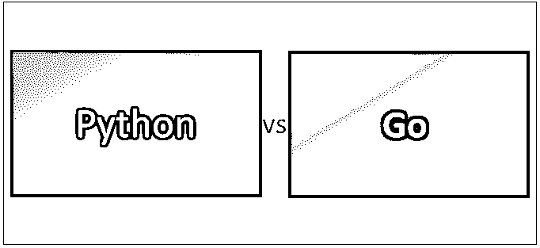

# Python vs Go

> 原文：<https://www.educba.com/python-vs-go/>

## Python 和 Go 的区别

[Python 是一种](https://www.educba.com/what-is-python/)面向对象的编程语言，Go，或 Golang，是从 C 语言衍生出来的编程。Go 主要用于系统应用和编程，python 用于基于 web 的应用和涉及[数据分析](https://www.educba.com/careers-in-data-analytics/) &数据科学的数据库应用。python 和 go 都遵循函数式的&过程化编程方法，区别在于 python 是命令式的&反射式的，而 Go 具有强大的并发特性。

### Python 和 Go 的正面比较

下面是 Python 和 Go 的 6 大对比:

<small>网页开发、编程语言、软件测试&其他</small>

### Python 和 Go 的主要区别

以下是 Python 和 Go 的主要区别:

*   Python 是一种脚本语言，必须被解释，而 Go 在大多数时候更快，因为它在运行时不需要考虑任何事情。
*   Python 是一种很好的语言，它的语法很容易理解，因此可读性更好，更灵活，而 Go 在清晰的语法方面也是首屈一指的，它没有任何不必要的成分。
*   Python 不提供内置的并发机制，而 Go 有内置的并发机制。
*   说到安全性，Python 是一种编译过的强类型语言，因此增加了一层安全性，而 Go 非常合适，因为每个变量都必须有一个与之关联的类型。这意味着开发人员不能泄露细节，这将进一步导致错误。
*   为了实现相同的功能，Python 比 Go 更简洁。
*   与 Go 相比，Python 有大量的库，但是 Go 的情况正在逐渐改善。
*   在语法方面，Python 仍然占了上风，因此对用户友好。
*   在解决数据科学问题时，Python 仍然是最受欢迎的语言，而 Go 更适合系统编程。
*   Python 是一种动态类型的语言，而 Go 是一种静态类型的语言，这实际上有助于在编译时捕获错误，这可以进一步减少生产中的严重错误。
*   Python 对于[基础编程](https://www.educba.com/python-programming-beginners-tutorial/)很棒；如果希望构建复杂的系统，使用它会变得很复杂，而使用 Go，同样的任务可以很快完成，而不需要深入到编程语言的微妙之处。
*   Python 比 Go 更简洁。动态键入有所帮助，但总体而言；你也可以用 Go 编写非常简洁的代码。

**推荐课程**

*   [C++和 DirectX 教程](https://www.educba.com/python-3-vs-python-2/)
*   [关于胡迪尼的训练](https://www.educba.com/design/courses/houdini-training-course/)

### Python 和 Go 对照表

以下是积分列表；描述一下 Python 和 Go 的对比。

| **BASIS FOR****比较** | **Python** | **出发** |
| **范式** | 面向对象、命令式、函数式、过程式、反射式 | 程序性、功能性和并发性 |
| **执行** | 解释 | 编辑 |
| **键入** | 动态类型语言 | 静态类型语言 |
| **用途** | [Python 更专注于编写 web 应用程序](https://www.educba.com/uses-of-python/) | Go 更侧重于做一门系统语言；尽管如此，它正在蚕食 python 在网络应用中的份额。 |
| **内存** | Python 不提供内存管理 | 使用 Go，您可以进行内存管理 |
| **语法** | 语法使用缩进来表示代码块 | 语法基于左大括号和右大括号 |
| **并发** | 缺乏内在的并发性 | 并发是内置的 |
| **物体方位** | 一级面向对象编程，支持函数概念 | 轻度支持面向对象和函数概念，但是是强类型的。 |

### 结论

简而言之，Python 和 Go 各有千秋，这取决于程序员理解现实需求的技巧和能力。就语法而言，Python 和 Go 都是清晰易读的，并且在很大程度上减轻了程序员的负担。

Python 和 Go 都可以在不考虑操作系统的情况下立即安装，因此带来了跨平台的特性。Python 可以虚拟地跨领域使用，如 [web 开发](https://www.educba.com/career-in-web-development/)，动画，图形，机器学习。它主要用于数据科学，并拥有大量用于科学计算的库。有一系列用 Python 开发的项目。另一方面，当涉及到网络服务时，Go 成为了一个喘息的机会。它开始是一种系统语言，但是经过一段时间，它已经为网络服务建立了声誉。

在学习算法和数据结构等计算机科学基础知识时，伪代码被大量使用；拥有一种类似 Python 的语言，它非常类似于伪代码，这是一个很大的优势，使学习更容易，另一方面，Go 非常快，更容易编写，伴随着 Go doc 自动生成文档，使程序员的生活比以往任何时候都更容易。

### 推荐文章

这是 Python 和 Go 之间区别的有用指南。在这里，我们讨论了 Python 与 Go 的直接比较、关键差异以及信息图和比较表。您也可以阅读以下文章，了解更多信息——

1.  [Java vs Node JS](https://www.educba.com/java-vs-node-js/)
2.  [Python vs Node.js](https://www.educba.com/python-vs-node-js/)
3.  [Java vs Python](https://www.educba.com/java-vs-python/)
4.  [Ruby vs Python](https://www.educba.com/ruby-vs-python/)

