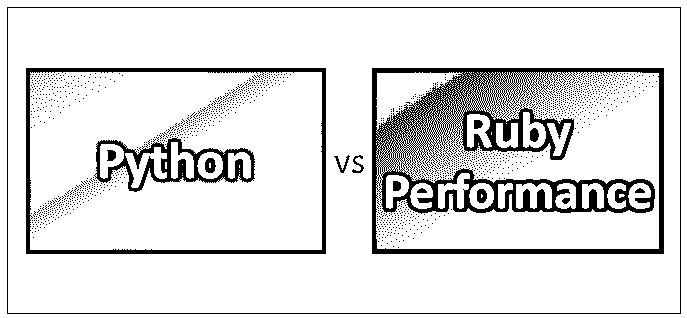

# Python 与 Ruby 性能对比

> 原文：<https://www.educba.com/python-vs-ruby-performance/>

## Python 和 Ruby 性能的差异

[Python 是一种](https://www.educba.com/what-is-python/)通用编程语言。Python 支持多种编程范式，并提出了一个大型标准库；范例包括面向对象、命令式、函数式和过程式。在 Python 语言中，语法很简单，因此它是新手的理想教学语言。Ruby 是一种面向对象的、反射的、动态的、通用的编程语言。Ruby 将面向对象编程的概念发挥到了极致。在 Ruby 中，一切都是对象，包括全局变量。类和模块是对象，函数和运算符是对象的方法。

**让我们详细研究一下 Python 和 Ruby:**

<small>网页开发、编程语言、软件测试&其他</small>

Python 由荷兰程序员吉多·范·罗苏姆创建，并于 1991 年首次发布。Python 在 web 开发领域被广泛使用。它很容易学习，因为它的语法很容易学习已经成为其最大的好处之一。其庞大的库被认为是其最大的优势之一，它提供了完成如此多任务的特性。

Ruby 是由日本的松本幸宏在 20 世纪 90 年代设计和开发的。因此，结合函数式编程和 lambdas 的使用，Ruby 变得更加强大。Ruby 作为面向对象的语言受到了像 c++(T1)、Java(T3)和 Perl(T5)这样的语言的很大影响。它是 web 开发和[函数式编程](https://www.educba.com/functional-programming-vs-oop/)的首选，这是 Ruby 社区从一开始就关注的领域。Ruby 从一开始就变得更加多样化，但是它还没有达到 Python 那样的多样化水平。

Python 是一种脚本语言，可以自动化大部分便利的东西；多年来，它已经成为现代软件开发中最受欢迎的脚本语言，从基础设施管理到数据分析。一个人必须花更多的时间思考他们试图解决的问题，花更少的时间思考语言的复杂性。

Ruby 也可以用于非基于 web 的脚本和编程，但是许多学习资源都专注于 Rails 和 web 开发。Ruby 的特性和优雅已经成为它的最大卖点之一，同时，程序员也很难找到 bug。Ruby 的语法与 Perl 和 Python 的语法非常相似，但是它将面向对象的特性发挥到了极致，与 Python 相比，这是一个全新的范例。

Python 包括许多可靠的并发库，但同时，它要求开发人员清楚副作用和隔离。使用 Ruby，人们可以轻松地编写在多个内核上运行的并发程序；与 Python 类似，开发人员负责副作用和隔离问题。与 Ruby 相比，Python 的并发处理需要更多的资源。但是话说回来，如果要同时获得 Python 和 Ruby 性能语言提供的蛋糕，就要归结为开发人员的编码习惯。

### Python 和 Ruby 性能的直接比较(信息图)

以下是 Python 和 Ruby 性能的 8 大对比:

### Python 和 Ruby 性能的主要区别

以下几点解释了 [Python](https://www.educba.com/python-interview-questions/) 和 Ruby 性能之间的主要区别:

1.  Python 是一种脚本语言，必须进行解释，而 Ruby 是一种面向对象的编程语言，具有动态性和反射性。
2.  Python 是一种很好的语言，它的语法很容易理解，因此更具可读性和灵活性，而 Ruby 比 Python 更简洁，这提供了一种优雅的解决方案。
3.  Python 不提供内置的并发机制，而 Ruby 提供了一组库来处理并发。
4.  Python 有一套更好的工具来创建游戏，因为它的 GUI 工具包比 Ruby 的强大得多。
5.  与 Ruby 相比，Python 绑定和应用程序样式在创建应用程序方面稍好一些，但同时，Ruby 在元编程方面很强，这允许创建像 vagger 这样的精彩产品。
6.  Python 社区非常稳定和多样化，但是当涉及到创新时，它比 Ruby 慢，而 Ruby 的社区在创新方面很高，但是事情往往更容易出问题。
7.  Python 仍然在显式语法上占了上风，因此可读性更好，而 Ruby 更简洁优雅。
8.  在解决数据科学问题时，Python 仍然是最受欢迎的语言，而 Ruby 更适合 web 编程。
9.  Python 方法更直接地面向编程，因此对程序员来说一切都显而易见，而 Ruby 专注于“人类语言”编程，其代码更像口头语言，而不是基于机器的语言。
10.  Python 对于基础编程来说很棒；如果希望构建复杂的系统，使用它会变得很复杂，而使用 Ruby，像 Ruby on Rails 这样的 web 应用程序框架以其优雅简洁的面向对象方法使 web 开发变得更容易。

### Python 与 Ruby 性能比较表

下面是 8 Python 和 Ruby 性能的比较表

| **比较依据** | **Python** | **红宝石性能** |
| **范式** | 面向对象、命令式、函数式、过程式、反射式 | 面向对象的、解释的、动态的和反射的 |
| **框架** | Django 始于 2003 年 | Ruby on rails 始于 2005 年 |
| **功能** | 直接性和可读性 | 简洁和更神奇 |
| **用途** | 谷歌，Instagram，火狐等 | 苹果、推特、Github 等 |
| **社区** | 稳定而多样 | 更快创新 |
| **语法** | 显而易见，有时读起来很不雅 | 更简洁，但有时很难调试 |
| **特性** | 易学，保守，比 Ruby 更严格 | 基于模块的方法和高度灵活性 |
| **应用程序** | 非常适合需要大量计算和处理大量数据的应用程序。 | 快速原型化流量大的应用程序 |

### 结论

Python 和 Ruby 的性能都来自它们的框架，比如 Django 和 [Ruby on Rails](https://www.educba.com/ruby-vs-ruby-on-rails/) 。在 Django 中可以做的任何事情，在 Ruby on Rails 中也可以做。哪种框架或语言更好并不是能力的问题，而是哪种更适合您的场景和需求的问题。就 web 开发而言，Python 和 Ruby Performance 都是强大的框架，有强大的社区支持它们。如果有人计划专注于构建 web 应用程序， [Ruby 更受欢迎](https://www.educba.com/ruby-commands/)也更灵活，因为有一个非常创新的社区建立在它之上，他们总是处于开发的前沿。

Python 社区已经包含了一个大型的 Linux 和学术社区，因此提供了许多数学和科学领域的用例。这种支持为不断增长的 Python 社区提供了更多的稳定性和多样性。

简而言之，任何一种方式都不会错。几乎所有你在 Python 中可以做或学习的事情都可以被翻译成 Ruby，反之亦然。有了给定的框架，数据密集型应用程序和原型应用程序可以轻松构建。您构建应用程序或解决一般逻辑和编程问题的决定最终将取决于您的经验和需求水平。

### 推荐文章

这是 Python 和 Ruby 性能之间主要差异的指南。在这里，我们讨论了 Python 与 Ruby 的性能对比、关键差异以及信息图和比较表。您也可以看看以下文章——

1.  [Java vs Python](https://www.educba.com/java-vs-python/)
2.  [脚本](https://www.educba.com/programming-vs-scripting/) [vs 编程](https://www.educba.com/programming-vs-scripting/)
3.  [数据科学 vs Web 开发](https://www.educba.com/data-science-vs-web-development/)
4.  [Java vs Ruby](https://www.educba.com/java-vs-ruby/)

