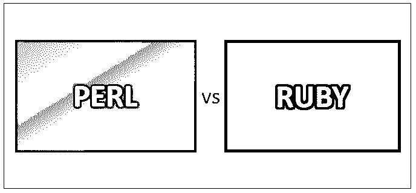

# Perl vs Ruby

> 原文：<https://www.educba.com/perl-vs-ruby/>

## Perl 和 Ruby 的区别

Perl 是一种通用的解释型动态编程语言，最初由拉里·沃尔于 1987 年创建。最初，它是作为一种通用的 Unix 脚本语言创建的，目的是使报表处理更容易、更快。 [Perl 代表实用提取](https://www.educba.com/install-perl/)和报告语言。它运行在各种平台上，如 Windows、Mac 和各种版本的 Unix。

Ruby 是由日本的 Yukihiro Matsumoto 在 20 世纪 90 年代设计和开发的一种面向对象的、反射的、动态的、通用的编程语言。

<small>网页开发、编程语言、软件测试&其他</small>

Perl 语言借鉴了 C、Shell 脚本、AWK 和 sed 等编程语言的特性。它是多范式、功能性、命令性、面向对象、程序性和事件驱动的。

Ruby 将面向对象编程的概念发挥到了极致。在 [Ruby](https://www.educba.com/install-ruby/) 中，一切都是对象，包括全局变量。类和模块是对象，函数和运算符是对象的方法。因此，结合函数式编程和 lambdas 的使用，Ruby 变得更加强大。

Perl 是一种非常稳定的跨平台编程语言。它能有效地与 HTML、XML 等标记语言一起工作。它是开源软件，在 GNU 通用公共许可证(GPL)下获得许可。

Ruby 是面向对象的，它深受 C++、Java 和 Perl 等语言的影响。它是 web 开发和函数式编程的首选，这是 Ruby 社区从一开始就关注的领域。Ruby 从一开始就变得更加多样化，但是它还没有达到 Perl 那样的多样化水平。

尽管 Perl 是一种更古老的语言，但它是一种非常可靠的语言，在 web 开发中非常适用。Perl 在设计上很精明。当它在 20 世纪 80 年代推出时，在最初阶段非常受欢迎，其背后有多重原因。c 是一种低级语言，在那个时代，即使是最简单的过程也需要多行代码。此外，Perl 是可移植的，不像 c。因此，Perl 在 20 世纪 90 年代大受欢迎，并在电子商务兴起期间成为基于 web 的业务的首选。

Ruby 可以用于非基于 web 的脚本和编程，但是许多学习资源都专注于 Rails 和 web 开发。Ruby 的特性和优雅已经成为它的最大卖点之一，同时，程序员也很难找到 bug。Ruby 的语法类似于 Perl，但是它将面向对象的特性发挥到了极致。

像亚马逊这样的巨头都是用 Perl 编写的。当涉及到系统管理时，它与构建复杂的企业软件一样有效。Perl 仍然是后端架构的资产。Perl 最大的优势之一是 CPAN(Comprehensive Perl Archive Network)，它是数千个 Perl 软件模块和打包代码库的集合，这些模块和库是由它们自己的作者编写和维护的。

### Perl 和 Ruby 的直接比较

以下是 Perl 和 Ruby 之间的 8 大对比:

### Perl 和 Ruby 的主要区别

以下是 Perl 和 Ruby 之间的区别:

1.  Perl 是一种面向对象的语言，必须被解释，而 Ruby 是一种高度面向对象的编程语言，它是动态的、反射性的，经常被编译，然后编译的输出被解释。
2.  Perl 代码库，CPAN 是无与伦比的，有大量的可用库，而 Ruby 虽然有相当数量的库，但仍需要赶上 Perl。
3.  Perl 是系统管理工作以及 [web 开发任务](https://www.educba.com/data-science-vs-web-development/)的理想选择，而 Ruby 非常适合流量大的应用程序。
4.  当谈到支持正则表达式时，Perl 有很多库，而 Ruby 对正则表达式的支持与 Perl 相比是相当不错的。
5.  Perl 最常用于 CGI(通用网关接口)脚本，与 C 一起用于 web 服务器，因此广泛用于服务器技术领域，而 Ruby 在元编程方面很强，这允许创建像 vagger 这样的精彩产品。
6.  Perl 有一个名为“Perlmonks”的社区，它是语言支持中最好的，而 Ruby 有一个 Google group 作为支持社区。
7.  Perl 是一个历史悠久的巨人，拥有大量的用户，而 Ruby 在新开发人员中越来越受欢迎，正在赶上 Perl。
8.  Perl 有点像 CeeLanguage，而 Ruby 也从 Small talk 借鉴了一点。
9.  Perl 5 较少面向对象，尽管 Perl 6 有很好的面向对象支持，而 Ruby 是一种高度面向对象的语言。
10.  Perl 对 Unicode 的支持强多了；它支持 Unicode 属性，而 Ruby 对 Unicode 的支持没有 Perl 那么强；它的编码更加明确。

### Perl 和 Ruby 对照表

下面是 Perl 和 Ruby 的详细对比。

| **BASIS FOR**

**比较**

 | **Perl** | **红宝石** |
| **范式** | Perl 5 不太面向对象 | 纯面向对象语言 |
| **框架** | 姜戈 | 催化剂 |
| **到达** | 最初发布于 1987 年 | 1994 年发布 |
| **图书馆** | 相当多的图书馆可供使用 | 在库方面超过了 Perl |
| **社区** | Perlmonks 是最好的编程语言社区之一 | Google 群组或论坛支持 Ruby |
| **语法** | 支持[多种变量类型](https://www.educba.com/python-variable-types/) | 只有一种变量类型 |
| **特性** | 跑得飞快，表现出色 | Ruby 脚本运行得相当不错 |
| **应用程序** | 非常适合 [web 应用](https://www.educba.com/what-is-web-application/)开发和系统管理 | 快速原型化流量大的应用程序 |

### 结论

Perl 是一种非常古老的语言；它早在 1987 年就开始了它的旅程，而 Ruby 是在 1994 年到达的。因此，Perl 和 Ruby 语言都有各自的优缺点。Perl 有优秀的社区做后盾，这是 Perl 最大的优势之一。Perl 提供了大量适合各种需求的库。作为市场上的老马，Perl 的文档也更丰富更好。它在很长一段时间内的巨大领先优势确保了大多数库都有很好的文档记录，并且在网上有大量的例子。

Ruby 正以相当快的速度追赶上来，并在不断发展。人们可以用 Ruby 编写任何经过改进的 Perl 代码。从一开始，它就提供了面向对象的特性，有助于保持大型代码体的可维护性。用 Perl 编写面向对象的代码可能很痛苦；在鲁比语中，一个喘息者。Ruby 提供了元编程和对代码生成的更好支持。

比起编写 Perl 代码，人们更喜欢编写 Ruby 代码，反之亦然。在过去的几年里，Ruby 已经填补了 Perl 在库、文档和社区方面的许多空白。Perl 或 Ruby 都有自己的一套更适合特定需求的领域。最终归结为需求和程序员的能力。

### 推荐文章

这是 Perl 和 Ruby 区别的指南。我们已经讨论了 Perl 和 Ruby 的直接比较、关键区别以及信息图和比较表。你也可以看看下面的文章来了解更多。

1.  [Perl vs Python](https://www.educba.com/perl-vs-python/)
2.  [Ruby vs Ruby On Rails](https://www.educba.com/ruby-vs-ruby-on-rails/)
3.  [Python vs Scala](https://www.educba.com/python-vs-scala/)
4.  [JavaScript vs Ruby](https://www.educba.com/javascript-vs-ruby/)

