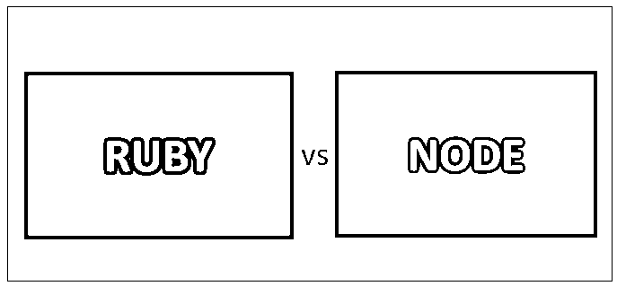

# Ruby vs 节点

> 原文：<https://www.educba.com/ruby-vs-node/>

## Ruby 和 Node 的区别

Node.js 是一个跨平台、快速和精简的 JavaScript 运行时环境，构建在一个 JavaScript 引擎上。Node.js 使用事件驱动的非阻塞 I/O，通过它我们可以实现低延迟和高吞吐量，并使它变得轻量级和高效。Node.js 对服务器和桌面应用程序都很有用。Ruby 是一种开源编程语言，面向对象的语言，注重简单性、可移植性、可扩展性和生产力。如果我们熟悉 python 之类的其他编程语言，那么它简单的语法就很容易阅读和编写。

### 什么是节点？

Node.js 是用 c/c++，JavaScript，和它的包生态系统 NPM (node package manager)编写的，包里有很多开源库。Node.js 是 Ryan Dahl 在 2009 年为 Linux 和 macOS 推出的。Node 有许多内置模块，我们可以在其中使用命令行。节点非常适合处理异步 JS 代码来执行许多活动。

<small>网页开发、编程语言、软件测试&其他</small>

### 什么是 Ruby？

Ruby 是一种开源的编程语言，面向对象的语言。它主要是在 Linux 上开发的，可以在所有平台上工作，如 UNIX、Windows、DOS 和 Mac OS 等。Ruby 由松本幸宏创作，于 1995 年首次发布。由于它是开源的，我们可以根据我们的需要和用途自由修改、编辑。Ruby 类似于 Small talk 和 Perl，因为它是面向对象的，像 Small talk 一样方便，像 Perl 一样方便，更容易维护。

### Ruby 和 Node 的直接比较(信息图)

以下是 Ruby 和 Node 的 7 大对比:

### Ruby 和 Node 的主要区别

以下几点解释了 Ruby 和 Node 之间的主要区别:

*   与 Ruby 相比，Node.js 将提供更快的服务器端解决方案，这是因为它基于事件的编程、单个 CPU 的非阻塞 I/O 使用。
*   Node.js 比 Ruby 有更少的学习曲线，对于来自不同编程背景的人来说很容易学习，而 Ruby 有更多的学习资源，在线社区。
*   Ruby 需要有明确的文件/文件夹结构，而 Node.js 非常灵活；我们可以将整个代码放在一个文件或多个文件或目录中。
*   Node.js 没有关于文件名的规则；我们可以根据需要命名文件，而 Ruby 对文件名有严格的规定；如果我们改变文件名，应用程序就会崩溃。
*   Ruby 在其操作中支持多线程，它更适合 CPU 密集型应用程序，而 Node.js 是单线程的，最适合繁重的 I/O 应用程序，不适合 CPU 密集型应用程序。
*   在 Ruby 中，没有回调，也就是说，所有的指令都是按顺序执行的，而 Node.js 有回调，并以异步方式工作。
*   在 Ruby 中，代码维护很容易，因为它在开发时有规则，并且很容易在开发人员之间转移，而 Node.js 代码维护很棘手或很困难，因为它没有针对开发人员的任何规则。
*   Node.js 是不一致的，因为 API 会随着时间的推移而频繁更改和改进，而 Ruby 是一致的，因为它的更改较少。
*   Node.js 可以作为前端和后端开发的编程语言，而 Ruby 是后端开发的。
*   Node.js 包生态系统 NPM (node package manager)有大量的库，而 Ruby 没有 Node.js 那么多

### Ruby 和节点对照表

下面是 Ruby 和 Node.js 的对照表。

| **比较的基础** | **红宝石** | **节点** |
| **框架类型** | Ruby 是一个固执己见的框架，希望以某种方式做事，这在调试 web 应用程序时是一个缺点。 | Node.js 是一个非自以为是的框架，因为它提供了更多的控制，但在开发时没有标准规则可循。为了在团队中工作，我们需要在编码时有一定的规则可以遵循，而 Node.js 没有这些规则。 |
| **开发时间** | Ruby 有能力开发一个完整的 CRUD 应用程序，包括数据库连接，通过命令行用很少的命令进行迁移。 | 这将需要时间，因为我们需要编写代码，找到所需的模块，并与其他模块集成。虽然 Node.js 提供了选择不同组件的灵活性，但是集成它们需要更多的时间。 |
| **性能** | Ruby 的性能非常慢，这是它的一个瓶颈。由于 Ruby 应用程序的抽象本质，有时调试 Ruby 应用程序是一个耗时且困难的过程。 | 由于其 JavaScript 引擎，Node.js 在许多情况下比 Ruby 快，尽管它有一些问题。 |
| **学习曲线** | Ruby 很容易学，因为它有很多在线教程和课程。它有最活跃的开发者社区，如果我们在学习时停滞不前，通过它我们可以轻松地学习。 | 与 ruby 相比，Node.js 的学习曲线更短，但来自不同编程背景(如 C/C++)的开发人员也可以轻松学习。前端开发人员很容易学习，就像我们用 JavaScript 编写一样。 |
| **CPU 密集型任务** | Ruby 非常适合 CPU 密集型任务，比如图像处理、数据处理和快速应用程序开发。 | Node.js 在处理 CPU 密集型任务时会导致 web 应用程序挂起，因为它使用了单线程。这将花费很长时间，并阻止其他任务运行。 |
| **可扩展性** | Ruby 的可扩展性不如 Node.js，所以很多公司因为可扩展性而从 Ruby 迁移到 Node.js，比如纽约时报、LinkedIn、优步、PayPal 等等。 | 与 ruby 相比，Node.js 的可伸缩性更好，因为它拥有带抽象的集群，可以基于 web 应用程序的工作负载，以最少的 CPU 数量生成进程。 |
| **人才发现** | 很少有人了解 Ruby 和框架，因此，他们有巨大的需求，需要支付很高的报酬，因为他们很难得到 | Node.js 有更多精通框架和编程语言的人。我们可以从一个人那里同时得到前端和后端的开发者，而且不需要支付像 Ruby 那么高的费用。 |

### 结论 Ruby vs Node.js

最后，是对 Ruby vs Node.js 的比较的概述。我希望在阅读完这篇 Ruby vs Node.js 文章后，您将对这些框架和编程语言有更好的理解。由于 Ruby 和 Node.js 可以实现相同的结果，但是 [Ruby 适合于我们需要开发 CPU 密集型应用程序或需要快速移动以进行凝乳操作的情况](https://www.educba.com/ruby-commands/)，而 Node.js 适合于我们需要开发具有大量 I/O 操作的应用程序、单页面应用程序、实时应用程序等的情况。

### 推荐文章

这是 Ruby 和 Node 之间区别的有用指南。在这里，我们讨论了直接比较、关键差异以及信息图和比较表。您也可以阅读以下文章，了解更多信息——

1.  [Java vs Node JS](https://www.educba.com/java-vs-node-js/)
2.  [Java vs Ruby](https://www.educba.com/java-vs-ruby/)
3.  [Python vs Node.js](https://www.educba.com/python-vs-node-js/)
4.  [Ruby vs Ruby On Rails](https://www.educba.com/ruby-vs-ruby-on-rails/)

