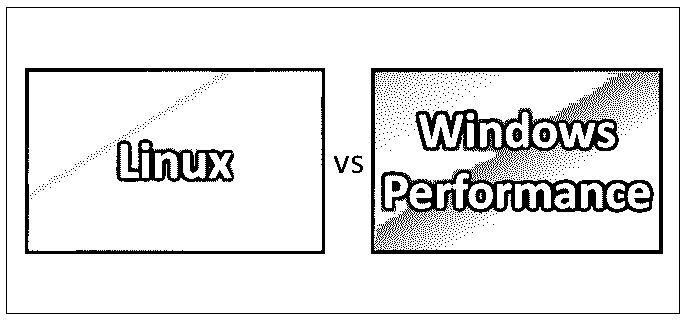
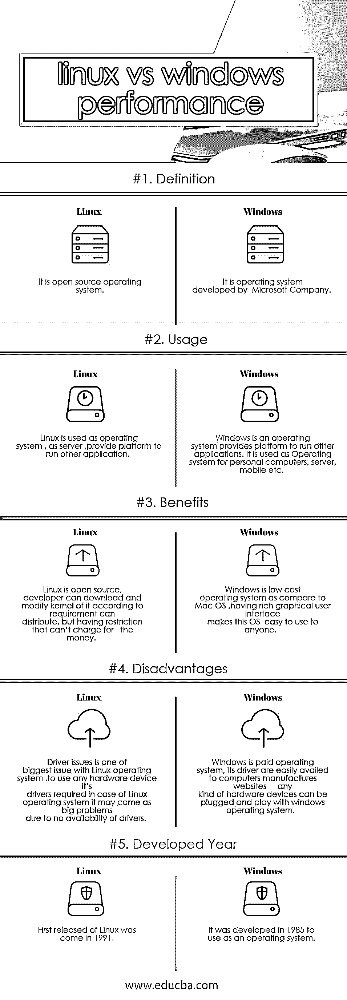

# Linux 与 Windows 性能对比

> 原文：<https://www.educba.com/linux-vs-windows-performance/>

## Linux 与 Windows 性能之间的差异

[Linux 是一个](https://www.educba.com/what-is-linux/)操作系统。它是一个围绕 Linux 内核构建的开源操作系统。它以一种被称为 [Linux 发行版](https://www.educba.com/linux-distributions/)的形式打包，用于桌面和[服务器应用](https://www.educba.com/windows-server-interview-questions/)。技术人员通常使用它，因为一个人应该知道使用它的各种 Linux 命令。Windows 是一个操作系统。它有一个丰富的用户界面；它是一个付费的操作系统。对于非技术人员来说非常好用；技术和非技术人员也可以使用。

**让我们详细了解一下 Linux 和 Windows 的性能**

<small>网页开发、编程语言、软件测试&其他</small>

Linux 发行版的定义组件是 Linux 内核，它是由 Linus Torvalds 于 1991 年 9 月 17 日首次发布的操作系统内核。许多 Linux 发行版在它们的名称中使用了单词 Linux。Linux 最初是为基于 Intel x86 体系结构的个人计算机开发的，但后来被移植到比任何其他操作系统都多的平台上。由于基于 Linux 内核的 Android 操作系统在智能手机上的主导地位，Linux 在所有通用操作系统中拥有最大的安装基数。

微软于 1985 年 11 月 20 日开发了一个名为 Windows 的操作环境，作为 MS-DOS 的图形操作系统外壳，以响应对图形用户界面日益增长的兴趣。微软不时推出许多版本的 windows 操作系统。它在基于 GUI 的操作系统领域占据了主导地位。

Linux 包括许多版本，如 Android、Arch Linux、Debian Linux、Gentoo Linux、kabunto、Mandriva Linux、PC Linux、Red Hat Linux、Sabayon Linux、Slackware、Suse Linux。

微软不时发布许多版本的 windows，如下所示。

基于 Dos 的操作系统包括 Windows1、Windows2、Windows2.1x、Windows3 和 Windows3.1x

Windows 9x 是继 Windows 95，Windows 98，Windows ME 之后。

Windows NT 客户端版本–Windows XP、Vista、Windows 7、Windows 8、Windows 10

windows Server–Server 2003(家庭服务器)、Server 2008 (EBS 2008)。

### Linux 和 Windows 性能的直接比较(信息图表)

以下是 Linux 和 Windows 性能的 5 大对比:

### Linux 和 Windows 性能的主要区别

以下是要点列表，描述了 Linux 和 Windows 性能之间的主要差异:

1.  Linux 开源操作系统，任何人都可以下载，并根据需要修改内容，然后分发。
2.  Windows 操作系统不是开源操作系统；如果有人想使用 Windows 操作系统，他必须购买。its 没有人能像 Linux 一样按照自己的要求改变内容。
3.  基于 Linux 的驱动程序在市场上不容易买到，因为它是开源的。这给使用特定的硬件设备带来了问题。它是一家开源公司，不像微软和 Mac OS 那样为 Linux 创建驱动程序。
4.  Windows 操作系统不是开源的，所以它的驱动程序很容易获得；由于各种硬件驱动程序的可用性，任何硬件设备都可以很容易地插入 Windows 计算机。
5.  Linux 是一个开源的操作系统，所以用户不需要花钱就可以使用 Linux。
6.  Windows OS 是微软公司的产品；它不是一个开源产品，所以要使用 Windows 操作系统，用户需要付费，然后唯一的用户才能使用它。
7.  支持是开源产品的一个问题；发行 Linux 的公司通过支持赚钱。
8.  虽然在 Windows 操作系统中支持现成可用，但您无需担心像 Linux 产品那样的支持，因为它是付费产品。所有硬件厂商都会支持[微软 Windows](https://www.educba.com/introduction-to-windows/) 。由于大量的微软用户和更广泛的驱动程序，所有的硬件设备都得到支持。
9.  Linux 操作系统非常安全；它以安全著称
10.  与 Linux 相比。Windows 更容易受到病毒和其他攻击。
11.  由于 Linux 的安全性和强大性，它被大多数公司用作服务器；许多公司都提供对 Linux 的支持，其中一些是 Red Hat、SUSE 和 CANONICAL。
12.  如果您计划开发基于 windows 的应用程序，那么最推荐使用 windows 平台，因为 Linux 不支持 windows 应用程序。就网络而言，windows 主机让这变得容易多了。你不必担心它是否支持。

### Linux 和 Windows 性能比较表

下面是 Linux 和 Windows 性能之间的比较表。

| **BASIS FOR**

**比较**

 | **Linux** | **Windows 性能** |
| **定义** | 这是一个开源的操作系统 | 它是由微软公司开发的操作系统 |
| **用途** | Linux 被用作操作系统，作为服务器，提供运行其他应用程序的平台。 | [Windows 是一个](https://www.educba.com/what-is-windows/)操作系统，提供了一个运行其他应用程序的平台。它被用作个人电脑、服务器、手机等的操作系统。 |
| **好处** | Linux 是开源的；开发者可以根据需要下载并修改它的内核进行分发，但是有一个限制就是不能收费。 | 与 Mac OS 相比，Windows 是一个低成本的操作系统；拥有丰富的图形用户界面使得这个操作系统易于任何人使用。 |
| **缺点** | 驱动程序问题是 Linux 操作系统的最大问题之一，使用任何硬件设备都需要驱动程序，在 Linux 操作系统的情况下，由于没有可用的驱动程序，这可能会成为大问题。 | Windows 是付费操作系统；它的驱动程序很容易被电脑制造商网站所利用。任何种类的硬件设备都可以插入 windows 操作系统。 |
| **开发年份** | 1991 年首次为 Linux 发布 | 它是在 1985 年开发出来用作操作系统的。 |

### 结论

它是在[开源软件开发](https://www.educba.com/software-development-vs-web-development/)模式下组装的操作系统，主要用于服务器用途。它支持许多编程语言，如 C、C++、JAVA 等等。你不需要花很多钱来获得许可证，因为它的软件来自 GNU 通用公共许可证。Linux 在工作站和网络上提供高性能；您不必定期重启来保持性能。

它是微软操作系统的一个系列。[编程语言](https://www.educba.com/what-is-a-programming-language/)如 Visual Home Page、微软 ASP.NET 官方站点、Visual C#、Visual C++都用了那还不如选择 Windows 托管。微软视窗系统已经取得了很大的进步和变化，这使得操作系统更容易使用。它比 Linux 简单。它需要定期重启；否则，系统可能会挂起。

Windows 和 Linux 主机各有优缺点。根据你的需求，你需要选择哪个主机更适合你。

### 推荐文章

这是 Linux 与 Windows 性能差异的指南。在这里，我们讨论了 Linux 与 Windows 性能的直接比较、关键差异以及信息图和比较表。您也可以阅读以下文章，了解更多信息——

1.  [Linux vs Windows 10](https://www.educba.com/linux-vs-windows-10/)
2.  [Linux vs Ubuntu](https://www.educba.com/linux-vs-ubuntu/)
3.  [Linux vs Windows Server](https://www.educba.com/linux-vs-windows-server/)
4.  [Linux vs BSD](https://www.educba.com/linux-vs-bsd/)

