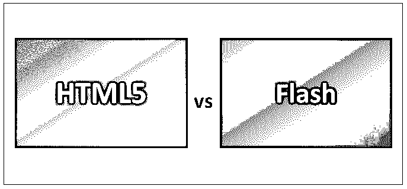

# HTML5 与 Flash

> 原文：<https://www.educba.com/html5-vs-flash/>

## HTML5 与 Flash 的区别

HTML5 是用于呈现和结构化万维网内容的标记语言。HTML5 是 HTML 标准的第五个版本，也是当前版本。HTML5 通过支持最新的多媒体改进了语言。HTML5 对人类来说是可读的，并且可以被 Web 浏览器、解析器等很好地解析。Flash 是 Adobe 产品。这是一个[多媒体软件](https://www.educba.com/best-free-multimedia-software/)平台，主要用于制作动画、[桌面应用](https://www.educba.com/microsoft-office-application/)、[移动应用](https://www.educba.com/mobile-applications/)、移动游戏和嵌入式网络浏览器视频播放器、丰富的互联网应用。Flash 通常用于视频或音频播放器、广告和网页的交互式媒体内容。

### HTML5

*   HTML5 由 W3C(万维网联盟)于 2014 年 10 月发布。HTML5 是用 HTML 元素编写的，由标签组成。这些标签之间的数据代表内容。HTML5 的主要动机是允许 web 浏览器解释内容并最终显示它们。HTML5 附带了预定义的标签。
*   前端开发人员可以将图像、视频、表格和各种内容一起插入到一个有凝聚力的网页中。HTML5 使用纯代码生成交互式内容。元素不是以精确的形式预先制作然后存储的，而是它们的特征被编码，然后一旦页面被加载，浏览器就呈现实际的内容。因此，使用 HTML5 设计的网页在不同的浏览器上可以有不同的行为和外观。
*   对于那些想要为不同平台创建不同版本网站的网页设计师来说，这是一个福音。 [HTML5 语法](https://www.educba.com/html-vs-html5/)不再基于 SGML(标准通用标记语言)；它被设计成向后兼容普通的解析旧版本的 HTML 的[。HTML5 还指定了可以与 JavaScript 一起使用的脚本 API。](https://www.educba.com/versions-of-html/)
*   HTML5 standalone 不能在网页中提供动画。它使用 JavaScript 或 CSS3 来制作 HTML 元素的动画。苹果 Safari、谷歌 Chrome、Mozilla Firefox、Opera 等最新版本的浏览器都支持很多 HTML5 功能。预装在 iPhones、pad 和 Android 手机上的移动网络浏览器都非常支持 HTML5。

### 闪光

*   一个人可以创建一个动画的文本，图纸和静态图像所使用的图形。Flash 还支持音频和视频的双向流。它可以通过鼠标、键盘、摄像头和麦克风捕捉用户输入。Adobe AIR 是由 Adobe Systems 创建的跨平台运行时系统，用于构建需要 Flash 的桌面和移动应用程序。
*   在 21 世纪初，Flash 被广泛安装在台式电脑上。它通常用于显示交互式网页、在线游戏以及播放音频和视频内容。在 Adobe 推出 Stage3D 后，Flash 网站上用于演示和游览的 3D 内容出现了增长。
*   Flash 使用容器来存储交互内容，最终使用插件 Flash Player 在浏览器中呈现这些内容。Flash 内容是独立于平台的，因为容器不会从一个平台改变到另一个平台。因此，如果有人在 PC 或移动设备上观看基于 Flash 的网站，它会显示相同的内容。

### HTML5 和 Flash 的正面比较

以下是 HTML5 和 Flash 的 8 大对比:

<small>网页开发、编程语言、软件测试&其他</small>

### HTML5 和 Flash 的主要区别

HTML5 vs Flash 都是市场上的热门选择；让我们讨论一下 HTML5 和 Flash 之间的一些主要区别:

1.  HTML5 在任何平台上都有巨大的潜在市场，而 Flash 的浏览器支持有限，需要一个插件。
2.  HTML5 是开源的，可以免费获得，而 Flash 是 Adobe 的专利，必须购买。
3.  HTML5 是轻量级的，速度快，渲染网页需要较少的 CPU 时间，而 Flash 是 CPU 密集型的，不如 HTML5 轻量级。
4.  HTML5 的音频和视频支持不是内置的，而 Flash 对音频和视频格式有很好的支持。
5.  HTML5 在 web 浏览器中本地运行，而 Flash 需要在 web 浏览器上单独安装一个插件来显示和运行内容。
6.  运行 HTML5 内容所需的处理能力明显低于 Flash 内容所需的处理能力。
7.  HTML5 是一项相当新的技术，仍然在随着新元素和标签支持而发展，而 Flash 是一匹老马，市场上有许多成熟的工具，尽管价格昂贵。
8.  HTML5 使用代码来生成交互式内容；浏览器在页面加载时呈现内容，而 Flash 使用容器来存储交互式内容，这些内容使用一个名为 Flash player 的插件在浏览器中呈现。
9.  HTML5 的目标是建立一个本地支持媒体流的网站，而 Flash 是一种使开发者能够通过互联网传输媒体的技术。
10.  HTML5 功耗给用户带来了巨大的好处，因为它消耗的电量更少，而 Flash 消耗的 CPU 更多，使用插件和 Flash Player 等工具消耗的电量更多。

### HTML5 和 Flash 对照表

以下是积分列表；描述 HTML5 和 Flash 的对比。

| 【HTML5 与 Flash 的比较基础 | **HTML5** | **闪光** |
| **到达** | 市场上最新的 HTML 版本 | 与 HTML5 相比更老的技术 |
| **支持** | 所有浏览器本身都支持 | 需要安装额外的插件 |
| **性能** | 需要较低的处理能力 | 与 HTML5 相比，需要更高的处理能力 |
| **资源** | 打火机上的一个资源不需要任何插件 | 需要安装的面向资源的插件越多 |
| **成本** | 免费提供，开源 | 专用开发环境，必须购买 |
| **支持** | 不同的音频和视频支持缺乏内置支持 | 良好的音频和视频支持 |
| **工具** | 构造 2 是 HTML5 编辑器 | Flash builder 之类的工具虽然成熟，但价格昂贵 |
| **友好** | 与搜索引擎优化(搜索引擎优化)友好 | Flash 对 SEO 不友好 |

### 结论

HTML5 是开源的，任何人都可以通过贡献来改进它，而 Adobe 拥有 flash。HTML5 是一种安全的技术，将有利于商业，家庭用户等。使用 Flash 这种专有解决方案，会导致安全问题和开发速度变慢。网络已经发展到只接受像 HTML5 这样的开放标准。

Flash 已经存在 20 多年了。在那个时代，它是视频和其他多媒体的主导平台。它已经成为在线视频分发行业的标准，但是 Flash 技术在安全性和速度方面存在一些问题。2007 年苹果第一次发布 iPhone 不支持 Flash 因此，闪存支持在市场上飘忽不定。这种趋势在市场上是显而易见的，包括一些网络浏览器放弃了对 Flash 的支持。像 2016 年 7 月，火狐就逐步淘汰了对 Flash 的支持。因此，所有主要的网络浏览器也加入了 HTML5 的行列。

HTML5 正在缓慢而稳定地填补 Flash 在其巅峰时期占据主导地位的空白。JW Player 是一款 HTML5 视频播放器，为数百万个热门网站的视频提供支持。时代在变化，朝着更现代、更快的标准迈进。闪存不再是曾经的主导力量。HTML5 克服了 Flash 的所有缺点，比如安全性和速度。 [HTML5 对“https”的支持](https://www.educba.com/html5-new-elements/)和视频播放器支持将有助于安全、无缝地交付内容，这与 Flash 不同，Flash 占用大量 CPU 资源且不完全安全。我希望现在你已经对 HTML5 和 Flash 有了更公平的认识。请继续关注我们的博客，获取更多类似的文章。

### 推荐文章

这是 HTML5 和 Flash 之间区别的有用指南。在这里，我们已经讨论了 HTML5 与 Flash 的直接比较，关键差异，以及信息图和比较表。你也可以看看下面的文章来了解更多。

1.  [HTML vs XML](https://www.educba.com/html-vs-xml/)
2.  [HTML vs CSS](https://www.educba.com/html-vs-css/)
3.  [HTML vs JavaScript](https://www.educba.com/html-vs-javascript/)
4.  [HTML vs HTML5](https://www.educba.com/html-vs-html5/)

