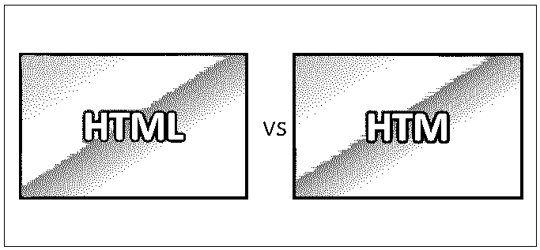
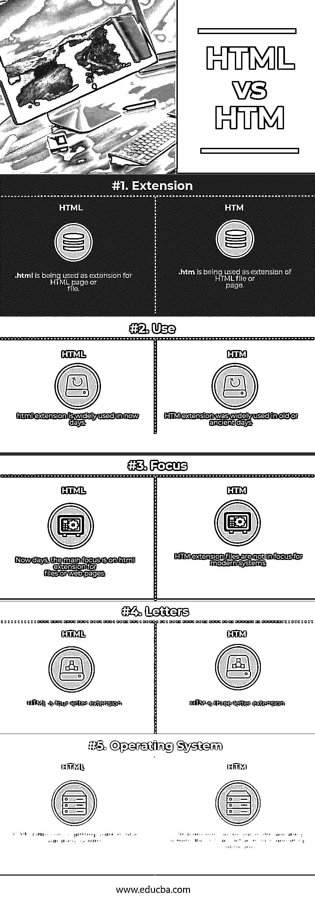

# HTML vs HTM

> 原文：<https://www.educba.com/html-vs-htm/>

## HTML 和 HTM 的区别

HTML 的完整形式是超文本标记语言。HTML 用于开发网页和[应用](https://www.educba.com/uses-of-html/)。HTML 由元素组成；这些元素定义了 HTML 页面的结构。HTML 元素用于表示标题、段落、图像、表格和更多的功能。HTM 被用作 HTML 页面的文件扩展名之一。当我们使用 HTML 文件来创建网页时，那么它的文件扩展名可以是 in。' htm '格式。我们可以在不同网站的 URL 末尾检查这个扩展。

### 超文本标记语言

*   HTML 早些时候由 Tim Berners Lee 提出，由 W3C 和 WHATWG 开发，并于 1993 年发布。HTML 由 SGML 扩展而来。HTML 的文件扩展名是。html 和. htm . HTML 的最后一个版本是 HTML5，是 2014 年 HTML 的一个主要版本。
*   HTML 可以嵌入 CSS(层叠样式表)和 JavaScript。HTML 元素被封装在类似的 HTML 标签中。浏览器不显示 HTML 标记；它只显示 tags.HTML 页面中包含的内容，可以使用记事本(在 Windows 机器上)和文本编辑(在 Mac Book 或 Mac 机器上)等 HTML 编辑器进行开发。
*   基本的 HTML 页面结构由 1。 *Doctype* 标签喜欢<！DOCTYPE html >，描述编写的 html 版本。2. *HTML 根元素*标签，如< html > < /html >，其中包含了为网页编写的所有代码。3.*头元素*标签类似于< h1 > < /h1 >，在此标题和标题中有描述。4. *Body 元素*标签和< body > < /body >一样，它保存着文档的内容。

### html 文件的后缀

*   HTM 文件扩展名主要用于磁盘操作系统(DOS)和 windows 也。当与不采用四个字母扩展名的操作系统存在兼容性问题时，会使用扩展名 HTM。
*   这是早期用于旧操作系统的手段，因为它们不能处理文件名太大的文件。但是现在，在一个现代化的时代，系统的速度和能力足以处理大文件，而对文件名的长度没有限制。
*   使用 HTM 文件扩展名，以便用户可以知道请求的是什么类型的数据，并区分网页的其他扩展名。文件扩展名起到了重要的作用，因为我们知道，如果我们试图打开计算机上的文件，如果它不打开，这意味着所需的程序没有安装在我们的计算机上。
*   如果浏览器无法打开该页面，可能是该页面或文件已不在托管服务器上。这可能是一个打字错误的问题；有时候，我们输入了错误的网址。浏览器并不真正关心扩展；如果我们键入一个没有文件扩展名的有效 URL，它将找到页面或文件并显示内容。

### HTML 和 HTM 的面对面比较(信息图)

以下是 HTML 和 HTM 的五大对比:

<small>网页开发、编程语言、软件测试&其他</small>

### HTML 和 HTM 的主要区别

以下是要点列表，描述了 HTML 和 HTM 的主要区别。

1.  [HTML 是](https://www.educba.com/what-is-html/)超文本标记语言，用途。html 和。htm 作为文件扩展名，同时开发应用程序页面或文件。HTM 是文件扩展名为[的 HTML 页面](https://www.educba.com/linking-pages-in-html/)或文件格式。
2.  HTML 扩展是大多数托管服务器或组织想要处理的首选。html 文件，而被要求的网页。如今，HTM 扩展文件并不是网页的首选。

### HTML 和 HTM 的对照表

下面是 HTML 和 HTM 的对照表。

| **BASIS FOR****比较** | **HTML** | **HTM** |
| **分机** | **。html** 正被用作 html 页面或文件的扩展名。 | **。htm** 正被用作 HTML 文件或页面的扩展名。 |
| **使用** | HTML 扩展现在被广泛使用。 | HTM 分机在古代被广泛使用。 |
| **焦点** | 如今，[的主要焦点是针对文件或网页的 HTML 扩展。](https://www.educba.com/advantages-of-html/) | HTM 扩展文件不是现代系统的焦点。 |
| **字母** | HTML 是四个字母的扩展。 | HTM 是三个字母的扩展。 |
| **操作系统** | HTML 扩展正在新的操作系统中使用。 | HTM 扩展可以用于旧的操作系统，如 DOS，也可以用于新的操作系统。 |

### 结论

HTML(超文本标记语言)文件或页面在。html 和。htm 格式。HTML 和 HTM 之间没有这么大的区别。HTML 和 HTM 的唯一区别是只有一个字母，或者我们可以说是单词的拼写(字母“L”)。早期的操作系统没有这么强大，也不能接受四个字母的单词作为扩展名，所以 HTM 发现了它的存在。

所有可以打开或浏览 HTML 扩展文件的浏览器都支持 HTM 文件。在大多数服务器中，最好只有。html 文件可以被托管以限制。要显示的 htm 扩展名文件。这也是一些托管服务器的安全措施。

最后，HTML 和 HTM 是一样的，显示相同的内容，使用相同的脚本。这取决于用户选择哪一个作为他们的文件名的扩展名，以及哪一个对他们的应用程序来说听起来更舒服。

### 推荐文章

这是 HTML 和 HTM 之间区别的指南。在这里，我们已经讨论了 HTML 与 HTM 的直接比较，关键差异，以及信息图表和比较表。您也可以阅读以下文章，了解更多信息——

1.  [HTML vs XML](https://www.educba.com/html-vs-xml/)
2.  [HTML5 vs Flash](https://www.educba.com/html5-vs-flash/)
3.  [HTML5 vs JavaScript](https://www.educba.com/html5-vs-javascript/)
4.  [CSS vs HTML](https://www.educba.com/html-vs-css/)

