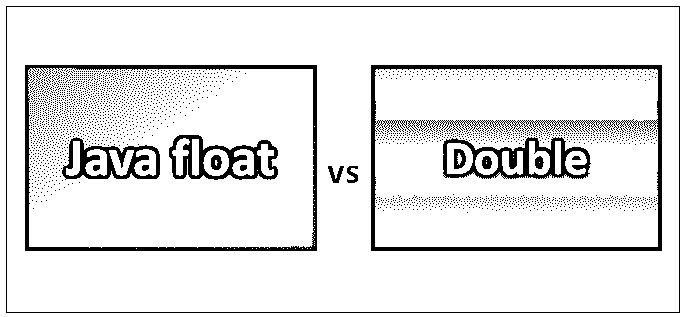

# Java float vs Double

> 原文：<https://www.educba.com/java-float-vs-double/>

## Java float 和 Double 的区别

浮点数据类型是单精度 32 位 IEEE 754 浮点。值的范围超出了本文的讨论范围，但是它主要是在 Java 语言规范的浮点类型、格式和值部分中指定的。

double 数据类型是双精度 64 位 IEEE 754 浮点型。它的取值范围超出了本文的讨论范围，但是在 Java 语言规范的浮点类型、格式和值一节中有详细说明。

<small>网页开发、编程语言、软件测试&其他</small>

float 主要用于在浮点数的大数组中节省内存。我们始终需要记住，数据类型不应该用于精确值，如货币。

double 数据类型通常是十进制值的默认选择。数据类型不应用于精确值，如货币。

**默认值:**

| **数据类型** | **默认值(对于字段)** |
| **浮动** | 0.0f |
| **double** | 0.0d |

Java 中的 Float 数据类型存储一个精度为 6-7 位的十进制值。因此，例如，12.12345 可以保存为浮动，但 12.123456789 不能保存为浮动。在 Java 中表示浮点数据类型时，我们应该在数据类型的末尾追加字母 f；否则，它将保存为 double。

Double 数据类型存储精度为 15-16 位的十进制值。默认值为 0.0d 这意味着，如果您没有在小数点后面附加 f 或 d，该值在 Java 中将被存储为 double。

### Java float 和 Double 的直接比较(信息图)

以下是 Java float 和 Double 之间的 7 大比较:

### Java float 和 Double 的主要区别

以下几点解释了 java 中 float 和 Double 的主要区别:

1.  在 Java 中，double 数据类型比 float 更精确。默认情况下，浮点数在 Java 中是双精度的。为了将它们存储在 float 变量中，您需要显式地对它们进行强制转换，或者用' F '或' F '作为后缀。
2.  Float 使用 1 位符号、8 位指数和 23 位尾数，而 double 使用 1 位符号、11 位指数和 52 位尾数。
3.  在选择 Java float 和 Double 时，我们需要考虑一些重要的事情。我们可能还会遇到一些需要使用特定数据类型的情况，除非您觉得您的结果不适合 float，那么在这种情况下，您可以选择 double。
4.  Java float 和 Double 都是近似的类型，但是在内存空间和其他方面有所不同。
5.  当你想比较 java 和 float 时，总是倾向于大十进制，而当你用大十进制构造函数时，你需要用一个字符串参数。

### Java float 和 Java Double 对照表

下面是 Java float 和 Double 的对照表。

| **BASIS FOR****比较** | **Java Float** | **Java Double** |
| **定义** | 浮点数据类型是单精度 32 位 | double 数据类型是双精度 64 位 |
| **用途** | 精确度较低 | 更加精确 |
| **好处** | Extensive support libraries.开源和社区发展。 | 更多面向 [web 开发](https://www.educba.com/career-in-web-development/)和 web 的特性 |
| **存储** | The float needs 32-bit storage(It只需要 4 个字节来存储一个变量) |  Double needs 64-bit storage(It需要 8 个字节来存储一个变量) |
| **学术界** | 浮点是 32 位 IEEE 754 浮点 | double 是 64 位 IEEE 754 浮点型。 |
| **精度** | 浮点精度是 6 到 7 位十进制数字 | Double 可以提供高达 15 到 16 个小数点的精度。 |
| **范围** | 与 double 相比，Float 的范围更小。 | Double 的音域更高。 |

### 结论

虽然 Java float 和 double 都可以表示浮点数，但是我们可以考虑在 Java float 和 Double 之间进行选择。虽然 Java float 和 double 都是近似类型，但是如果需要更精确的结果，请使用 Double。如果内存有限，请使用 float，因为它占用的空间几乎是 double 的一半。如果您的数字不符合 float 提供的范围，那么使用 double。尽管要小心浮点计算和表示，但不要在货币计算中使用 double 或 float，而要使用大小数。

以上就是 Java 中 float 和 double 的区别。记住，默认情况下，浮点数在 Java 中是双精度的；如果您想将它们存储到一个浮点变量中，您需要显式地转换它们，或者使用' F '或' F '字符来满足它们。

Java float vs Double 都用来表示 Java 中的[实数，即带分数或小数点的数。](https://www.educba.com/career-in-java/)

您应该使用逻辑运算符，例如>或

如果[足够存储数据](https://www.educba.com/data-modeling-interview-questions/)的话，选择占用较少存储空间的数据类型也是最佳实践，所以如果你对精度和范围满意，选择 float over double 不过，double 比 float 更准确。

Double 和 float 不用于表示要求非常高精度的值。例如，为了存储货币值，使用 double 或 float 不是一个好主意；相反，Java 有一个类“Big Decimal”，它指定小数点后的精确位数，包括向上或向下舍入。

在 Java 中，Double 和 float 数据类型都用来表示浮点数；double 数据类型比 float 更精确。与 6 到 7 个十进制数字的浮点精度相比，双精度变量可以提供高达 15 到 16 个小数点的精度。java 中 float 和 double 的另一个显著区别是它们的存储需求，double 比 float 更昂贵。存储一个变量需要 8 个字节，而 float 只需要 4 个字节。这意味着，如果内存是一个约束，那么使用 float 比 double 更好。double 类型也比 float 有更大的范围，如果你的数字不太适合 float，那么你必须在 Java 中使用 double。同样值得注意的是，浮点数或实数在 Java 中默认为 double。如果您想将它们存储到一个浮点变量中，您需要转换它们或者使用前缀' F '或' F '。

### 推荐文章

这是 Java float 和 Double 之间区别的有用指南。在这里，我们讨论了 Java float vs Double head to head comparison，key difference，以及信息图和比较表。您也可以阅读以下文章，了解更多信息——

1.  [Java Vector vs ArrayList](https://www.educba.com/java-vector-vs-arraylist/)
2.  [Java 性能或 Python](https://www.educba.com/java-performance-vs-python/)
3.  [Java vs Python](https://www.educba.com/java-vs-python/)
4.  [Scala vs Java 性能](https://www.educba.com/scala-vs-java-performance/)

