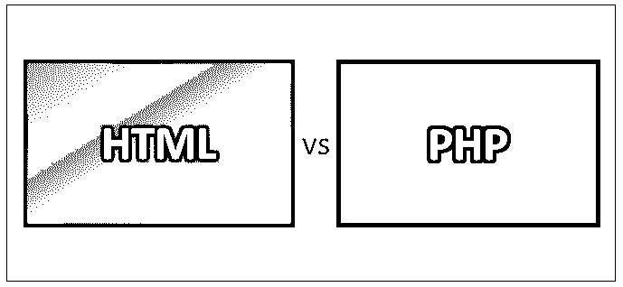

# HTML vs PHP

> 原文：<https://www.educba.com/html-vs-php/>

## HTML 和 PHP 的区别

HTML 是超文本标记语言的缩写，是超文本和标记的结合。超文本是一种特殊的方法，通过点击打开下一页的超链接，我们可以在网上四处移动。标记是 HTML 标签，如开始和结束标签，里面有文本，我们可以通过它来格式化文本，放置超链接，图像等。HTML 是万维网的基本构件。HTML 是任何网站的支柱，因为它是每个网站前端代码的主要部分。浏览器不显示 HTML 标签，而是用来呈现页面内容。它用 Markup.HTML 描述 HTML 页面或网页的结构，是蒂姆·伯纳斯·李在 1991 年发明的，他也是万维网的创始人。

PHP 是一种开源的、强大的服务器端脚本语言，用于创建动态网站、web 应用程序和静态网站。PHP 最初被称为“个人主页”，后来，它成为 ASP 技术的替代品。PHP 是一个缩写词，代表超文本预处理器。PHP 脚本可以包含在 HTML 网页中，在服务器上执行，并在 HTML 的帮助下在屏幕上显示结果。PHP 可以集成不同类型的数据库，如 Oracle、MySQL 和 Microsoft SQL Server 等。使用 PHP，我们可以做很多事情:连接到数据库并检索信息，给网站用户发送电子邮件，加密数据，将数据存储在数据库中，等等。PHP 是动态网站开发等最流行的脚本语言。除此之外，我们可以使用 PHP 进行命令行脚本编写、桌面应用程序开发，以及[项目管理工具](https://www.educba.com/top-7-open-source-project-management-tools/)。

<small>网页开发、编程语言、软件测试&其他</small>

### HTML 和 PHP 的直接比较(信息图表)

下面是 HTML 和 PHP 的 8 大对比

### HTML 和 PHP 的主要区别

以下是积分列表；描述主要区别:

*   HTML 是描述网页结构的超文本标记语言，它是网站前端的主干，而 PHP 是一种开源的、流行的服务器端脚本语言，将用于开发动态 web 应用程序和网站、静态网站等。
*   HTML 基本上用作前端开发或者客户端，而 PHP 用于服务器端开发。
*   HTML 兼容大多数浏览器，而 PHP 也兼容大多数浏览器。
*   HTML 用于格式化网站上的内容并决定网站的外观，而 PHP 用于使页面按预期运行。
*   HTML 用于插入文本、图像、超链接、视频等。，而 PHP 用于计算、数据库连接、存储和检索数据、登录、注册表单等。
*   PHP 代码有一个适当的结构，它很复杂，因为如果逻辑或语法有任何错误，它不会给出预期的输出，而在 HTML 中，我们可以在任何地方写任何我们想要的东西，但它仍然会给出输出。
*   HTML 可以与 AJAX 集成，用于前端开发的动态网站开发，而 PHP 也可以与 AJAX 集成，用于更好的动态网站开发。
*   HTML 用于重定向、指定颜色、文本格式、对齐等。而 PHP 用于逻辑操作、存储、发送电子邮件、回复电子邮件、文件上传和下载、生成网页等。
*   HTML 用于开发静态网页，而 [PHP 用于开发使网站动态化的组件](https://www.educba.com/what-is-php/)。
*   PHP 脚本的输出是 HTML，因为它们类似于 HTML 文件，可以在脚本代码中包含 HTML 和 PHP，但对于最终用户来说，当打开 PHP 网页时，只能访问 HTML 元素。

### HTML 与 PHP 对照表

以下是要点列表，描述了 HTML 与 PHP 之间的比较:

| **比较的基础** | **HTML** | **PHP** |
| **语言类型** | HTML 是一种用于创建网页的标记语言，是前端开发的主干 | PHP 是一种开源、流行的服务器端脚本语言，用于开发动态网站、动态 web 应用程序和静态网站。 |
| **代码类型** | HTML 代码是静态的；每次我们打开它总是保持不变。 | PHP 文件本质上是动态的，输出会因浏览器而异 |
| **简单易学** | HTML 非常好学；即使我们犯了错误，它也会调整。我们可以用更少的时间学习 HTML。 | PHP 也比较好学但是没有 HTML 那么多；我们需要小心写作，因为它不允许我们在代码中有任何错误。PHP 会花相对更多的时间去学习。 |
| **兼容性** | HTML 几乎兼容所有可用的浏览器 | PHP 还兼容几乎所有可用的浏览器 |
| **开发者** | HTML 有大量的开发人员在不断地工作和改进它。 | PHP 也有大量开发人员在贡献新的特性和支持， |
| **整合** | HTML 页面可以与 AJAX 集成，用于动态网页开发和网站的前端部分。 | PHP 可以与动态网页的 AJAX 集成，不同的数据库，如 Oracle，MySQL，Sybase 等。 |
| **何时使用** | HTML 用于开发网页的前端，它将组织网站的内容，内容需要如何显示等。 | PHP 用于服务器端编程，它将与数据库交互以检索信息、存储、发送电子邮件、运行逻辑并将内容提供给 HTML 页面以显示在屏幕上。 |
| **语法** | HTML<title>标题名称</title>

# 一些内容

段

 | PHP 基本语法如下:
<？php// PHP 代码在这里？> |

### 结论

最后，概述了 HTML 和 PHP 的区别。希望你看完这篇 HTML vs PHP 的文章，对 HTML 和 PHP 有更好的理解。当我们需要开发网站的客户端或前端，并组织网站的内容和网站将如何显示时，将使用 HTML。PHP 将用于服务器端编程，它将执行逻辑计算，从数据库中存储和检索数据，发送电子邮件，与 Oracle，MySQL 等不同类型的数据库集成。和其他用途，如命令行脚本桌面应用程序开发。为了编写 PHP 代码，用户还需要了解 HTML，因为 PHP 代码将包含在 HTML 文件中。HTML 和 PHP 语言对 Web 开发都很重要。

### 推荐文章

这是一个关于 HTML 和 PHP 之间的区别、它们的含义、直接比较、关键区别、比较表和结论的指南。您也可以阅读以下文章，了解更多信息——

1.  [HTML vs XML](https://www.educba.com/html-vs-xml/)
2.  [HTML5 vs Flash](https://www.educba.com/html5-vs-flash/)
3.  [CSS](https://www.educba.com/html-vs-css/) [vs HTML](https://www.educba.com/html-vs-css/)
4.  [HTML5 vs](https://www.educba.com/html-vs-html5/) [HTML](https://www.educba.com/html-vs-html5/)

