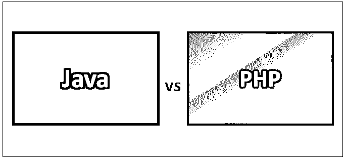
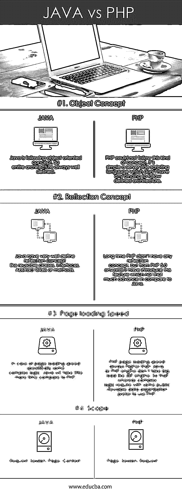

# Java vs PHP

> 原文：<https://www.educba.com/java-vs-php/>

## Java 和 PHP 的区别

Java 是一种纯粹的通用编程语言，而 PHP 通常是一种服务器端脚本语言。Java 可以支持服务器端和客户端语言，而 PHP 只支持服务器端语言。任何 Java 代码都需要在执行前正确编译，它是一种强类型语言，而 PHP 是一种动态类型语言，不需要编译代码。关于应用程序安全性和架构概念，Java 在任何时候都比 PHP 好得多。

**让我们详细学习一下 Java 和 PHP。**

<small>网页开发、编程语言、软件测试&其他</small>

PHP 主要考虑服务器站点脚本编程，任何人都可以编写；最大的虚拟主机公司正在使用 Apache 服务器/PHP。在任何人都无法编写 Java 编程的地方，用 Java 编写代码需要有详细的理解。PHP 不遵循任何应用服务器概念；它只有一个 PHP 引擎运行。php 文件。而对于 Java 应用程序，应该需要将任何 web 应用服务器部署为 WAR 或 EAR 文件。JSP 引擎只用于显示页面，WAR 或 EAR 文件包含所有需要的。类文件或 JAR 库或 JSP 页面。

因为 WAR 或 EAR 文件通常包含。类文件，不可能轻松地读取该文件，verities 工具是用来转换的。类转换成 Java，但是它的代码格式不正确。尽管 PHP 非常容易阅读，但是如果有人跟踪部署环境，他可以很容易地查看 PHP 文件或替换它们。Java [也有 servlet 过滤器](https://www.educba.com/servlet-filter/)的概念，它有助于纠正请求或提高用户定义的安全性，而 PHP 没有这种概念。

### Java 和 PHP 的面对面比较(信息图表)

下面是 Java 和 PHP 的四大对比

### Java 和 PHP 的主要区别

下面是解释 Java 和 PHP 主要区别的一些要点

1.  Java 需要应用服务器、JVM、任何操作系统、web 服务器来运行任何应用程序。而 PHP 只需要 Apache 服务器/IIS、PHP 引擎、操作系统、Web 服务器就可以运行。
2.  应用程序安全性是任何 Java 应用程序的关键点之一。Servlet 过滤器、 [URL 编码](https://www.educba.com/html-url-encoding/)、安全 Web 服务在 Java 中主要用于应用程序安全性方面。而 PHP 没有这种安全处理的概念。
3.  Java 非常容易与任何 API 进行通信，这使得 Java 更适合未来的自动化工具开发。尽管 PHP 在 API 调用的概念上有一些限制，但在较高版本中也可以通过 PHP 进行 API 调用。
4.  从第一天开始，Java 内部就有反射概念，比如接口、重复类、[抽象类](https://www.educba.com/abstract-class-in-php/)，或者方法概念。而 PHP 没有这种概念，但是 PHP 高级版本引入了这种概念，它不像 Java 那么高级。
5.  就页面加载时间而言，PHP 页面比 JSP 页面要快一些。为 PHP 引擎定义的任务数量比 JSP 引擎少得多。尽管如此，Java 有许多性能调优选项；提高页面加载性能的最大方法之一是不要在 JSP 页面中编写任何业务逻辑或核心 java 代码。通常使用标签库(例如 JSTL)来处理这个目的。
6.  由于 PHP 非常容易学习，它显然在支持和资源可用性方面成本较低。而 Java 显然比 PHP 保持着更高的成本。
7.  几个开放流行的页面设计工具像 Drupal 和 WordPress 都是用 PHP 编写的。Java 通常在页面设计工具中并不流行，而 Java 主要流行于那些专注于业务逻辑或对象表示概念的工具。
8.  更新 PHP 版本非常容易；只需添加“Hello Web 2.0”就足以更新任何 PHP 页面的版本。
9.  管理或更新 JSP 页面并不是一件非常困难的事情，但是编写复杂逻辑的人应该对 Java 编程有全面的了解。尽管修改 PHP 页面非常容易，但任何设计师或 HTML 开发人员都可以做到。

### Java 与 PHP 对照表

以下是积分列表；描述这些比较:

| ****对比**的依据** | **Java** | **PHP** |
| **物体概念** | Java 遵循面向对象的概念。因此，整个架构总是定义良好。 | PHP 不能遵循这种概念；它是一种简单的服务器端脚本语言，没有任何绑定来遵循已定义的架构。 |
| **反射概念** | Java 已经很好地定义了反射概念，如可重用类、接口、抽象类或方法。 | 很长一段时间 PHP 没有任何反射概念，但是从 PHP 5.0 开始，它引入了这个特性，与 Java 相比并没有太大的进步。 |
| **页面加载速度** | 在页面加载速度的情况下，特别是一些复杂的逻辑，Java 会比 PHP 多花一点时间。 | PHP 页面加载速度总是高于 Java，因为 PHP 引擎不会像 JSP 引擎那样承担很大的负载。因此，尽管复杂的逻辑需要一些公共可见的数据，但组织更喜欢使用 PHP。 |
| **范围** | 请求、会话、页面、上下文 | 页面、会话、请求 |

### 结论

综上所述，Java 和 PHP 在开发和部署任何 web 应用程序时完全遵循一些不同的方法。最大的组织，主要是银行、采购或其他重要领域，由于安全限制和友好使用任何外部或第三方 API，总是更喜欢使用 Java。而 PHP 主要用于普通的网页设计屏幕，动态视图或管理员管理只需要最低限度的数据库访问。PHP 总是一项低成本的投资，所以对于一个小组织来说，开始一个简单的网页总是更可取的，这有助于他们开始他们的初始业务。云化进入市场后，特别是像 AWS，它也提供了许多选项来最小化使用 Java 平台的成本，吸引小型或刚起步的组织，并以最小的成本使用 Java 平台并提供最佳的服务。

### 推荐文章

这是 Java 和 PHP 之间区别的有用指南；我们已经讨论了它们的含义、直接比较、主要区别和结论。您也可以阅读以下文章，了解更多信息——

1.  [Java vs C#](https://www.educba.com/java-vs-c-sharp/)
2.  [Java vs JavaScript](https://www.educba.com/java-vs-javascript/)
3.  [Java vs Ruby](https://www.educba.com/java-vs-ruby/)
4.  [Ruby vs PHP](https://www.educba.com/ruby-vs-php/)

