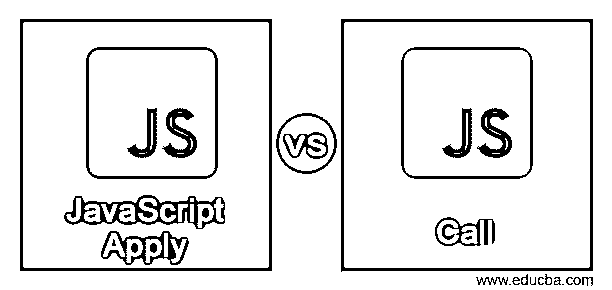

# JavaScript 应用与调用

> 原文：<https://www.educba.com/javascript-apply-vs-call/>

## JavaScript 应用与调用的区别

JavaScript 是一种面向对象的脚本语言。它由 Brendan Eich 创建，由 Netscape Communications、Mozilla Foundation 和 Ecma International 开发。它于 1995 年首次发布。JavaScript 文件扩展名是' '。js '，互联网媒体类型为 application/javascript。

javascript 是作为一种客户端脚本语言与 Java 一起引入的，它的代码无需编译就可以在浏览器上运行。它被解释了。Javascript 可以直接嵌入 HTML。Javascript 代码在浏览器上运行，使网页更具动态性和交互性。

<small>网页开发、编程语言、软件测试&其他</small>

Javascript 使用动态类型，数据类型仅在运行时得到验证。Javascript 是一种基于文本的、动态的、弱类型的语言。在 JavaScript 中，对象可以直接继承其他对象，这意味着对象是基于原型的。

JavaScript，主要用在一个项目中，有一个像 JQuery、AngularJs、React.js、Backbone.js 这样的前端技术的需求；用于服务器端技术的有 node.js、MongoDB，用于[移动应用开发的](https://www.educba.com/testing-of-mobile-application/)语言如 phone gap、react-native。它还用于动态单页应用程序。

JavaScript 具有许多特性，如通用支持、命令式和结构化、面向对象、动态类型、运行时评估、函数式、委托式、变量函数、正则表达式、数组和对象文字、特定于供应商的扩展、简单语法、嵌入式脚本语言、脚本引擎、应用程序平台、开发工具。

JavaScript 在任何使用的平台上都提供了安全性。但是有时候，在编写程序时会有安全问题。这些可能像跨站点漏洞、对客户端的错误信任、对开发人员的错误信任、浏览器和插件错误代码、沙盒实现错误、硬件漏洞。

在 JavaScript 中，函数是对象，作为对象，函数有方法。有许多强大的功能，如应用，调用和其他几个。JavaScript Apply vs Call 方法几乎是相似的，而且在 JavaScript 中使用得更多。

JavaScript 使用应用方法来借用函数，并在调用时设置“this”值。apply 函数将参数作为一个数组，以便每个参数单独传入函数。Javascript 使用一个调用方法来达到同样的目的，这几乎是一样的。call 函数单独接受参数，或者我们可以说它接受参数列表。

### JavaScript 应用和调用的直接比较(信息图)

以下是 JavaScript Apply 和 Call 的 6 大对比:

### JavaScript 应用和调用之间的主要区别

让我们讨论一下 JavaScript Apply 和 Call 之间的一些主要区别:

1.  JavaScript Call 和 Apply 函数之间的根本区别是在调用函数时传递参数。在 Apply 函数中，参数作为数组传递。在[调用函数](https://www.educba.com/javascript-call-function/)中，参数以参数列表的形式传递。
2.  在 Javascript 中，apply 函数允许多个函数。但是调用函数不允许。
3.  java 脚本应用函数的语法类似于 object.propertyname.apply(obj，["name1 "，" name2 "，…])或 function.apply (thisArg，[argsArray])。对于 java 脚本调用函数，语法类似 object.propertyname.call(obj，“name1”，“name2”，…。)或 function.call(thisarg，arg1，arg2，…).
4.  Apply function 的数组类对象不被 chrome 和 internet explorer 等浏览器接受，有时会抛出异常。对于 call 函数，不会出现这种情况。

### JavaScript 应用和调用对照表

下面是 JavaScript Apply 和 Call 的对照表。

| ****对比**的依据** | **JavaScript 应用** | **JavaScript 调用** |
| **定义** | JavaScript Apply 函数用于借用函数并设置该值。 | JavaScript 调用函数来源于借用和调用函数。 |
| **自变量** | JavaScript Apply 函数将参数作为一个数组。 | JavaScript 调用函数单独接受参数。 |
| **添加元素** | 在 JavaScript Apply 中，元素可以进一步添加到另一个数组中。 | 在调用函数中，我们只需要向列表中添加一个元素。 |
| **内置函数** | 在 Javascript 中，Apply 方法可以使用像 min 和 max 函数这样的内置函数。 | 在调用函数中，不能使用内置函数。 |
| **构造器** | Apply 函数可用于对象的链构造函数。 | 通话功能没有这个功能。 |
| **可变函数** | 应用函数能够使用变量函数 | 呼叫功能无法使用。 |

### 结论

JavaScript 调用和应用函数几乎相似。这些函数主要用于相同的目的，借用函数和调用函数来设置“this”的值。借用函数可以像借用数组方法、借用字符串方法、借用自定义方法和函数一样。

JavaScript 有各种各样的函数，但是应用和调用函数是最常用的函数。这些功能可用于其功能，也可用于特定时间的应用或功能要求。

### 推荐文章

这是 JavaScript Apply 和 Call 之间主要区别的指南。在这里，我们还将讨论 JavaScript Apply vs Call 的直接比较、主要差异、信息图和比较表。您也可以看看以下文章，了解更多信息–

1.  [Python 或 JavaScript](https://www.educba.com/python-vs-javascript/)
2.  [HTML5 vs JavaScript](https://www.educba.com/html5-vs-javascript/)
3.  [Python 和 JavaScript](https://www.educba.com/python-vs-javascript/)
4.  [JavaScript](https://www.educba.com/java-and-javascript/) [和 Java](https://www.educba.com/java-and-javascript/)

