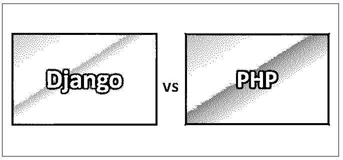

# Django vs PHP

> 原文：<https://www.educba.com/django-vs-php/>

## Django 和 PHP 的区别

随着技术的出现，有许多技术和框架进入了市场。Django vs PHP 就是这种进步的结果。Web 技术已经向前发展，有了许多新的框架和语言。Django 是一个框架，而 PHP 是一种开发语言。Django 协助构建和[维护网络应用](https://www.educba.com/how-to-build-web-applications-using-mongodb/)。另一方面，PHP 允许开发人员创建有助于与数据库交互的动态内容。虽然 Django 和 PHP 都与 web 应用程序有关，但是 Django 和 PHP 之间有很大的不同。让我们来看看这些不同之处。

### Django 和 PHP 的面对面比较(信息图)

以下是 Django 和 PHP 性能的四大对比:

<small>网页开发、编程语言、软件测试&其他</small>

### Django 和 PHP 的主要区别

以下是要点列表，描述了 Django 和 PHP 之间的主要区别:

[Django 是一个](https://www.educba.com/what-is-django/)框架，PHP 是一种开发语言。Django 通过其模板、URL 映射、模型、通用视图、文件上传工具、通用视图等提供了平滑开发的方法。它确保这个框架提供快速的开发。另一方面，PHP [是一种开发语言](https://www.educba.com/what-is-php/)，它使用这个框架并确保高质量的开发。它有各种运算符类型、循环类型、数组、字符串、GET 和 POST 方法、函数等。PHP 允许使用这些工具进行适当的开发。

### Django 和 PHP 对照表

下面是 Django 和 PHP 性能的对比表。

| **Django 与 PHP 的对比基础** | 姜戈 | **PHP** |
| **基本区别和历史** | Django 是一个 Python web 框架，有助于快速开发和系统设计。这个框架中涉及的编码部分也比较少。Django 最初是由 Adrian 和 Simon Willison 在 2003 年创立的。它于 2005 年发行。它是开源软件。 | PHP 是由拉斯马斯·勒德尔夫在 1994 年开发的一种开发语言。它代表超文本预处理器。它是一种脚本语言，可以嵌入到 HTML 中，用于管理动态内容、数据库、会话跟踪等。它可以与许多流行的数据库集成，如 MySQL、Oracle、Microsoft SQL Server 等。 |
| **环境设置** | Django 是一个 Python 框架，因此需要在系统上安装 Python，
**安装 Python:** Django 需要 Python 2.6.5 或更高版本。
一旦完成，你就可以继续[安装 Django](https://www.educba.com/install-django/) 。Django 的安装很容易，Python 是独立于平台的，它有一个可以在任何地方工作的包。Django 可以从[http://www.djangoproject.com/download](https://www.djangoproject.com/download/)
下载。你会得到一个 tar 文件，可以解压并安装。
CD Django-x . xx
sudo python setup . py install
一旦安装完成，您可以通过运行以下命令来检查它:Django-admin . py–version。
还支持 MySQL、Oracle 等各种数据库。 | PHP 包括三个需要安装在你的系统上的重要组件。这些应该是:
**web 服务器:** PHP 将与所有 Web 软件
**数据库:**它支持所有著名的数据库
**PHP 解析器:**需要安装一个解析器，以便为 Web 浏览器生成 HTML 输出。
**PHP 解析器安装**——安装 PHP 解析器前，检查此链接是否更新
http://127 . 0 . 0 . 1/info . PHP
如果此链接运行成功，则 PHP 和 Web 服务器安装成功。 |
| **语法和项目创建** | Django 可以在 Windows 和 Linux 上使用 cmd 提示符轻松运行。您可以导航到必须创建项目的位置。
*$ Django-admin start project myproject*
该命令将帮助您在相应的位置创建一个名为 my project 的项目。结构如下:
my project/
manage . py
my project/
_ _ init _ _。py
settings . py
URLs . py
wsgi . py
这个结构可以定义为:
manage.py 这个文件充当项目本地 Django-admin，用于通过命令提示符进行交互。
my project 子文件夹是实际的 Python 包。它包含下面:

*   _init_。 Py: This folder can be used as a package.
*   Settings.py: This file contains the settings of your project.

 | PHP 的基本语法帮助你学好 PHP。
逃到 PHP
PHP 解析引擎需要一个区分器来区分普通代码和 PHP 元素。这可以通过以下四种方式实现:
-规范的 PHP 标签:普遍接受的 PHP 标签是<？php…？>
——短开(SGML 风格)标签
这些标签看起来像——<？..?要使用这些，请在构建 PHP 时启用短标签配置选项。
在 php.ini 文件中设置 short_open_tags 设置。用 PHP 解析 XML 时应该禁用这个。ASP 风格的标签:这些标签被动态服务器页面用来描述代码块。这些也被称为模拟标签。它们可以用作< %…% >
-HTML 脚本标签:它们也可以与 HTML 一起使用，并与 HTML 标签一起使用，如下:
 |
| **文件上传** | 虽然 Django 是一个框架，但它允许 web 应用程序上传文件。所有类型的文件都可以使用 Django 上传。
上传图像:在上传图像之前，应该安装 Python 图像库。上传图片的代码如下:
#-*-编码:utf-8 -*-
来自 Django 导入表单 class ProfileForm(表单。表单):
名称=表单。CharField(max_length = 100)
图片=表格。ImageFields()
这里的区别在于形式。ImageField，它将确保文件将被上传。如果不成功，此事件将失败。
这也有一个强制字段 upload_to，它将代表硬盘上保存图像的位置。在这之后，我们将不得不在 myapp/views.py 中创建一个视图。文件，如果不发送，将会出错。 | To upload files in PHP, they need to be uploaded in a temporary directory and later will be redirected to target destinations by a PHP script. Information stored in phpinfo.php describes a temporary directory that is used to upload files as upload_tmp_dir, and it permits the maximum size of files that can be uploaded in upload_max_filesize. All these parameters are stored in a php.ini file. A form as below needs to be created to upload a file.
*<?php*if(isset($_FILES[‘image’])){$errors= array();$file_name = $_FILES[‘image’][‘name’];$file_size =$_FILES[‘image’][‘size’];$file_tmp =$_FILES[‘image’][‘tmp_name’];$file_type=$_FILES[‘image’][‘type’];$file_ext=strtolower(end(explode(‘.’,$_FILES[‘image’][‘name’])));$expensions= array("jpeg "、" jpg "、" png ")；if(in_array($file_ext，$ expensions)= = false){$errors[]= "不允许扩展名，请选择 JPEG 或 PNG 文件。";}if(＄file _ size > 2097152){$errors[]= '文件大小必须超过 2mb '；}

if(empty($errors)==true){

move_uploaded_file($file_tmp，" images/"。$文件名称)；

呼应“成功”；

}否则{

print _ r($ errors)；

}

}

?>

<form action="””" method="”POST”" enctype="”multipart/form-data”">

<input type="”file”" name="”image”">

<input type="”submit”/">

一旦完成，就可以创建一个上传脚本，它将 PHP 变量放在一个名为$_FILES 的文件中。创建该文件后，将创建以下五个变量:
$_FILES['file']['tmp_name']

$_FILES['file']['name']

$_FILES['file']['size']

$_FILES['文件']['类型']

$_FILES['file']['error']

</form>

 |

### 结论

PHP 和 Django 都在 web 应用程序开发中扮演着重要的角色。PHP 帮助实际开发 web 应用程序，而 Django 提供了一个可以创建应用程序的平台。PHP 和 Django 都是为了拥有一个好的 web 应用程序。不同的是 [Django 是一个框架](https://www.educba.com/django-vs-node-js/)和 [PHP 是一种语言](https://www.educba.com/php-interview-questions/)，他们有自己的一套实用程序来产生最好的应用程序。

### 推荐文章

这是 Django 和 PHP 之间主要区别的指南。在这里，我们讨论了 Django 与 PHP 的直接比较、关键差异、信息图和比较表。您也可以看看以下文章——

1.  [Java vs PHP](https://www.educba.com/java-vs-php/)
2.  [Django vs Node.js](https://www.educba.com/django-vs-node-js/)
3.  [Ruby vs PHP](https://www.educba.com/ruby-vs-php/)
4.  [Django vs Rails](https://www.educba.com/django-vs-rails/)

