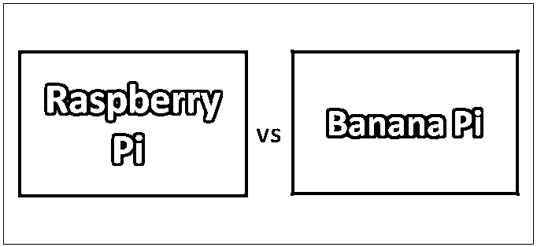

# 树莓派 vs 香蕉派

> 原文：<https://www.educba.com/raspberry-pi-vs-banana-pi/>

## 树莓派和香蕉派的区别

Raspberry Pi 是一系列小型单板电脑，成本低廉，可以插入电脑显示器或电视，使用标准键盘和鼠标。它由 Raspberry Pi 基金会在英国开发，旨在促进学校的基础计算机科学教学。不包括键盘等外围设备。，但一些配件已经包含在许多官方和非官方的捆绑包中。Raspberry Pi 的竞争对手 Banana pi 是一种新的单板计算机，具有更快的处理器和 RAM 能力。树莓 Pi 对香蕉 Pi 的硬件设计影响很大。因此，香蕉 Pi 与树莓 Pi 板兼容。它也可以运行在各种操作系统上，如 Raspbian，NetBSD，Android，Debian 等。它使用 Allwinner SoC(片上系统),由 Linux-孙茜端口覆盖。

### 什么是树莓派？

*   Raspberry Pi 是一个功能强大的小设备，可以让各行各业的人探索计算机科学，并学习如何用 Python 等语言编程。它应该做你期望台式电脑做的一切事情，从浏览互联网和播放高清视频，制作电子表格，文字处理和玩游戏。树莓派体积小，价格亲民；因此，它很快被计算机爱好者用于一个不仅仅需要基本微控制器的项目。
*   虽然 Raspberry Pi 比现代的笔记本电脑或台式机慢，但它仍然是一台完整的 Linux 计算机，可以在低功耗水平上提供所有预期的功能。Raspberry Pi 背后的基金会是一家注册的教育慈善机构，总部设在英国，旨在促进计算机科学和相关学科领域的儿童教育。Raspberry Pi 是为 Linux 操作系统设计的，许多 Linux 发行版都有针对 Raspberry Pi 优化的版本。
*   最流行的两个是基于 Debian 操作系统的 Raspbian 和基于 Fedora 操作系统的 Pidora。为 Raspberry Pi 选择操作系统的最佳实践是，在桌面或服务器环境中，最接近用户熟悉的操作系统。

### 什么是香蕉圆周率？

*   Banana pi 提供了一个开源硬件平台，用于运行 Elastos.org 的开源操作系统。是双核安卓 4.2 产品，比树莓 Pi 更好。对于市场上的几个 Linux 发行版，如 Debian、Ubuntu、OpenSuse 和运行在 Raspberry Pi 和 Cubieboard 上的 images，它是非常高效的。它由一个千兆以太网端口和一个 SATA 插座组成。香蕉 pi M1 的大小和一张信用卡差不多。它有可能流畅地运行游戏，因为它支持 1080P 高清视频输出。
*   GPIO 与 Raspberry Pi 兼容，它可以直接运行 Raspberry Pi 映像。市场上有几个版本的香蕉 pi，如香蕉 pi M1、香蕉 pi M+、香蕉 pi Pro、香蕉 pi G1 等。所有版本都附带了增强的功能，如操作系统支持、可用 RAM 和 GPIO 功能。Banana Pi 具有可扩展的配置，价格适中。其高性能由 Allwinner SoC 和 1 GB DDR3 SDRAM 驱动。它是高度通用的，并且与 Raspberry pi 图像兼容。它是为每个想玩电脑技术和进行创作的人而设计的，而不仅仅是一个电子产品用户。

### 树莓派和香蕉派的比较

以下是树莓派和香蕉派的主要区别

<small>网页开发、编程语言、软件测试&其他</small>

### 树莓派和香蕉派的主要区别

树莓派和香蕉派的主要区别如下:

1.  Raspberry Pi 依靠 MicroSD 和 USB 进行存储，而 Banana pi 配备了 SATA 端口，允许更快地连接硬盘等大容量存储设备。
2.  树莓 Pi 中的视频处理器比香蕉 Pi 中的邮件 GPU 更先进；任何计划使用 HDMI 输出流媒体覆盆子可能是一个更好的选择。
3.  树莓 pi 在所有单板计算机中拥有最多的追随者，而香蕉 Pi 在以下指数中的排名远低于树莓 Pi。
4.  可用的指南和教程的数量，包括可用于 Raspberry Pi 的软件，是数不清的，而 Banana pi 的指南和教程与 Raspberry Pi 相比数量有限。
5.  Raspberry Pi 模型 3 具有板载 2.4 GHz 802.11n Wi-Fi，可以开箱即用，而 Banana pi 大多数模型都具有板载 Wi-Fi。
6.  对 Raspberry Pi 的软件支持非常好，而 Banana Pi 的软件支持有限，不符合 Raspberry 标准。
7.  尽管有谷歌的支持，Raspberry Pi 在完全兼容 Android 方面仍面临一些问题，而 Banana pi 完全支持 Android 操作系统。
8.  树莓 Pi 3 配有四核处理器和 1 GB 内存，而香蕉 pi M3 配有八核处理器和 2GB 内存。
9.  树莓 Pi 3 有四个 USB 连接端口，而香蕉 pi M3 只有三个 USB 端口，其中一个用于 OTG 连接。
10.  树莓 Pi 3 使用外部微型 SD 卡来存储操作系统和其他数据，而香蕉 pi M3 则有 8 GB eMMC 板载存储。

### 树莓派与香蕉派对比表

下面是最上面的比较

| **比较的基础** | **树莓派** | **香蕉派** |
| **处理器** | ARM Cortex A7-900 MHz–四核 | 全赢 A20–Cortex A7-1 GHz–双核 |
| **RAM** | 1 GB LPDDR2 | 1 GB DDR3 |
| **USB** | 4 个 USB 2.0 接口 | 2 个 USB 2.0，2 个 MicroUSB |
| **GPIO** | 40 针扩展接头 | 26 针扩展接头 |
| **网络** | 1 x 10/100 Ethernet | 1 x 10/100/1000 Ethernet |
| **尺寸** | 85.6 x 56 x 21 毫米 | 92 x 60 毫米 |
| **音频** | 3.5 毫米 | 3.5 毫米板载麦克风输入 |
| **视频** | 1 个 HDMI–1.3 或 1.4 | 1 个 HDMI 接口，1 个复合接口 |

### 结论

Raspberry pi 的设计围绕着它的预算友好性和易用性，这是它在市场上有巨大需求的主要原因。对其他软件的广泛支持只会增加该设备的有用性，有大量关于编写和编译软件的信息，硬件是为 Raspberry Pi 构建的。虽然同样的信息也存在于香蕉 pi 中，但并不常见，这很棘手，因为香蕉 Pi 比树莓 Pi 更难设置。

任何习惯了覆盆子 pi 的质量的人第一眼可能不会对香蕉 Pi 的外观和感觉留下深刻印象。由于 CPU 会产生任何组件的热量，因此用户在将它构建到项目中或为它组装机箱时，需要考虑它的位置。与此同时，Banana Pi 相对于旧版本的 Raspberry Pi 有了显著的改进，但是新的硬件版本使得性能提升几乎可以忽略不计。此外，香蕉派缺乏支持，价格较高，因此很难推荐树莓派 b 型。

但如果有人优先考虑内置 Wi-Fi 或通过 SATA 进行大容量存储，Banana pi 将是一个理想的选择。然而，树莓 Pi 和香蕉 Pi 特性都可以在树莓 Pi 上设置，没有太多麻烦。在这篇关于树莓派和香蕉派的文章的最后，是需求和价格标签，这真的很重要。

### 推荐文章

这是树莓派和香蕉派之间最大差异的指南。在这里，我们还通过信息图和比较表讨论了树莓 Pi 和香蕉 Pi 的主要区别。您也可以看看以下文章——

1.  [Arduino](https://www.educba.com/raspberry-pi-vs-arduino/) [vs 树莓派 vs 差异](https://www.educba.com/raspberry-pi-vs-arduino/)
2.  [树莓 Pi 3 vs Arduino](https://www.educba.com/raspberry-pi-3-vs-arduino/)
3.  [树莓派 vs 橘子派](https://www.educba.com/raspberry-pi-vs-orange-pi/)
4.  [Raspberry Pi 与 ODROID |最大差异](https://www.educba.com/raspberry-pi-vs-odroid/)

