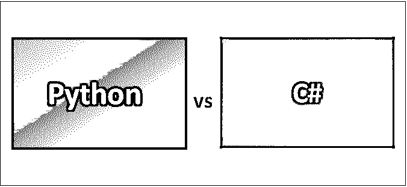

# Python vs C#

> 原文：<https://www.educba.com/python-vs-c-sharp/>

## Python 和 C#的区别

两者都是面向对象的语言，但最大的区别是 C #是完全面向对象的。C #是一种静态编译语言。这是一种现代而直接的语言。微软公司管理 c #。Python 是一种高级的、通用的、交互式的和面向对象的脚本语言。Python 的意图是极其清晰的。Python 是一种动态解释语言。Python 通常主要基于开放供应倡议和社区参与。Python 在快速发展时代大放异彩。

### Python 是什么？

Python 是一种通用的、交互式的、面向对象的高级语言。吉多·范·罗苏姆在 1985- 1990 年间创建了它。和 Perl 一样，Python ASCII 文本文件也在羚羊通用公共许可证(GPL)下面。Python 是一种高级的、通用的、交互式的和面向对象的脚本语言。Python 的意图是极其清晰的。由于不同的语言使用标点符号，它经常使用英语关键字，并且它的句法结构比其他语言少。

<small>网页开发、编程语言、软件测试&其他</small>

#### Python 专业版

*   **Python 是一种解释型**Python，由解释器在运行时处理。在运行它之前，你不必编译你的程序。这通常有点像 PERL 和 PHP。
*   **Python 是交互式的—**你将真正坐在 Python 提示符下，与解释器一起编写你的程序。
*   **Python 是面向对象的—**Python 支持面向对象编程风格的编程技术。在对象中，Python 封装了代码。
*   **Python 是一种初学者语言—**Python 是一种适合初级程序员的语言，支持从简单的文本处理到万维网浏览器再到游戏的各种应用。

### 什么是 C#？

C#由微软开发，并得到国际标准组织(ISO)的认可。这是一种现代而直接的语言。它是由安德斯·海尔斯伯格和他的团队在 event 活动框架中开发的。它面向公共语言基础设施(CLI ),由可工作的代码和运行时设置组成，支持在完全不同的 pc 平台和架构上使用各种高级语言。

#### C#优点

以下原因使 C#成为广泛使用的熟练语言

*   它是一种流行的、通用的人工语言
*   它是面向对象的。
*   它是部分定向的。
*   很容易被告知。
*   它是一种结构化语言。
*   它制作经济节目。
*   它可以在一系列 pc 平台上编译。
*   这是 of.Net 框架的一部分。

### Python 和 C#的直接比较

下面是 Python 和 C#的最大区别

### Python 和 C#的主要区别

下面是描述 Python 和 C#之间区别的要点列表

1.C#是静态编写的，而 Python 是动态编写的语言。C#是一种静态语言，通常包含构建/编译步骤。

2.你可能能够用 Python 写一个程序，比用 C#写一个相应的程序少很多行。Python 与跨语言程序非常兼容。

3.Python 在易学、跨平台开发、开放供应库的便利性方面是赢家

4.C#在开发方法、工具、性能、语言进化速度、习惯库等方面都是赢家。

5.Python 可读性更健康；C #有额外的一致语法。

6.Python 是一种比 C#更动态的语言。

### Python 和 C#的直接比较

下面是 Python 和 C#之间最重要的比较

| **比较的基础** | **Python** | **C#** |
| **性能** | Python 是强制性的，因为一个同事已经掌握了这种语言。通过 Python 对 JIT 编译器的实现，Python 的程序执行得到了改善。Python 以其简单的学习曲线和快速的开发而闻名。 | C#可能在这方面有一点小的优势。C#被强制作为编译语言。这些实现各有利弊。如果我们谈论性能，C#由于其公共语言基础结构框架而更快。然而，这对语言实现和语言本身来说往往是不适当的。 |
| **易用性** | Python 拥有惊人的整数数据类型！不加考虑地拿走很简单；然而，用一种完全不同的语言(相当于 C# Python)提交编写可以很好地实现字典、元组和列表！ | C#植根于面向对象编程的范例中。有了 Java 方面的专业知识，选择 C#并不困难。另外，如果你对开发微软平台的应用程序感兴趣，C#与强大的。NET 框架。 |
| **语法** | Python 的语法回到了它的动态排序系统。在 Python 实例中，变量不必声明为最小位，因此实例变量可以动态创建。 | C#看起来很混乱。在 C#中，类别成员变量的声明很重要，这些变量应该在使用之前声明。 |
| **图书馆** | 它充满了一个慷慨的习惯图书馆。Python 胜在扩展性和灵活性。编写代码开发 Python 的习惯库更容易(也更有趣)。 | .NET Framework 的基本类别库(BCL)还为 C#开发提供了强大的支持。 |
| **程序员生产率** | Python 为程序员提供了额外的高效设置。这是语言的动态特性、语法的类别以及可以重用的大型预写代码库的便利性相对简单的混合结果。 | C#越大越健康；时间越来越长。我相信这种可能性是肯定存在的。 |

### 结论

在整篇文章中，您将看到许多选项和功能，您只是将其定价为。NET 开发人员还存在于 Python 中，而且很多时候是一种明显更高级的类型。然而，让我们暂时忽略语言的直接比较。编写 Python 代码的灵活性是一个巨大的优势。网。随着各种设备、操作系统和云供应商的出现，跨平台能力只会变成额外的必需，而不会降低。

### 推荐文章

这是 Python 和 C#之间主要区别的指南。在这里，我们还讨论了 Python 与 C#性能的主要差异，包括信息图表和比较表。您也可以看看以下文章，了解更多信息–

1.  [Ruby vs Python 性能](https://www.educba.com/ruby-vs-python-performance/)
2.  [c#](https://www.educba.com/c-sharp-vs-javascript/)[vs JavaScript——有用的比较](https://www.educba.com/c-sharp-vs-javascript/)
3.  [Ruby](https://www.educba.com/python-vs-ruby/) [vs Python](https://www.educba.com/python-vs-ruby/)
4.  [Java 和 c#-哪个更有用](https://www.educba.com/java-vs-c-sharp/)
5.  [C# vs Js:有什么区别](https://www.educba.com/c-sharp-vs-js/)
6.  [C#与 JavaScript:惊人的差异](https://www.educba.com/c-sharp-vs-javascript/)

