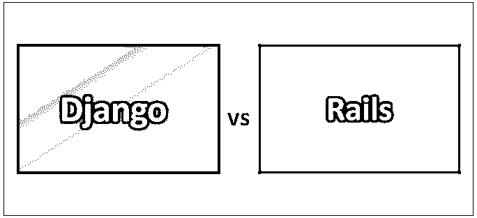

# Django vs Rails

> 原文：<https://www.educba.com/django-vs-rails/>

## Django 与 Rails 的区别

Django 是一个免费的、开源的、高性能的 web 框架，用流行的、简单的、灵活的、相对简单易学的 [Python 编程语言](https://www.educba.com/python-programming-beginners-tutorial/)编写。它采用 MVC(模型视图控制器)设计模式。Django 寻求简化[高端网络应用](https://www.educba.com/how-to-build-web-applications-using-mongodb/)的开发。Ruby on Rails，俗称 Rails，也是一个用 Ruby 实现的 web 框架。Rails 提供了面向对象编程和动态类型语法的完美结合。

**让我们更详细地研究 Django 和 Ruby on Rails:**

<small>网页开发、编程语言、软件测试&其他</small>

*   Django web 框架最初是由 Adrian Holovaty 和 Simon Willison 在 2005 年创作的，现在由 DSF (Django 软件基金会)维护。自从它发布以来，由于它的用户友好性，成千上万的程序员、初学者和高级用户都使用过它。
*   Django 强调代码的可重用性和组件的可插入性、紧凑的编码实践、最小耦合和快速开发。它还提供了一个 CRUD(创建、读取、更新和删除)接口，以实现更简单和动态的可操作性。
*   Ruby on Rails，俗称 [Rails](https://www.educba.com/career-in-ruby-on-rails/) ，也是用 Ruby 实现的 web 框架。Rails 由 David Heinemeier Hansson 编写，最初于 2005 年发布。
*   像 Django 一样，它遵循 MVC(模型视图控制器)框架，这有助于使用 XML 或 JSON 进行数据交换，使用 HTML、CSS 和 JavaScript 作为用户界面，符合 web 标准。
*   Django 和 Ruby on Rails 都广泛用于开发 web 应用和原型，因为它们有标准的库、持久性支持和功能丰富的框架——Python 的 Django 框架和 Ruby 的 Ruby on Rails。
*   这些是[解释脚本语言](https://www.educba.com/programming-languages-vs-scripting-languages/)，不像 Java、C++等编译语言。然而，编译语言往往运行得相对更快。Ruby on Rails 作为一种 [web 开发工具](https://www.educba.com/top-10-web-development-tools/)比 Django-Python 更受欢迎。

### Django 和 Rails 的面对面比较(信息图)

以下是 Django 和 Rails 的 8 大区别:

### Django 和 Rails 的主要区别

让我们讨论一下 Django 和 Ruby on Rails 之间的一些主要区别:

*   Python 是 Django 的基础语言，因此遵循所有的编码惯例并坚持标准的 Python 编程方式。另一方面，Rails 继承了 Ruby 的基本特质；因此，它的编码理念与其母语言是一致的。
*   Rails 哲学建立在两个支柱之上——DRY(不要重复自己),即“每一部分知识在一个系统中必须有一个单一的、明确的、权威的表示。”通过不重复编写相同的信息，代码更易于维护，更易于扩展，错误更少，CoC(约定优于配置)强调了在 web 应用程序中做许多事情的最佳方式，并默认了这组约定，而不是指定无限的配置。Django 的哲学包括- DRY(不要重复自己)，它说每一个不同的概念和/或数据都应该存在于一个且只有一个地方。冗余是不好的。正常化是好的。显式优于隐式，列在 PEP 20 中，意思是 Django 不要做太多的“魔术”。魔法不应该发生，除非有一个真正好的理由。此外，松散耦合和紧密内聚(描述框架的各个层)不应该“知道”彼此，除非绝对必要。
*   每个 Django vs Rails 都按照 MVC(模型视图控制器)实现了相似的内部设计原则。在这种体系结构中，每个数据库表通常与它们各自的类和控制器(一个服务器端组件)进行映射，在接收到 HTTP 客户端请求时呈现视图。
*   ORM(对象关系映射)虽然相似，但对于 Django 和 Rails 来说是不同的。Rails 有一个通用的 ORM ,使得代码可以在所有支持的数据库后端工作。模型定义通过这些重要的文件来组织-模型文件包含业务逻辑和验证规则，迁移文件包含对数据库结构的增量更改的定义，模式文件包含对当前数据库结构的引用。 [Django 有](https://www.educba.com/uses-of-django/)一个等价的实现，但代码级别有所不同——模型文件包含业务逻辑、数据库结构和验证规则。迁移文件是在模型文件更新并包含增量数据库更改时自动生成的。
*   Django 和 Rails 中客户端请求的路由不同。Django 要求在代码中明确定义每个端点。而 Rails 默认情况下将 URL 路由到控制器方法。这种行为可以在配置文件中修改。
*   在前端，网页的行为可以通过集成[前端技术来控制，包括 JavaScript](https://www.educba.com/javascript-interview-questions/) 。Rails 有一个内置的静态编译管道，默认情况下[使用 coffee script](https://www.educba.com/typescript-vs-coffeescript/)。Django 默认提供静态文件，同时开放第三方应用程序，增加编译和压缩选项。
*   web 框架的性能是它在商业用户中受欢迎的主要原因之一。在这一点上，Rails 比 Django 要好一些。尽管如此，Django 和 Rails 同样被开发人员社区用来解决他们的业务用例。显而易见，Bitbucket 使用 Django，而 Github 使用 Rails，两者都提供了相当的整体性能。
*   工作软件的快速开发和及时交付是大多数开发项目面临的复杂问题。由于 Rails 的 gems(库)，应用程序可以快速开发。要将这些宝石付诸实施，需要一个精通 Rails 细微差别的经验丰富的开发团队。Rails 比 Django 多得了几分。
*   在选择技术时，寿命和耐用性是其他需要考虑的因素。在大数据和物联网时代，每天有越来越多的设备连接到网络，增加了数据来源。大数据现象及其处理需要大量的科学分析和 ML(机器学习)算法的部署。在可预见的未来，Python (Django)代码将比 Ruby (Rails)更有优势。

### Django 和 Rails 的比较

下面是 Django 和 Rails 最上面的比较。

| **Django 与 Rails 的比较基础** | 姜戈 | **轨道** |
| **原点** | 源于 Python 的 web 框架 | 源自作为健壮的 web 框架的 Ruby |
| **用例** | 适合开发数据量大的网站和高流量的服务器 | 适用于快速实施复杂和高流量的网站和应用程序 |
| **架构** | 遵循 MVC 设计模式 | 基于分层结构的 MVC 模式 |
| **性能** | 提供非常强劲的性能 | 在性能上与 Django 不相上下甚至更胜一筹 |
| **动机** | 在坚持简单性的同时，加强任务实现的一致性 | 提供自由度和灵活性，以多种不同方式解决任务 |
| **显著特征** | 简单易学，保守，代码可读性强，实现快速高效 | 富有表现力、高效、优雅和强大 |
| **开发者首选** | 与变化、保守的代码和较少的更新相比，它更加突出稳定性。 | 强调创造性编码、频繁更新、自由和灵活性以及可读代码 |
| **主要实施** | YouTube，Instagram，Spotify，Reddit，BitTorrent | Basecamp，Hulu，Twitter(最初)， [Github](https://www.educba.com/install-github/) ，Airbnb |

### 结论

简而言之，Django vs Rails 是一个现代的、健壮的、面向对象的和服务器端的 web 框架，提供了足够的灵活性和工具来开发高端网站。每个框架都有一个很大的社区基础，因为它们独特的特性被开发人员所采用。

### 推荐文章

这是 Django 和 Rails 之间主要区别的指南。在这里，我们讨论了 Django 和 Rails 的直接比较、主要差异、信息图和比较表。您也可以看看下面的 Django vs Rails 文章来了解更多信息

1.  [Django vs Flask——哪个有用](https://www.educba.com/django-vs-flask/)
2.  [Ruby vs Ruby On Rails](https://www.educba.com/ruby-vs-ruby-on-rails/)
3.  [Django vs Laravel–有价值的差异](https://www.educba.com/django-vs-laravel/)
4.  [Rails vs PHP](https://www.educba.com/rails-vs-php/)
5.  [MongoDB vs PostgreSQL:哪个有利](https://www.educba.com/mongodb-vs-postgresql/)

