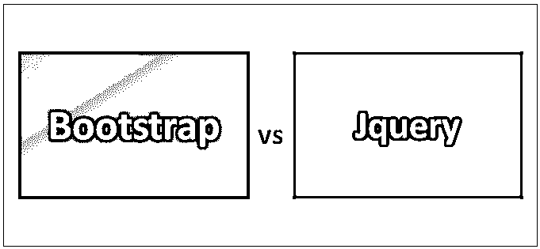

# Bootstrap vs Jquery

> 原文：<https://www.educba.com/bootstrap-vs-jquery/>

## Bootstrap 与 Jquery 的区别

[Bootstrap 是](https://www.educba.com/what-is-bootstrap/)[开发 web 应用](https://www.educba.com/how-to-build-web-applications-using-mongodb/)的前端框架。它是免费和开源的。它由 Bootstrap 核心团队开发，由 Mark Otto 和 Jacob Thornton 设计。它最初发布于 2011 年。它是用 HTML，CSS， [Sass](https://www.educba.com/sass-interview-questions/) ，Less，和 JavaScript 编写的。它最初被命名为 Twitter Blueprint。

Bootstrap 主要基于用 [HTML 和 CSS](https://www.educba.com/html-vs-css/) 编写的设计模板，使用不同的表单，基于 JavaScript 等组件的扩展。Bootstrap 发布了它的新版本 Bootstrap 2，有更多的特性和新的组件，对现有版本也有所改变。它还支持最新版本的谷歌 Chrome、Firefox、IE、Opera 和 Safari。

<small>网页开发、编程语言、软件测试&其他</small>

Bootstrap 用于在 web 上开发响应式构建和移动优先项目。它用于开发兼容并立即与各种尺寸的屏幕，因为它提供了跨所有浏览器和不同设备的一致性。在 HTML 和 CSS 的帮助下，很容易进行多种多样的定制。Bootstrap 是 Github 上排名最高的库之一。

Bootstrap 的一个特点是有各种各样的主题和插件，这使得应用程序更具交互性和易用性。它还支持原生的移动外观。它易于使用且容易获得。

[Jquery 是开源的](https://www.educba.com/what-is-jquery/)来设计 HTML 的客户端脚本。它免费且易于使用。它由 Jquery 团队开发，由 John Resig 设计。它最初发布于 2006 年。它是用 JavaScript 写的。

Jquery 被用来制作一个基于 HTML 的界面系统，使得应用程序和网站在所有设备上都更容易响应和访问。Jquery 易于开发，主要嵌入在 HTML 中。它也被称为 JavaScript 库。

Jquery 遵循文档对象模型，它表示 web 页面的所有元素。它还简化了语法和元素操作。使用 Jquery 开发有四个原则，即分别开发 javascript 代码和 HTML 标记，促进简洁和清晰，消除跨浏览器和平台的兼容性问题，以及可扩展性。

Jquery 对所有浏览器都有很好的兼容性。Jquery 项目主要借助一个名为 QUnit 的[测试自动化框架](https://www.educba.com/test-automation-framework/)进行测试，也可以添加插件来测试任何 [javascript 代码](https://www.educba.com/javascript-interview-questions/)。它可以用于许多用户界面脚本，如 Ajax 等。

### Bootstrap 和 Jquery 之间的直接比较(信息图表)

下面是 Bootstrap 和 Jquery 之间的 6 大区别:

### Bootstrap 和 Jquery 之间的主要区别

让我们讨论一下 Bootstrap 和 Jquery 之间的一些主要区别:

1.  Bootstrap 是高响应设计应用，有助于从任何设备访问应用，并且可以根据需要禁用。Jquery 也是开箱即用的。
2.  在 Bootstrap 中，应用程序看起来更漂亮，更吸引人。在 Jquery 中，应用程序看起来很迟钝。
3.  Bootstrap 主要是设计来使网站快速或快速地启动和运行。Jquery 相对来说比较慢。
4.  Bootstrap 可以使用 [CSS 框架](https://www.educba.com/css3-interview-questions/)使网站更加可定制。在 Jquery 中，不能使用许多定制来开发站点。
5.  Bootstrap 很受欢迎，在 GitHub 上排名靠前。Jquery 在 java 开发者中也很受欢迎。
6.  Bootstrap 的模板有很多不同的主题，可以用于不同的网站。Jquery 没有这种自由。
7.  引导站点有时看起来和其他站点一样。在 Jquery 中，不存在这样的问题。
8.  Bootstrap 主要是速度快，经常发布新的特性或组件。Jquery 很慢，新的特性或组件也不经常发布。
9.  Bootstrap 确实支持应用程序的本地移动外观。Jquery 不支持原生移动外观，看起来几乎一样。
10.  Bootstrap 有一个很棒的社区和文档，有现成可用的实例和模板。Jquery 文档在很多方面都有所欠缺。
11.  Bootstrap 有许多插件可用于定制构建，使应用程序更具交互性。Jquery 没有种类繁多的插件来开发应用程序。

### 引导和 Jquery 对照表

下面讨论 Bootstrap 和 Jquery 之间的主要比较:

| 【Bootstrap 与 Jquery 的比较基础 | **自举** | **Jquery** |
| **定义** | 它是一个用于开发应用程序的开源前端框架。 | Jquery 是一个用于客户端脚本的开源 javascript 库。 |
| **已编程** | 主要用 HTML、CSS、Less、Saas、JavaScript 编写。 | 主要是用 JavaScript 写的。 |
| **设计好的** | 它最初是由马克奥托和雅各布桑顿设计的。 | 它是由约翰·雷西格设计的 |
| **性能** | 自举提供更高的性能。 | 它的性能相对较慢。 |
| **应用程序** | Bootstrap 主要用于开发桌面应用程序。 | [Jquery 主要用于](https://www.educba.com/jquery-queryselector/)开发移动应用。 |
| **网站** | Getbootstrap.com | Jquery.com |

### 结论

Bootstrap 和 Jquery 都用于前端应用程序开发。Bootstrap 和 Jquery 可以很容易地结合起来，解决许多框架的缺点。Bootstrap 存在文件过大的问题。Bootstrap 有太多的类，样式变得凌乱，DOM 元素丰富。Jquery 变得缓慢，有时在大屏幕上看起来很糟糕。

Bootstrap 主要用于即时开发与所有设备和屏幕兼容的应用程序。最受其他前端开发语言和平台的开发者欢迎。定制和它的快速性能使得开发者或组织选择它并开发应用程序。

Jquery 与市场上几乎所有的浏览器都有很好的向后兼容性，并且可以轻松嵌入其他库和语言，使开发变得更加容易。它得到了全球的广泛支持。Jquery 在顶级网站和国家处于领先地位，因为它在市场上存在的时间更长。 [Bootstrap 是一种新型产品](https://www.educba.com/install-bootstrap/),也正在顶级网站和国家获得市场。

以上是 Bootstrap 与 Jquery 区别的概述。这些都有它自己的利弊使用。可以根据客户需求、可用资源和易于开发的应用程序来使用或选择这些工具。Bootstrap 和 Jquery 都有很好的社区支持和可用文档，这有助于新开发人员学习和适应这些语言。走出盒子去学习和尝试新事物总是好的。快乐学习！!

### 推荐文章

这是 Bootstrap 和 Jquery 之间主要区别的指南。我们已经讨论了 Bootstrap 与 Jquery 的直接比较、主要区别以及信息图和比较表。您也可以看看下面的 Bootstrap vs Jquery 文章来了解更多信息

1.  [角度与敲除哪个有利](https://www.educba.com/angular-vs-knockout/)
2.  [角度或自举](https://www.educba.com/angular-vs-bootstrap/)
3.  [vista . js vs jquery](https://www.educba.com/vue-js-vs-jquery/)
4.  [角度与自举](https://www.educba.com/angular-vs-bootstrap/)
5.  [JavaScript vs JQuery](https://www.educba.com/javascript-vs-jquery/)
6.  [Angular vs JQuery](https://www.educba.com/angular-vs-jquery/)
7.  Bootstrap vs WordPress:差异
8.  [Vue.js vs Angular:有什么区别](https://www.educba.com/vue-js-vs-angular/)

